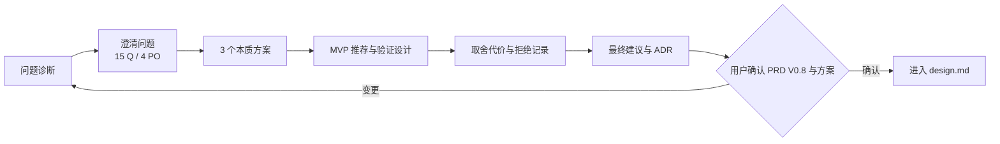
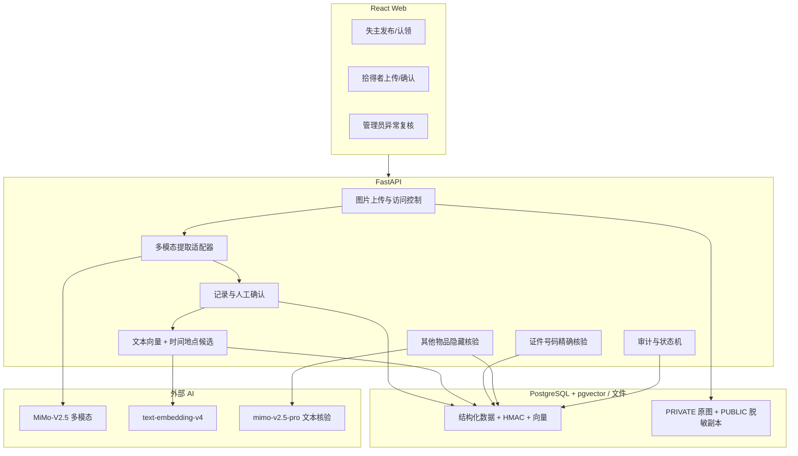
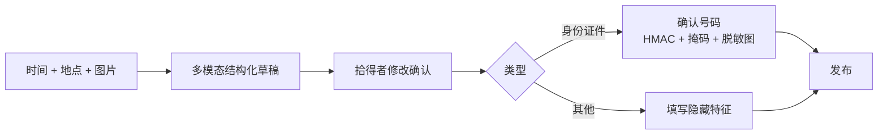
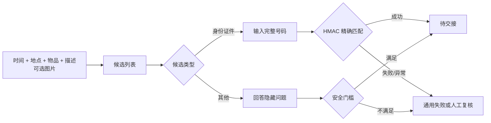

# AI 失物招领匹配与认领复核系统 · 技术方案选型

**文档版本：** V4.0（新需求触发重新评审）  
**更新日期：** 2026-07-16  
**PRD 基线：** V0.8（已确认）  
**方案状态：** 方案 A 已接受；方案 B、C 已拒绝  
**固定约束：** Python + FastAPI + PostgreSQL + pgvector

> V3.0 曾基于“图片不进入 AI、所有物品走隐藏核验”形成选型。用户新增身份证件/其他双类型、多模态图片提取和证件号码认领后，V3.0 已不能直接进入实现，本文件替代其作为当前方案 Review 文档。

---

## 一、需要记录哪些文档

进行设计决策时必须生成并维护以下 8 份文档，缺一不可：

| 序号 | 文档 | 当前版本 | 状态 |
|---:|---|---|---|
| 1 | [问题诊断](docs/diagnosis/problem-diagnosis.md) | V4.0 | 已更新 |
| 2 | [澄清问题列表](docs/diagnosis/clarifying-questions.md) | V4.1 | 15 问，其中 4 个 P0；全部已确认 |
| 3 | [方案选项](docs/options/solution-options.md) | V4.0 | 3 个本质方案已对比 |
| 4 | [取舍矩阵](docs/options/tradeoff-matrix.md) | V4.0 | 证据评分已完成，待 spike 校准 |
| 5 | [拒绝方案记录](docs/options/rejected-options.md) | V4.0 | 已记录替代、代价和隐藏风险 |
| 6 | [验证案例与结果](docs/validation/cases-and-results.md) | V4.0 | 案例已设计，运行结果待执行 |
| 7 | [最终建议](docs/decision/final-recommendation.md) | V4.1 | 方案 A 已接受 |
| 8 | [决策备忘 ADR](docs/decision/decision-memo.md) | V4.1 | 旧 V3 已替代，新决策已接受 |

执行链路：

## 二、需求变化对旧方案的影响

| 新要求 | V3 旧状态 | V4 必须变化 |
|---|---|---|
| 身份证件类 / 其他物品 | 单一物品流程 | 发布与认领双分支 |
| 拾得者上传图片后自动识别 | 图片只人工查看 | 新增多模态提取、结构校验和人工确认 |
| 身份证件号码掩码 | 无证件号码字段 | 原图/脱敏图、掩码/HMAC 分离 |
| 身份证件不填隐藏特征 | 所有物品需要隐藏特征 | 证件用号码精确核验 |
| 失主可选图片 | 不支持失主旧照片 | 作为 PRIVATE 支持材料，不进行多模态提取 |

## 三、顶层方案对比

| 方案 | 核心思路 | 需求覆盖 | 主要风险 | 加权分 | 结论 |
|---|---|---|---|---:|---|
| **A：受控多模态 + 人工确认 + 分类型核验** | AI 只生成发布草稿；证件号码规则核验；其他物品 LLM 核验 | 完整 | 图片隐私和双流程工作量 | **4.40** | **已接受** |
| B：OCR/规则优先 | 证件 OCR；普通物品手填；规则候选 | 部分 | 不满足普通物品自动提取 | 4.00 | 已拒绝 |
| C：端到端多模态 LLM | 模型直接负责提取、匹配和认领 | 表面完整 | 敏感数据、概率判断、不可复现 | 3.25 | 已拒绝 |

三个方案分别是“混合人机协同”“确定性流水线”“模型端到端决策”，不是同一方案的低/中/高配。

## 四、推荐方案 A

### 4.1 系统边界

### 4.2 拾得者发布路径

### 4.3 失主认领路径

### 4.4 数据用途

| 数据 | 级别 | 使用者 | 禁止用途 |
|---|---|---|---|
| 确认后的名称/公开描述 | PUBLIC/MATCH_ONLY | 候选服务、普通用户摘要 | 不证明所有权 |
| AI 原始提取 JSON | PRIVATE/MATCH_ONLY 审计 | 拾得者本人、审计 | 不直接发布、不直接评分 |
| 身份证件原图 | PRIVATE | 受控多模态/脱敏服务 | 不进入候选 DTO、向量、普通日志 |
| 脱敏图片和掩码号码 | PUBLIC | 候选页 | 不用于精确比对 |
| 证件号码 HMAC | PRIVATE | 证件核验服务 | 不给 LLM、管理员列表或前端 |
| 其他物品隐藏特征 | VERIFICATION | 隔离核验服务、必要管理员复核 | 不进入候选匹配和公开解释 |

## 五、关键子决策

### D1：多模态模型

| 选项 | 优点 | 风险 | 结论 |
|---|---|---|---|
| MiMo-V2.5 官方图片理解 API | 与现有 MiMo 生态一致；支持 URL/Base64、描述和分类 | 号码 OCR 效果需 spike；外部传图 | **推荐验证** |
| OCR 专用模型 + 文本 LLM | 证件文本更针对 | 普通物品描述仍需第二能力 | 方案 B 备选 |
| 本地 VLM | 数据不出本机 | 两天部署和资源风险高 | 本轮不选 |

### D2：AI 输出生效方式

**选择：草稿 + 拾得者确认。** 拒绝“模型直接发布”。保存 `raw_ai_result`、`confirmed_value`、修改人和时间。

### D3：证件类型范围

**已确认：MVP 仅居民身份证。** 如果扩到护照/学生证/驾驶证，必须重新进入 PRD 与方案评审，新增号码规范化、掩码和测试策略。

### D4：证件号码保护

**已选择：** 应用层规范化 → HMAC-SHA256 → 常量时间比较；保存 HMAC 与掩码，不把明文写入普通日志。拒绝普通哈希和 LLM 比较。

### D5：图片脱敏

**已选择：** PRIVATE 原图 + 服务端遮挡生成 PUBLIC 副本 + 拾得者预览确认。自动定位失败时不公开图片或手工框选。

### D6：文本向量检索

**已选择：** 延续 text-embedding-v4 + pgvector 余弦精确搜索。pgvector 官方说明默认精确近邻搜索；MVP 小数据不建立 HNSW/IVFFlat。

### D7：失主可选图片

**已确认：** 只作为 PRIVATE 支持材料，不调用多模态、不进入候选分。后续若要求自动提取，需重新评估工作量和隐私范围。

### D8：失败降级

| 失败 | 降级 |
|---|---|
| 多模态超时/限流 | 保存草稿，手工填写 |
| 非法 JSON/低置信度 | Pydantic 拒绝生效，进入编辑页 |
| 图片脱敏失败 | 不公开原图，允许只展示文本 |
| 号码连续错误 | 统一提示，2 次后锁定/转人工 |
| embedding 失败 | 保存记录，标记待重试；可按时间地点规则生成低可信候选 |
| 隐藏核验 LLM 失败 | 转管理员，不自动通过或拒绝 |

## 六、取舍与拒绝理由

1. 接受方案 A 意味着多写图片双版本、确认状态和双核验流程，换取需求完整性与可追溯性。
2. 不选 B 的主要原因不是技术差，而是它未完整满足普通物品图片自动提取。
3. 不选 C 的核心原因是完整号码需要确定性比较，不能由概率模型裁决。
4. 保留手工降级，避免外部模型成为发布流程的单点故障。
5. 完整取舍见 [取舍矩阵](docs/options/tradeoff-matrix.md) 和 [拒绝方案](docs/options/rejected-options.md)。

## 七、验证要求

方案 A 已完成决策确认；以下内容作为进入实现和验收的验证门槛，仍需按真实结果填写：

1. 8 张合成/脱敏图片的多模态 spike；
2. 证件号码规范化、HMAC、掩码和尝试限制的单元测试设计；
3. 身份证件候选 DTO 与日志泄露检查；
4. 两条 E2E 主路径和多模态失败降级用例；
5. 已确认的 Q1～Q15 转化为单元、集成、E2E 和安全测试断言。

案例和当前真实结果见 [验证案例与结果](docs/validation/cases-and-results.md)。

## 八、官方证据

- [MiMo 图片理解](https://mimo.mi.com/docs/en-US/quick-start/usage-guide/multimodal-understanding/image-understanding)：支持图片输入、描述与分类；因此可用于草稿提取，但没有证据支持取消人工确认。
- [MiMo API FAQ](https://mimo.mi.com/docs/en-US/quick-start/faq/api-integration)：官方建议超时和指数退避，支持本方案的失败降级设计。
- [FastAPI 文件上传](https://fastapi.tiangolo.com/tutorial/request-files/)：`UploadFile` 支持 multipart 文件上传。
- [pgvector](https://github.com/pgvector/pgvector)：支持余弦距离和默认精确近邻搜索。
- [PostgreSQL pgcrypto](https://www.postgresql.org/docs/current/pgcrypto.html)：提供 HMAC 能力并提示数据库内加密的数据链路限制。

## 九、当前结论与阶段门

**方案 A 已确认接受。**

- PRD V0.8 已确认，Q1～Q15 已全部确认。
- V4 ADR 状态为“已接受”，方案 B、C 为“已拒绝”。
- 当前进入详细设计与 Design Review；模型 spike、编码和运行测试仍未执行。
