# AI 失物招领匹配与认领复核系统：端到端详细设计

**文档版本：** V1.4
**日期：** 2026-07-16  
**状态：** V1.3 已确认；V1.4 最小变更待增量 Design Review
**需求基线：** `prd.md` V0.9（需求方向已确认，文档已确认）
**方案基线：** `design_option.md` V4.1，方案 A 已接受  

> 本文是实现前的详细技术设计，不代表代码、模型 spike 或测试已经完成。任何运行结果必须在实现后写入验证文档。

---

## 1. 设计目标、优先级与非目标

### 1.1 设计目标

1. 用一个 React Web 前端和一个 FastAPI 服务端跑通“发布 → 候选 → 认领核验 → 自动/人工路由 → 线下交接 → 审计追溯”。
2. 拾得者上传图片后，由 MiMo-V2.5 生成物品类型、名称和公开描述草稿；拾得者修改、确认后才成为正式事实。
3. 将居民身份证与其他物品拆成两条确定的认领路径：身份证号码 HMAC 精确核验；其他物品使用隐藏描述生成的问题进行语义核验。
4. 候选匹配只使用 `PUBLIC + MATCH_ONLY` 数据；核验答案、完整号码、原图和联系方式不得进入候选向量。
5. 所有自动判断都可回溯到原始输入、模型版本、AI 原始输出、人工修改、规则结果和状态事件。
6. 外部模型失败时允许保存草稿和手工继续，不让 AI 成为发布流程的单点故障。
7. 失主在 Top 5 无合适候选时可提交未匹配复核，在具体候选核验失败或不同意结果时可提交认领复核；两类请求进入同一管理员队列但保留不同证据范围。

### 1.2 设计优先级

优先级从高到低为：

1. 敏感数据不泄露；
2. 身份证号码判断确定、可测试；
3. 主路径真实改变数据库状态；
4. AI 输出必须经人确认或受规则约束；
5. 两天内可以实现和演示；
6. 后续扩展性。

### 1.3 非目标

- 不支持身份证以外的护照、驾驶证、学生证等证件。
- 不训练或微调多模态、OCR、embedding 或文本模型。
- 不使用图片相似度判断物品归属；失主可选图片不做多模态提取、不参与候选评分。
- 不接公安、学校统一认证、证件真伪或挂失系统。
- 不实现物流、线上签收、支付、消息推送、复杂申诉和多人竞价式认领。
- 不部署独立向量数据库；MVP 不建立 HNSW/IVFFlat 近似索引。
- 不证明法律所有权；系统只给出候选、核验结果和交接状态。

## 2. 角色、信任边界与数据分级

### 2.1 角色

| 角色 | 主要动作 | 明确不能做 |
|---|---|---|
| 失主 | 发布失物、查看候选、提交认领、查看交接状态 | 查看隐藏答案、完整证件号、其他用户联系方式或原图 |
| 拾得者 | 发布招领、确认 AI 草稿和证件号码、保管物品、线下交接后关闭记录 | 代替失主提交认领、查看失主账号敏感资料 |
| 管理员 | 处理重复、低可信、冲突和超限申请；记录理由 | 默认查看完整证件号码；代替拾得者确认实物已交接 |
| |

普通注册账号可以在不同记录中分别充当失主或拾得者；管理员是受控审核角色，不是实物保管人。

### 2.2 信任边界

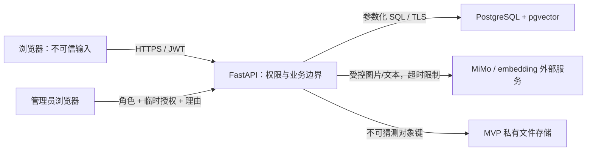

浏览器、上传文件和模型输出都视为不可信；只有经过类型校验、业务校验和权限检查的服务端数据可以改变正式状态。

### 2.3 四级数据规则

| 级别 | 例子 | 候选页 | 匹配服务 | 核验服务 | 管理员 |
|---|---|---:|---:|---:|---:|
| PUBLIC | 类型、名称、模糊时间地点、公开描述、掩码号码、脱敏图 | 可见 | 可用 | 可用 | 可见 |
| MATCH_ONLY | 精确时间、标准化地点、embedding、距离和内部得分 | 不原样显示 | 可用 | 可用 | 按需可见 |
| VERIFICATION | 隐藏描述、问题、答案要点、失主原始回答 | 不可见 | 禁用 | 可用 | 复核时可见 |
| PRIVATE | 原图、号码 HMAC、联系方式、账号、失主支持图片 | 不可见 | 禁用 | 最小使用 | 默认脱敏；授权操作按需访问 |

硬约束：

- 候选响应 DTO 只能从 PUBLIC 投影生成，禁止直接序列化数据库实体。
- 完整身份证号码只存在于单次请求内存；规范化并计算 HMAC 后立即丢弃，不入数据库、不入普通日志、不发给模型。
- 管理员列表只返回掩码和事件；管理员也不能通过普通接口读取完整号码。
- 身份证原图保存到记录关闭，候选页始终只读取已确认的脱敏副本。

## 3. 技术栈与目标目录

### 3.1 技术栈

| 层 | 选择 | 用途 |
|---|---|---|
| Web | React 18 + TypeScript + Vite | 失主、拾得者、管理员三类视图 |
| API | Python 3.11+、FastAPI、Pydantic v2 | REST API、输入输出校验、OpenAPI |
| 数据访问 | SQLAlchemy 2.x async + asyncpg、Alembic | 事务、迁移、PostgreSQL 访问 |
| 数据库 | PostgreSQL 16+ + pgvector | 结构化数据、JSON、审计、文本向量 |
| 认证 | JWT access/refresh + 密码哈希 | 注册登录和角色授权 |
| AI | MiMo-V2.5 图片能力、mimoV2.5-pro 文本能力、text-embedding-v4；均经兼容适配器调用 | 图片特征提取、问题/核验、公开文本向量 |
| 文件 | MVP 本地私有目录 + `StoragePort` 抽象 | PRIVATE 原图与 PUBLIC 脱敏副本 |
| 测试 | pytest、httpx、Testcontainers/PostgreSQL、Vitest、Playwright | 单元、集成和 E2E |

依赖的精确版本在 `dev.md` 锁定；本文锁定接口与行为，不虚构当前环境已安装。

### 3.2 建议目录

```text
day6/
├── backend/
│   ├── app/
│   │   ├── api/                 # 路由与 DTO
│   │   ├── auth/                # JWT、密码和 RBAC
│   │   ├── items/               # 失物/招领记录与状态机
│   │   ├── matching/            # embedding、候选评分和解释
│   │   ├── verification/        # 身份证/其他物品核验
│   │   ├── multimodal/          # MiMo 适配器与结构校验
│   │   ├── images/              # 上传、脱敏、受控读取和清理
│   │   ├── reviews/             # 管理员复核
│   │   ├── audit/               # 只追加审计事件
│   │   ├── db/                  # 模型、迁移和会话
│   │   └── core/                # 配置、错误、日志、时钟
│   └── tests/
├── frontend/
│   ├── src/features/auth/
│   ├── src/features/found-items/
│   ├── src/features/lost-items/
│   ├── src/features/candidates/
│   ├── src/features/claims/
│   ├── src/features/admin/
│   └── tests/
├── e2e/
├── storage/private/
├── storage/public/
└── docs/
```

## 4. 总体架构
设计采用单体模块化应用，不拆微服务。接口模块和领域服务是代码边界，不代表独立部署；事务、权限和审计仍集中在同一 FastAPI 进程中，符合两天 MVP 的部署和排错能力。

#### 角色—接口模块映射

| 角色 | 可访问接口模块 | 关键接口 | 明确不可访问 |
|---|---|---|---|
| 失主 | M1 认证、M2 失物与候选、M4 认领核验、M5 交接与记录 | 创建失物、读取本人 Top 5、提交未匹配复核、提交身份证/OTHER 核验、提交认领复核、待交接后读取联系方式、查看本人时间线 | 招领草稿确认、交接完成确认、管理员决定与审计查询接口 |
| 拾得者 | M1 认证、M3 招领发布、M5 交接与记录 | 上传图片、AI 提取、确认公开信息、确认身份证/隐藏问题、发布、线下交接后确认完成、查看本人时间线 | 以失主身份读取其他人的候选/核验、管理员复核接口 |
| 管理员 | M1 登录/刷新、M6 管理员复核与审计 | 处理多人认领、隐藏核验未通过、证件异常、未匹配复核和认领复核；提交带理由的确认/驳回并查询审计事件 | 普通用户注册、替代失主提交认领、替代拾得者正常确认交接、读取完整身份证号码 |

同一普通账号可以分别进入失主和拾得者任务，因此权限不能只检查账号的 `USER` 角色，还要检查记录归属和当前操作目的。管理员虽然拥有 `ADMIN` 角色，也必须通过 M6 专用接口和用途授权访问复核材料。

### 4.1 系统功能模块架构

为避免把功能架构图画成接口清单或服务实现细节，本节只保留四个层级，并在核心功能层按失主、拾得者和管理员三类角色组织业务模块。

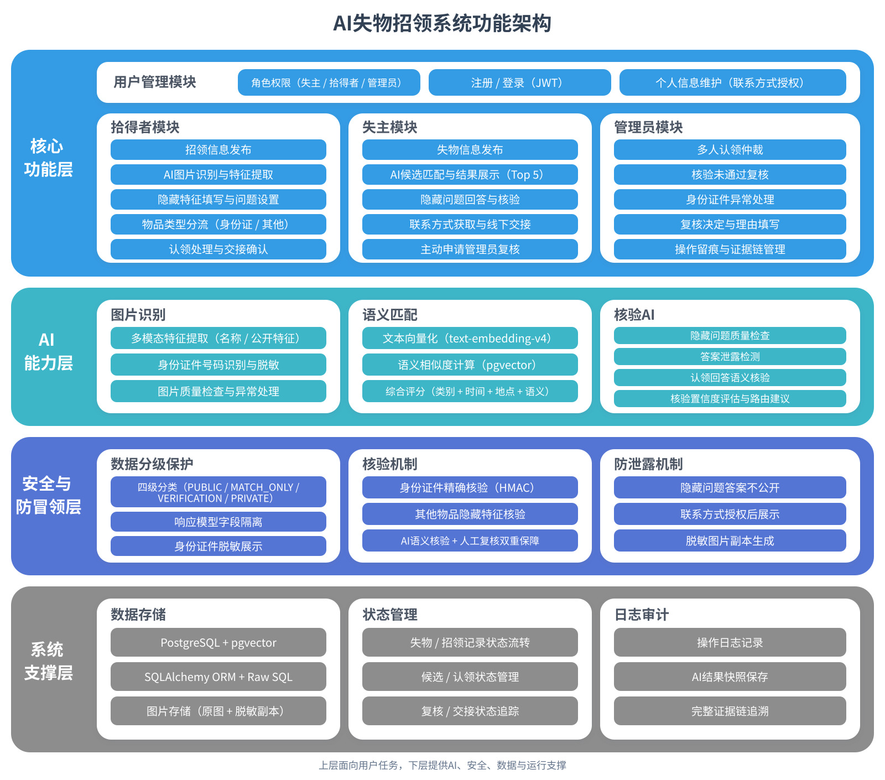

- **核心功能层**：用户管理，以及拾得者发布与交接、失主匹配与认领、管理员复核与审计。
- **AI能力层**：图片识别、文本语义匹配和普通物品认领核验。
- **安全与防冒领层**：四级数据保护、身份证 HMAC 精确核验、隐藏特征核验和敏感信息防泄露。
- **系统支撑层**：PostgreSQL + pgvector、图片文件存储、状态流转和日志证据链。

该图用于说明“系统提供哪些能力以及分别服务哪个角色”，不表达单个 REST 接口、代码包或独立部署单元；具体接口、状态机和数据约束继续由后文章节定义。

### 4.2 前端方案选择

前端比较过三种组织方式：

| 方案 | 说明 | 优点 | 代价 | 结论 |
|---|---|---|---|---|
| A：普通用户双任务入口 + 独立管理员布局 | 普通用户共用账号，从“我丢失了物品”和“我捡到了物品”进入两套流程；管理员使用 `/admin` | 符合一个用户可同时是失主/拾得者的角色模型；权限和任务边界清楚 | 需要两套向导和一套管理员工作台 | **采用** |
| B：失主端、拾得者端、管理员端三个独立应用 | 三个前端分别部署 | 物理隔离最清楚 | 登录、组件、部署和测试重复，不适合两天 MVP | 不采用 |
| C：单首页长表单动态切换 | 一个页面根据选项显示全部字段 | 页面数量少 | AI 等待、分类型核验和错误状态混杂，难展示证据链 | 不采用 |

普通用户的“失主/拾得者”是当前任务身份，不是永久账号角色。管理员是独立权限角色，登录后进入单独页面，不与普通用户任务导航混用。

### 4.3 前端技术与边界

| 能力 | 设计选择 | 边界 |
|---|---|---|
| 框架 | React 18 + TypeScript + Vite | 已确认的 SPA 技术栈 |
| 路由 | React Router | 普通用户 `/app` 与管理员 `/admin` 使用不同 Route Guard 和 Layout |
| 服务端状态 | TanStack Query | 候选、记录、申请、复核队列；不持久化敏感查询缓存 |
| 表单 | React Hook Form + Zod | 前端即时校验只改善体验，服务端仍是最终校验者 |
| 局部状态 | React state；仅跨页面向导摘要使用轻量 Context | 不把服务器业务状态复制为全局可变状态 |
| UI | Ant Design 基础组件 + 项目主题变量 | 优先交付一致的表单、表格、步骤条、抽屉和反馈状态 |
| API | 由 OpenAPI 生成/约束 TypeScript DTO，统一 `apiClient` | 页面不得直接读取数据库实体或拼接 PRIVATE 字段 |
| 测试 | Vitest + Testing Library + Playwright | 组件行为、路由权限和两条 E2E 主路径 |

前端不承担候选计分、HMAC、权限裁决或状态转换。前端可以阻止明显无效提交，但不能通过隐藏按钮代替服务端授权。

### 4.4 信息架构

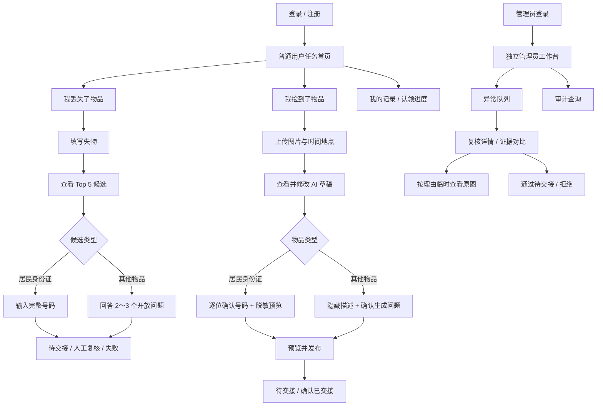

### 4.5 路由与页面清单

#### 公共与普通用户页面

| 路由 | 页面 | 主要职责 | 进入条件 |
|---|---|---|---|
| `/login` | 登录 | 登录、错误反馈、管理员账号入口 | 未登录 |
| `/register` | 注册 | 创建普通账号 | 未登录 |
| `/app` | 任务首页 | 显示“我丢失了物品”“我捡到了物品”两张主入口卡及最近记录 | USER |
| `/app/lost/new` | 我丢失了物品 | 新建失物记录 | USER |
| `/app/lost/:id/candidates` | 候选列表 | Top 5 PUBLIC 候选和安全理由 | 记录创建者 |
| `/app/candidates/:id/claim` | 认领核验 | 按 IDENTITY_DOCUMENT / OTHER 渲染不同核验表单 | 对应失主 |
| `/app/claims/:id` | 认领进度 | 展示核验中、人工复核、待交接、已认领状态 | 申请人/对应拾得者 |
| `/app/found/new` | 我捡到了物品 | 上传图片、时间地点，创建草稿 | USER |
| `/app/found/:id/confirm` | AI 草稿确认 | 对比 AI 建议与人工确认值 | 记录创建者 |
| `/app/found/:id/security` | 分类型核验信息 | 身份证逐位确认/脱敏；OTHER 隐藏描述/问题确认 | 记录创建者 |
| `/app/found/:id/preview` | 发布预览 | 只按 PUBLIC 候选视角预览并发布 | 发布门槛满足 |
| `/app/records` | 我的记录 | LOST/FOUND/认领申请筛选和状态入口 | USER |

未匹配复核和认领复核使用候选页/认领进度页中的对话框提交，不新增复杂页面层级；提交成功后统一在认领进度或记录时间线中查看状态。

#### 管理员独立页面

| 路由 | 页面 | 主要职责 | 进入条件 |
|---|---|---|---|
| `/admin/login` | 管理员登录 | 预置管理员登录 | 未登录 |
| `/admin/reviews` | 异常复核队列 | 按风险、物品类型、时间筛选；默认只显示掩码和事件摘要 | ADMIN |
| `/admin/reviews/:id` | 复核详情 | 对比 PUBLIC、MATCH_ONLY、VERIFICATION 和审计事件 | ADMIN |
| `/admin/audit` | 审计查询 | 按申请/记录/请求 ID 查看脱敏事件时间线 | ADMIN |

普通用户访问 `/admin/*` 返回 403 页面；管理员登录后默认进入 `/admin/reviews`。前端路由守卫用于尽早阻止错误导航，服务端仍必须再次验证角色和资源归属。

### 4.6 普通用户首页

首页不是“选择永久角色”，而是选择本次任务：

| 入口 | 主文案 | 辅助说明 | 主按钮 |
|---|---|---|---|
| 我丢失了物品 | 发布失物并寻找候选 | 填写记得的公开信息；可选图片不进入 AI 匹配 | `开始寻找` |
| 我捡到了物品 | 上传图片并发布招领 | AI 生成草稿，你确认后才公开 | `发布招领` |

首页下方显示“我的最近记录”，但不混合敏感信息：卡片只显示公开名称、记录方向、状态、更新时间和下一步动作。状态使用文本加颜色，不能只依靠颜色表达。

### 4.7 “我丢失了物品”前端流程

采用四阶段任务条：`填写失物 → 查看候选 → 认领核验 → 交接进度`。

#### 4.7.1 填写失物

- 必填：物品类型、名称、时间、地点、公开描述。
- 失主可选图片明确标注“仅作为 PRIVATE 支持材料，不进行 AI 分析、不参与候选评分”。
- 公开描述旁显示隐私提示：不要填写身份证完整号码、联系方式和只有真实失主知道的隐藏答案。
- 保存成功后以服务端记录 ID 跳转候选页；网络失败使用幂等键重试，不重复创建记录。

#### 4.7.2 候选列表与详情

- 固定最多展示 Top 5；每张候选卡显示安全图片、公开名称、候选分、分档和安全理由。
- 候选分文案固定为“公开信息接近程度，不代表所有权概率”。
- 理由只使用服务端 `reason_code` 映射，例如“描述高度接近”“时间接近”“地点相邻”“存在时间冲突”。
- 身份证候选展示脱敏图和掩码号码；OTHER 只展示确认安全的整体图和 PUBLIC 描述。
- 空列表或 Top 5 均不合适时显示“申请管理员复核”；提交内容包括失物记录、失主补充说明和当前候选快照，不要求失主公开隐藏信息。

#### 4.7.3 分类型认领

身份证核验表单：

- 使用 18 位安全输入框，默认隐藏中间字符，允许显式显示/隐藏；禁用浏览器自动填充建议。
- 提交前只做格式提示；服务端返回失败后不标出错误位置、不显示部分命中数量。
- 显示“本账号对此候选最多验证 2 次”；剩余次数只由服务端响应决定。
- 第 2 次失败后页面进入锁定状态，不再展示可提交表单。
- 失败、锁定或失主不同意结果时显示“申请认领复核”，请求关联具体 `claim_id`，不能修改原号码核验事件。

OTHER 核验表单：

- 只显示 2～3 个问题文本和回答框，不加载隐藏描述、答案要点或即时对错。
- 所有问题一次提交；提交后不可用“逐题试错”方式反复修改。
- AI 核验中显示非阻塞进度；超时后提示“已转人工复核”，不得显示伪造分数。
- 部分匹配、冲突、无法判断或失主不同意结果时，可补充复核理由；标准答案仍不得返回失主。

#### 4.7.4 进度与交接

状态页使用时间线展示：`已提交 → 系统核验/主动复核/人工复核 → 待交接 → 已认领`。只有进入待交接后显示拾得者授权联系方式；其它状态只显示通用进度。联系方式区域禁止出现在候选页 DOM 中后再用 CSS 隐藏，必须等授权接口成功后才渲染。

### 4.8 “我捡到了物品”前端流程

采用四步向导：`上传图片 → 确认 AI 草稿 → 核验信息 → 预览发布`。每一步都从服务端加载最新草稿版本，提交时携带 `expected_version`。

#### 4.8.1 上传图片

- 必填时间、地点和整体图片；上传前显示文件格式/大小限制。
- 本地预览使用 Blob URL，页面离开时立即 `revokeObjectURL`。
- 上传成功后调用提取接口，显示“AI 正在生成草稿”；超过前端等待阈值后允许离开并稍后继续。
- 模型超时、限流、低置信或非法 JSON 时进入手工填写模式，已上传图片和基础字段不丢失。

#### 4.8.2 AI 草稿确认

- AI 建议使用浅色提示区域，与正式输入字段视觉区分。
- 显示字段级置信度和警告，但不把置信度当成真实性证明。
- 名称、类型、公开描述全部可修改；修改后保留“AI 原值 → 人工确认值”的差异标记。
- 未点击明确的“我已检查并确认”不能进入下一步。

#### 4.8.3 居民身份证分支

- 使用 18 个字符位或等价的分段输入呈现模型候选号码；拾得者必须逐位核对并勾选确认。
- 界面只在当前安全页面短时持有完整号码；离开步骤或提交成功后清空表单状态。
- 号码确认后显示掩码预览，不在前端缓存、埋点、错误监控或 URL 中保留明文。
- 脱敏预览必须由拾得者确认；自动遮挡失败时提供手工框选，仍失败则选择“候选页不展示图片”。

#### 4.8.4 OTHER 分支

- 拾得者填写至少一段不公开的隐藏描述，并看到“不要写进公开描述”的提示。
- AI 返回 2～3 个问题、答案要点和维度；拾得者可以修改或重新生成，但不能让 AI 添加隐藏描述中不存在的事实。
- 若 `can_publish=false` 或有效问题少于 2 个，页面保留草稿并突出缺失原因。
- 确认后的问题集只在发布前对拾得者显示；发布后普通候选页仍不可见答案要点。

#### 4.8.5 发布预览和交接

- 预览页严格使用候选 PUBLIC DTO 渲染，达到“用普通用户接口验证不会泄露”的效果。
- 发布按钮上方逐项显示门槛：公开字段确认、类型专属核验信息、脱敏状态、联系方式授权。
- 有认领进入待交接后，拾得者记录页显示对应申请和“确认已完成线下交接”按钮；按钮需二次确认，防止误操作。

### 4.9 管理员独立工作台

管理员使用深色独立导航和紧凑信息布局，与普通用户端视觉区分，避免操作身份混淆。

#### 4.9.1 异常队列

- 列表字段：申请 ID、物品类型、掩码/公开名称、风险类型、进入队列时间、当前状态。
- 筛选：多人认领、普通物品核验未通过、证件异常、未匹配复核、认领复核；默认按等待时间排序。
- 列表不请求原图、完整号码、联系方式或隐藏答案全文。
- 风险标签必须配文字，例如“重复身份证”“关键冲突”，不能只显示红色图标。

#### 4.9.2 复核详情

- 顶部展示系统为什么没有自动放行，避免管理员被高候选分锚定。
- 身份证重复记录使用左右对比：掩码、创建人、时间地点、图片指纹和审计事件；不显示完整号码。
- OTHER 使用三列证据：问题/答案要点、失主原始回答、AI 结果/置信度；PUBLIC 与 VERIFICATION 区域有明确分级标签。
- 未匹配复核展示失物输入、Top 5 快照和失主补充说明，管理员可从现有招领记录中推荐一个候选或驳回；认领复核展示具体候选和原核验事件，管理员可确认进入待交接或驳回。
- “通过待交接”和“拒绝”都必须填写理由；理由为空时前端阻止提交，服务端仍二次校验。

#### 4.9.3 临时查看原图（P1，不阻塞 MVP 主流程）

- 原图默认不加载，也不预取。
- 管理员点击“申请查看原图”后填写理由，服务端返回短时单对象 `access_id`；前端在倒计时结束或抽屉关闭时清除图片和 Query cache。
- 页面显示“查看行为已记录”；禁止下载按钮和复制公开 URL。MVP 无法阻止操作系统截图，应在限制中如实说明。
- 完整身份证号码没有前端组件和 API，不因原图授权而额外显示号码文本。

两天 MVP 可不实现本节交互。未实现时管理员只使用 `PUBLIC + MATCH_ONLY + VERIFICATION` 的用途专属 DTO，`PRIVATE` 始终保持脱敏；不得用“直接显示原图”替代授权流程。

### 4.10 页面与组件边界

| 组件 | 职责 | 输入 | 禁止职责 |
|---|---|---|---|
| `AppShell` | 普通用户双入口和记录导航 | 当前路由、用户摘要 | 管理员导航 |
| `AdminShell` | 管理员队列、审计导航 | 管理员摘要 | 普通用户任务切换 |
| `LostItemForm` | 失物字段与可选图片 | `LostDraftDTO` | 调用多模态或计算候选 |
| `FoundItemWizard` | 管理四步向导和版本冲突 | `FoundDraftDTO` | 保存完整号码到持久状态 |
| `AiSuggestionPanel` | 展示 AI 原值、置信度、警告 | `ExtractionDraftDTO` | 自动覆盖人工值 |
| `IdentityConfirmation` | 逐位核对、确认、清空敏感状态 | 短时号码草稿 | 日志、localStorage、URL 参数 |
| `RedactionPreview` | 显示脱敏副本、手工框选 | PRIVATE 临时预览、PUBLIC 副本 | 候选页暴露原图 |
| `HiddenQuestionEditor` | 隐藏描述、问题/答案要点确认 | `QuestionSetDraftDTO` | 向失主侧复用答案 DTO |
| `CandidateCard` | PUBLIC 候选摘要和安全理由 | `CandidatePublicDTO` | 读取数据库实体 |
| `ClaimVerificationForm` | ID/OTHER 两种失主核验 | `ClaimChallengeDTO` | 显示标准答案或错误位置 |
| `ReviewRequestDialog` | 提交未匹配复核或认领复核 | `lost_record_id` 或 `claim_id`、理由 | 修改原始候选/核验结果 |
| `ClaimTimeline` | 角色投影后的状态和事件 | `TimelinePublicDTO` | 显示管理员内部备注 |
| `ReviewEvidencePanel` | 管理员最小复核证据 | `AdminReviewDTO` | 默认加载 PRIVATE 原图 |
| `TemporaryImageDrawer` | 临时授权原图与倒计时 | `access_id` | 缓存或生成持久 URL |

### 4.11 前端状态模型

| 状态类型 | 保存位置 | 示例 | 生命周期 |
|---|---|---|---|
| 认证状态 | 内存 Auth Context；refresh 使用 HttpOnly/SameSite Cookie | access token、用户角色 | 刷新后通过 refresh 恢复 |
| 服务端状态 | TanStack Query | 记录、候选、申请、复核 | 按 key 缓存；登出时全部清除 |
| 普通表单 | React Hook Form | 时间、地点、描述 | 页面/向导步骤 |
| 敏感表单 | 组件局部 state | 完整身份证号码 | 提交、离开页面、错误锁定时清空 |
| 上传预览 | Blob URL | 原图本地预览 | 组件卸载时释放 |
| 向导位置 | URL + 服务端记录状态 | `/found/:id/security` | 可恢复但不能跳过服务端门槛 |

Query key 至少包含资源类型、资源 ID 和当前用户；不得使用持久化 Query 插件缓存 PRIVATE/VERIFICATION 数据。管理员临时原图查询设为 `staleTime=0`，关闭后主动 `removeQueries`。

### 4.12 加载、空状态和失败交互

| 场景 | 页面表现 | 用户可执行动作 |
|---|---|---|
| AI 提取中 | 步骤内进度 + “AI 结果需人工确认” | 等待、离开后稍后继续 |
| AI 提取失败 | 保留图片/基础字段，显示原因类别 | 进入手工填写、重新尝试一次 |
| 候选为空 | 空状态和安全说明 | 稍后刷新、修改公开信息并重新匹配 |
| 版本冲突 409 | 提示草稿已在其它页面修改 | 拉取最新版本并重新确认 |
| 未授权 403 | 独立无权限页，不显示资源摘要 | 返回任务首页/管理员登录 |
| 号码核验失败 | 通用失败提示 | 剩余次数允许时重新输入 |
| 尝试锁定 | 表单不可编辑 | 查看人工复核状态 |
| OTHER 核验超时 | 显示已转人工 | 查看进度，不显示临时 AI 分数 |
| 管理员决定提交失败 | 保留理由但不假定状态改变 | 使用幂等键重试/重新加载 |
| 网络断开 | 顶部离线提示 | 不自动重复敏感核验；普通草稿可手动重试 |

### 4.13 响应式、可访问性与视觉规范

- MVP 首要验收宽度为桌面 `1280px` 及以上；普通用户表单支持 `768px`，管理员证据对比在窄屏改为上下排列。
- 不以移动端完整适配为两天 P0，但在 `375px` 不得出现敏感文本溢出或无法关闭的弹窗。
- 所有输入有可见 label；键盘可完成上传后的表单操作、问题回答和管理员决定。
- 状态、风险和结果使用“颜色 + 文本 + 图标”三者中的至少两种。
- 焦点可见；错误信息与字段通过 `aria-describedby` 关联；AI 处理完成使用非打断式 live region。
- PRIVATE/VERIFICATION 区域使用统一锁形标识和文字分级，不用“隐藏字段”这种模糊文案。
- 视觉重点是任务完成和证据可信，不增加与评分无关的动画、地图、消息中心和复杂大屏。

### 4.14 前端安全规则

1. 不把 access token、完整号码、隐藏答案、临时原图 URL 写入 `localStorage/sessionStorage`。
2. 生产设计中 refresh token 使用 HttpOnly、Secure、SameSite Cookie；access token 仅在内存。
3. 请求/响应错误上报前执行字段脱敏；禁用敏感表单的通用 session replay 采集。
4. 候选、管理员列表和时间线使用用途专属 DTO，不能由前端删除字段来实现权限。
5. PRIVATE 图片使用授权请求获取，禁止拼接静态路径；临时 URL 到期后清理 DOM、Blob 和缓存。
6. 身份证输入设置 `autocomplete="off"`，不进入 URL、埋点、Redux DevTools 或表单持久化。
7. 联系方式组件只有在 `/claims/{id}/contact` 成功后挂载，未授权响应不保留旧数据。
8. 登出、角色切换和 401 refresh 失败时立即清空 Query cache 和敏感局部状态。

### 4.15 前端测试设计

#### 组件测试

- `CandidateCard` 只渲染 `CandidatePublicDTO`，缺失安全图时展示占位而不请求原图。
- `IdentityConfirmation` 未逐位确认不能继续；提交/卸载后清空完整号码。
- `HiddenQuestionEditor` 少于 2 个有效问题时发布按钮禁用。
- `ClaimVerificationForm` 不显示标准答案、错误位置或即时单题结果。
- `TemporaryImageDrawer` 无 `access_id` 不发原图请求，关闭后移除缓存。

#### 路由和权限测试

- USER 访问 `/admin/reviews` 显示 403，且管理员 API 未被调用。
- ADMIN 登录默认进入 `/admin/reviews`，普通任务入口不出现在 `AdminShell`。
- 非记录创建者访问确认/候选页面时不渲染服务端返回前的旧缓存。
- 待交接前联系方式组件不存在；进入待交接后仅相关失主可见。

#### Playwright E2E

- “我丢失了物品”：创建失物 → 候选 → OTHER/身份证核验 → 进度 → 待交接。
- 失主主动复核：Top 5 无合适候选 → 未匹配复核；核验失败 → 认领复核 → 管理员确认/驳回。
- “我捡到了物品”：上传 → AI 草稿 → 人工修改 → ID/OTHER 分支 → PUBLIC 预览 → 发布。
- 管理员：异常队列 → 复核详情 → 无理由查看原图被拒绝 → 填理由临时查看 → 填理由决定。
- 失败：AI 超时转手填、第二次号码失败锁定、重复身份证转管理员、隐藏描述不足保留草稿。

### 4.16 角色原型图

原型是布局与交互约束，不代表页面已经开发完成。实现时允许调整视觉细节，但不得删除数据分级、人工确认、失败降级和状态说明。

#### “我丢失了物品”原型

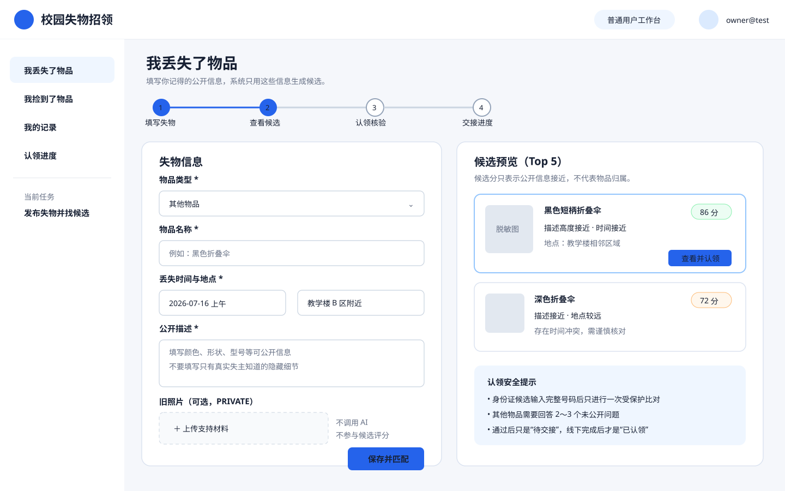

重点：普通用户任务入口、四阶段进度、失物公开信息、失主图片非 AI 提示、Top 5 候选和认领安全说明。

#### “我捡到了物品”原型

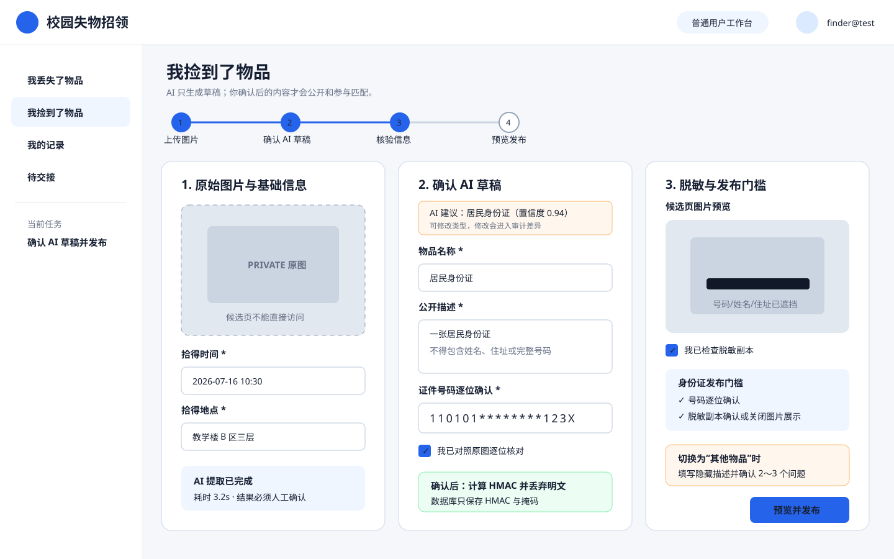

重点：四步发布向导、PRIVATE 原图、AI 草稿与人工确认分离、身份证逐位确认、脱敏预览和 OTHER 分支提示。

#### 管理员独立页面原型

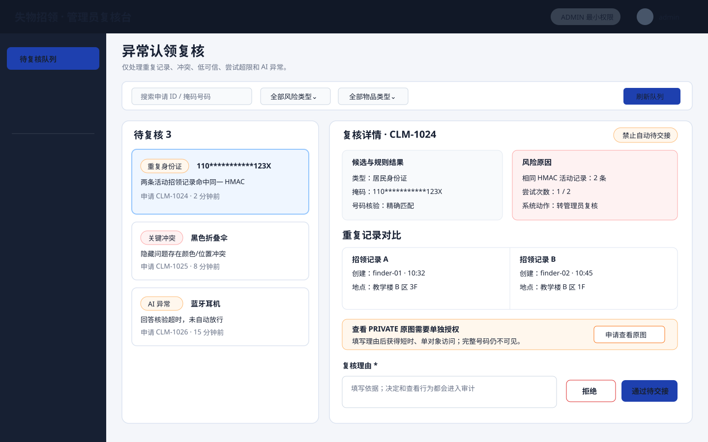

重点：独立 `/admin` 布局、异常队列、重复记录对比、原图临时授权、理由必填和“通过待交接/拒绝”动作。

## 5. 端到端执行模型

### 5.1 拾得者发布招领

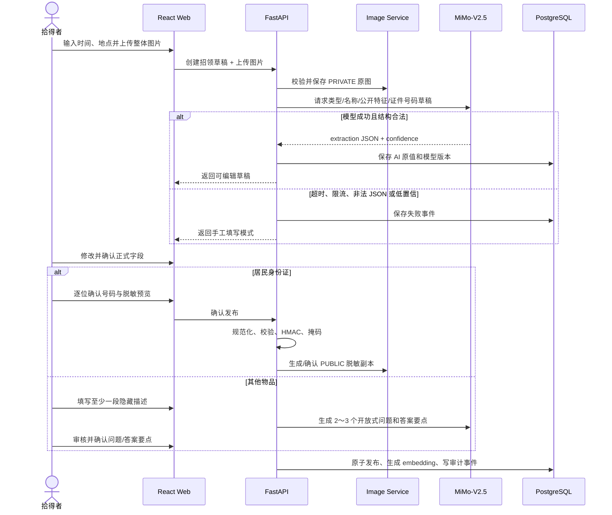

发布硬门槛：

- 所有类型：时间、地点、图片、正式名称、正式公开描述已确认。
- 身份证：类型只能为居民身份证；号码格式和校验位有效；拾得者逐位确认；脱敏副本已人工确认或选择不公开图片。
- 其他物品：隐藏描述非空；AI 生成 2～3 个不同维度的开放问题；问题和答案要点由拾得者确认。
- 任一门槛失败只保存 `DRAFT`，不得进入候选池。

### 5.2 失主发布失物并查看候选

1. 失主填写物品类型、丢失时间、地点、名称和公开描述。
2. 可选图片按 PRIVATE 支持材料保存，不调用多模态、不生成 embedding、不参与评分。
3. 服务端对确认的公开文本生成 embedding；按相同类型过滤招领记录。
4. 候选服务计算语义、时间、地点和完整度分，保存 Top 5 快照。
5. 前端仅展示 PUBLIC 摘要、分档理由和冲突，不返回内部坐标、向量、隐藏答案或联系方式。

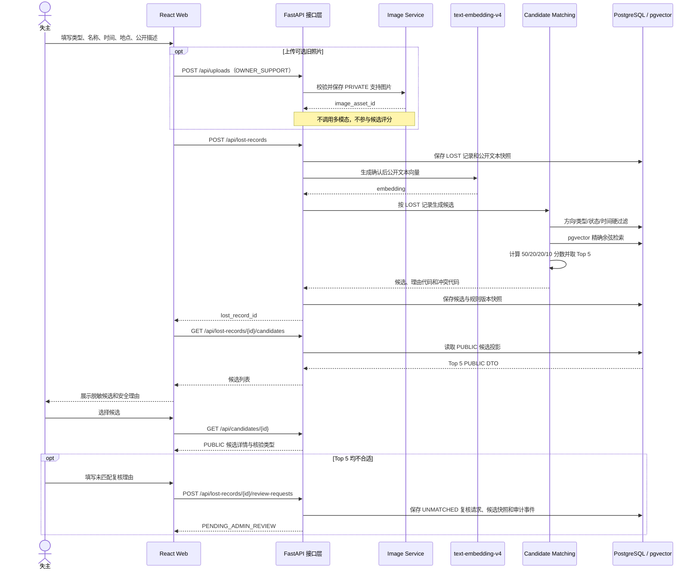

时序图中的失主图片只通过 Image Service 保存为 PRIVATE 材料，不经过 MiMo，也不生成图片向量。候选列表由服务端生成 PUBLIC DTO，前端不能从完整数据库对象中自行删除敏感字段。

### 5.3 身份证认领

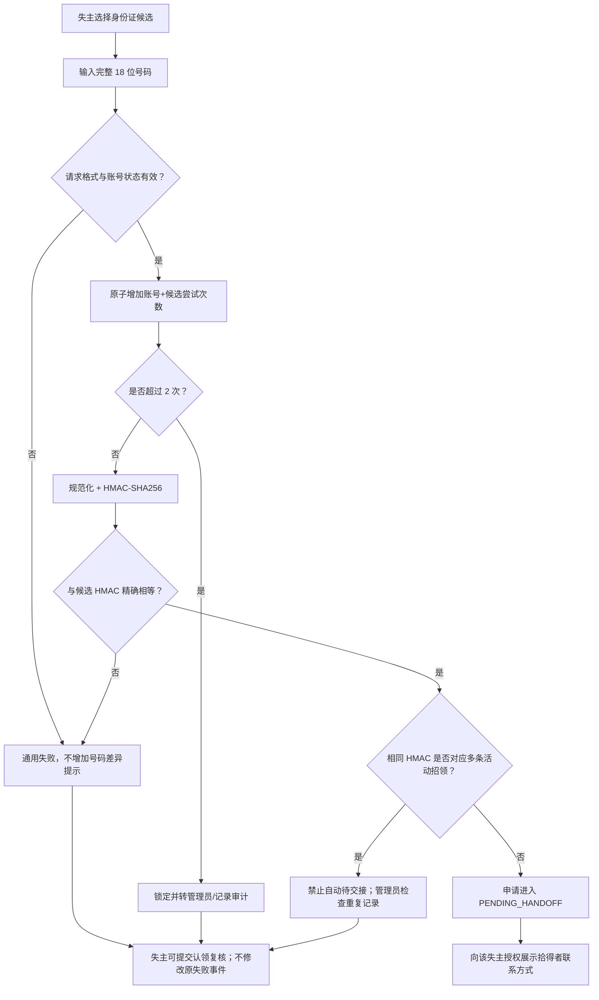

号码匹配成功不代表已认领；只有实物线下交接后，拾得者才能把记录改为 `CLAIMED/CLOSED`。

### 5.4 其他物品认领

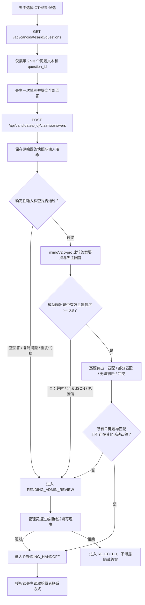

1. 失主选择候选后，服务端只返回问题文本和问题 ID，不返回标准答案或隐藏描述。
2. 失主一次提交 2～3 个开放式回答；服务端保存原始回答快照。
3. 规则先检查空回答、复制问题、明显冲突、异常重复提交。
4. mimoV2.5-pro 文本核验仅接收问题、答案要点和失主回答，返回每题结果、置信度和理由代码；不得生成面向失主的隐藏答案解释。
5. 所有关键题均为匹配、每题置信度 `>= 0.8`、模型输出合法且不存在其他活动认领时进入 `PENDING_HANDOFF`；否则进入 `PENDING_ADMIN_REVIEW`。
6. AI 超时、非法输出或低置信一律转管理员，不自动通过或拒绝。

候选 50/20/20/10 分数只用于 Top 5 排序和理由展示，不参与隐藏问答的二次加权。单题结果仍可映射为匹配 100、部分匹配 60、无法判断 30、冲突 0 供管理员解释，但不再计算综合认领可信度。

### 5.5 失主主动复核

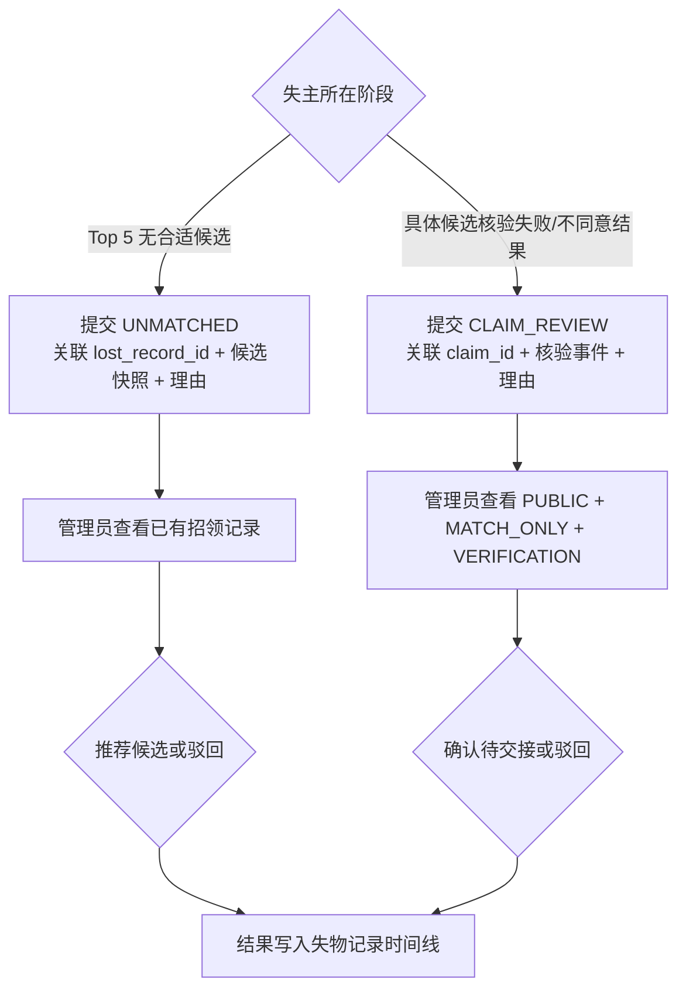

- 同一用户对同一 `lost_record_id` 或 `claim_id` 只允许存在一条活动复核请求，防止重复提交。
- 未匹配复核不创建虚假认领申请；管理员推荐候选后，失主仍需选择并完成对应类型核验。
- 认领复核不会覆盖原 AI/HMAC 结果；管理员决定作为新的事件追加。
- 两类请求都要求失主填写理由，但不得在理由中提交完整身份证号码或隐藏答案。

### 5.6 管理员复核与交接

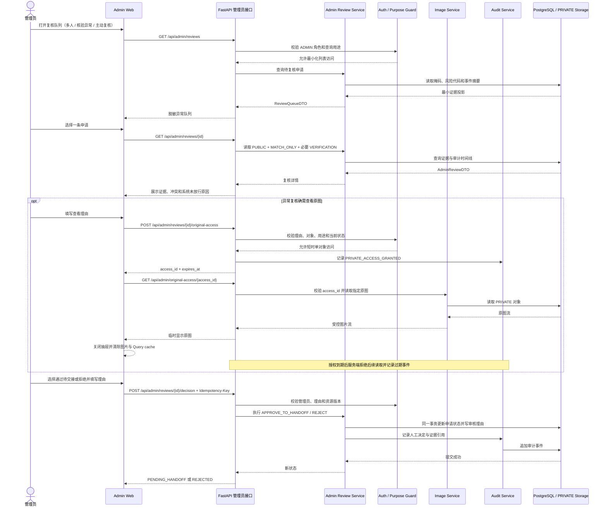

- 管理员工作台默认显示掩码、公开候选依据、内部得分、事件时间线、复核类型和风险代码。
- 其他物品复核可查看隐藏描述、答案要点和失主原始回答。
- 身份证重复记录复核默认仍只显示掩码、记录创建人、时间、原图指纹和审计事件。
- 如确需查看原图，可在 P1 实现“异常原图访问”；P0 主流程不依赖该能力，未实现时 PRIVATE 始终脱敏。
- 完整身份证号码没有管理员读取接口。
- 管理员可以 `APPROVE_TO_HANDOFF` 或 `REJECT`，必须填写理由；不能直接标记实物已交接。
- 待交接时，只有对应失主可以查看该招领的联系方式；拾得者完成线下交接后确认 `CLAIMED`。

## 6. 数据契约

### 6.1 枚举

枚举值是接口、数据库和状态机之间的稳定契约。数据库保存英文值，前端根据固定映射展示中文；前端不得直接把中文文案作为状态值提交。

#### 6.1.1 `UserRole`：账号权限角色

| 枚举值 | 中文名称 | 文字解释 |
|---|---|---|
| `USER` | 普通用户 | 可以按具体记录执行“我丢失了物品”或“我捡到了物品”任务；不是永久失主或拾得者角色。 |
| `ADMIN` | 管理员 | 使用预置管理账号访问 `/admin`，只处理异常复核和审计；不保管实物。 |

#### 6.1.2 `ItemType`：物品核验类型

| 枚举值 | 中文名称 | 文字解释 |
|---|---|---|
| `IDENTITY_DOCUMENT` | 身份证件类 | MVP 中仅指居民身份证；认领时使用完整号码的 HMAC 精确核验，不生成隐藏问题。 |
| `OTHER` | 其他物品 | 身份证以外的物品；通过公开信息生成候选，再使用 2～3 个隐藏问题核验。 |

#### 6.1.2.1 `PublicCategory`：物品展示类别（PUBLIC 字段）

| 枚举值 | 中文名称 | 对应 `ItemType` | 文字解释 |
|---|---|---|---|
| `ELECTRONICS` | 电子产品 | `OTHER` | 手机、耳机、充电宝等电子设备。 |
| `IDENTITY_CARD` | 证件卡片 | `IDENTITY_DOCUMENT` | 居民身份证、校园卡、学生证等证件类。 |
| `CLOTHING` | 服饰配饰 | `OTHER` | 衣物、包袋、手表、眼镜等。 |
| `STATIONERY` | 学习用品 | `OTHER` | 书本、文具、U 盘等。 |
| `OTHER` | 其他 | `OTHER` | 以上分类未涵盖的物品。 |

前端下拉框展示中文名称，后端保存英文枚举值到 `public_category`。当 `public_category` 为 `IDENTITY_CARD` 时，`item_type` 强制为 `IDENTITY_DOCUMENT`；其余均为 `OTHER`。`public_category` 用于**候选匹配硬过滤**（5 种类别各自独立匹配）和前端展示；`item_type` 决定认领核验分支，不影响候选匹配范围。

#### 6.1.2.2 `LocationEnum`：公开地点枚举

| 枚举值 | 中文名称 | 标准化代码（MATCH_ONLY） | 说明 |
|---|---|---|---|
| `DORMITORY` | 宿舍区 | `DORMITORY_AREA` | 学生宿舍楼区域。 |
| `CANTEEN` | 食堂 | `CANTEEN_AREA` | 校园食堂。 |
| `TEACHING_BUILDING` | 教学楼 | `TEACHING_BUILDING` | 日常上课教学楼。 |
| `RESEARCH_BUILDING` | 科教楼 | `RESEARCH_BUILDING` | 科研/实验楼。 |
| `LIBRARY` | 图书馆 | `LIBRARY` | 校园图书馆。 |

前端下拉框展示中文名称，后端保存中文枚举值到 `location_public`（PUBLIC），同时保存标准化代码到 `location_normalized`（MATCH_ONLY）用于匹配评分。

**地点接近度映射表：**

| 关系 | 得分 | 地点对 |
|---|---:|---|
| 同一地点 | 20 | 任意地点与自身 |
| 相邻建筑 | 14 | 教学楼 ↔ 科教楼；食堂 ↔ 宿舍区 |
| 同校园邻近 | 8 | 教学楼 ↔ 图书馆；食堂 ↔ 教学楼；宿舍区 ↔ 图书馆 |
| 明显无关 | 0 | 宿舍区 ↔ 科教楼；食堂 ↔ 科教楼；食堂 ↔ 图书馆 |

#### 6.1.3 `RecordKind`：记录方向

| 枚举值 | 中文名称 | 文字解释 |
|---|---|---|
| `LOST` | 失物记录 | 失主发布的“我丢失了物品”记录，只能与方向相反的 `FOUND` 记录生成候选。 |
| `FOUND` | 招领记录 | 拾得者发布的“我捡到了物品”记录，实物由拾得者保管，只能与 `LOST` 记录匹配。 |

#### 6.1.4 `RecordStatus`：失物/招领记录状态

| 枚举值 | 中文名称 | 文字解释 |
|---|---|---|
| `DRAFT` | 草稿 | 信息尚未满足发布门槛；允许继续修改，不进入正式候选池。 |
| `PROCESSING` | AI 处理中 | 正在执行图片提取、问题生成或发布前处理；失败后返回草稿而不是丢失数据。 |
| `PUBLISHED` | 已发布 | 已通过人工确认和类型专属发布门槛，可以参与候选匹配。 |
| `MATCHING_FAILED` | 匹配处理失败 | embedding、pgvector 或候选生成失败；记录仍保留，等待重试或规则降级。 |
| `PENDING_HANDOFF` | 待交接 | 某个认领申请已通过自动或人工核验，允许相关失主读取拾得者联系方式，但实物尚未确认交付。 |
| `CLAIMED` | 已认领 | 拾得者确认线下实物已经完成交接；这是业务完成状态，不等同于系统核验通过。 |
| `CLOSED` | 已关闭 | 记录生命周期结束，不再生成新候选；触发 PRIVATE 原图清理策略。 |
| `CANCELLED` | 已取消 | 创建者在允许条件下主动取消，记录不再参与候选匹配。 |

#### 6.1.5 `ClaimStatus`：认领申请状态

| 枚举值 | 中文名称 | 文字解释 |
|---|---|---|
| `SUBMITTED` | 已提交 | 失主已经提交身份证号码或 OTHER 问题回答，尚未开始核验。 |
| `VERIFYING` | 核验中 | 服务端正在执行确定性规则、HMAC 比对或 AI 回答核验。 |
| `PENDING_ADMIN_REVIEW` | 待管理员复核 | 存在重复记录、尝试超限、关键冲突、低置信或 AI 异常，禁止自动待交接。 |
| `PENDING_HANDOFF` | 待交接 | 核验通过，可以向对应失主展示拾得者授权联系方式。 |
| `REJECTED` | 已拒绝 | 管理员依据证据拒绝申请；系统不向申请人泄露隐藏答案或证件差异。 |
| `CLAIMED` | 已完成认领 | 对应拾得者已经确认线下交接完成。 |
| `LOCKED` | 已锁定 | 同账号同候选的身份证核验次数耗尽，系统不再执行新的自动号码比较。 |

#### 6.1.6 `DataClass`：数据安全级别

| 枚举值 | 中文名称 | 文字解释 |
|---|---|---|
| `PUBLIC` | 公开信息 | 可在普通候选页展示，例如名称、模糊时间地点、公开描述、掩码号码和确认后的脱敏图。 |
| `MATCH_ONLY` | 仅匹配使用 | 仅供候选引擎使用，例如精确时间、标准化地点、向量和内部得分；普通用户不能读取原值。 |
| `VERIFICATION` | 认领核验信息 | 只用于证明认领人是否知道未公开事实，例如隐藏描述、答案要点和原始回答。 |
| `PRIVATE` | 私密信息 | 身份、联系方式和原始敏感材料，例如原图、号码 HMAC、账号和支持图片；默认不向管理员完整展示。 |

#### 6.1.7 `ActorType`：审计事件操作者

| 枚举值 | 中文名称 | 文字解释 |
|---|---|---|
| `OWNER` | 失主任务操作者 | 普通用户在某条 LOST 记录或认领申请中的任务身份。 |
| `FINDER` | 拾得者任务操作者 | 普通用户在某条 FOUND 记录中的任务身份和实物保管责任。 |
| `ADMIN` | 管理员操作者 | 执行异常复核、临时原图授权和人工决定的管理员。 |
| `SYSTEM` | 系统规则 | 状态机、定时清理、确定性评分或自动路由产生的操作。 |
| `AI` | AI 能力 | 多模态提取、问题生成或回答核验产生的建议；不能代表最终人工决定。 |

#### 6.1.8 `ImagePurpose`：图片用途

| 枚举值 | 中文名称 | 文字解释 |
|---|---|---|
| `FINDER_ORIGINAL` | 拾得者原图 | 拾得者上传的 PRIVATE 原图，可进入受控图片理解和脱敏流程，不能直接出现在候选页。 |
| `PUBLIC_REDACTED` | 公开脱敏副本 | 从原图生成并经拾得者确认的 PUBLIC 图片，候选页只能访问这一版本。 |
| `OWNER_SUPPORT` | 失主支持图片 | 失主可选上传的 PRIVATE 材料，不调用多模态、不生成图片向量、不参与候选评分。 |

#### 6.1.9 `RedactionStatus`：图片脱敏状态

| 枚举值 | 中文名称 | 文字解释 |
|---|---|---|
| `NOT_REQUIRED` | 无需脱敏 | 图片不公开或不包含需要进入公开候选页的身份证敏感区域。 |
| `PENDING` | 待脱敏/待确认 | 已生成或正在生成遮挡副本，但拾得者尚未确认，不能作为 PUBLIC 图片。 |
| `CONFIRMED` | 已确认脱敏 | 服务端已生成脱敏副本且拾得者完成预览确认，可以进入候选 PUBLIC DTO。 |
| `FAILED` | 脱敏失败 | 无法可靠定位或遮挡敏感区域；必须手工框选或选择不公开图片。 |

#### 6.1.10 `ExtractionStatus`：AI 图片提取状态

| 枚举值 | 中文名称 | 文字解释 |
|---|---|---|
| `SUCCEEDED` | 提取成功 | 模型返回结构合法的草稿；仍需拾得者修改和确认。 |
| `INVALID` | 输出无效 | 返回非法 JSON、类型越界或缺少必要字段，不能直接生效。 |
| `TIMEOUT` | 调用超时 | 外部模型在限定时间内没有完成，保留图片和草稿并允许手填。 |
| `FALLBACK` | 已降级 | 系统已从模型处理切换为手工填写或 mock 演示路径。 |

#### 6.1.11 `QuestionResult`：OTHER 单题核验结果

| 枚举值 | 中文名称 | 分值 | 文字解释 |
|---|---|---:|---|
| `MATCH` | 匹配 | 100 | 核心事实与答案要点一致；数字、字母等精确特征规范化后完全一致。 |
| `PARTIAL_MATCH` | 部分匹配 | 60 | 方向一致但缺少非关键细节，不能单独证明归属。 |
| `UNDETERMINED` | 无法判断 | 30 | 回答过于笼统、问题质量不足或模型无法稳定判断；必须转管理员。 |
| `CONFLICT` | 冲突 | 0 | 回答与隐藏事实存在关键矛盾；系统不自动拒绝，转管理员复核。 |

#### 6.1.12 其它受控枚举

| 枚举 | 枚举值 | 文字解释 |
|---|---|---|
| `DocumentType` | `CN_RESIDENT_ID` | MVP 唯一支持的证件类型：中华人民共和国居民身份证。 |
| `AdminDecision` | `APPROVE_TO_HANDOFF` | 管理员通过复核，使申请进入待交接；不表示实物已交付。 |
| `AdminDecision` | `REJECT` | 管理员填写理由后拒绝申请。 |
| `ReviewRequestType` | `UNMATCHED` | Top 5 没有合适候选时，由失主针对失物记录提交；管理员可以推荐已有招领候选或驳回。 |
| `ReviewRequestType` | `CLAIM_REVIEW` | 具体候选核验失败、无法判断或失主不同意结果时，由失主针对认领申请提交；管理员可以确认待交接或驳回。 |

### 6.2 核心表

#### `users`

| 字段 | 类型 | 约束 |
|---|---|---|
| `id` | UUID | 主键 |
| `email` | varchar | 唯一、规范化 |
| `password_hash` | varchar | 不保存明文 |
| `phone_encrypted` | bytea/varchar | PRIVATE，交接授权后返回脱敏/明文所需值 |
| `role` | enum | `USER` 或 `ADMIN` |
| `created_at` | timestamptz | 服务端生成 |

#### `item_records`

| 字段 | 类型 | 说明 |
|---|---|---|
| `id` | UUID | 主键 |
| `owner_user_id` | UUID | 记录创建者 |
| `kind` | enum | LOST / FOUND |
| `item_type` | enum | IDENTITY_DOCUMENT / OTHER（决定核验分支） |
| `public_category` | enum | 电子产品/证件卡片/服饰配饰/学习用品/其他（决定候选匹配过滤） |
| `status` | enum | 状态机控制 |
| `name_public` | text | 人工确认后的名称 |
| `description_public` | text | 人工确认后的公开描述 |
| `event_time_exact` | timestamptz | MATCH_ONLY |
| `event_time_public` | text | PUBLIC 模糊时间 |
| `location_public` | text | PUBLIC |
| `location_normalized` | jsonb | MATCH_ONLY，标准化区域/坐标 |
| `embedding` | vector(D) | 仅确认的公开文本；D 由模型配置锁定 |
| `ai_extraction_id` | UUID nullable | FOUND 图片提取快照 |
| `published_at` | timestamptz nullable | 发布后不可为空 |
| `version` | integer | 乐观锁 |

#### `image_assets`

| 字段 | 类型 | 说明 |
|---|---|---|
| `id` | UUID | 主键 |
| `record_id` | UUID | 所属记录 |
| `purpose` | enum | FINDER_ORIGINAL / PUBLIC_REDACTED / OWNER_SUPPORT |
| `data_class` | enum | PRIVATE 或 PUBLIC |
| `object_key` | text | 不暴露真实路径 |
| `sha256` | char(64) | 文件完整性/重复辅助，不是身份证号码哈希 |
| `mime_type` / `size_bytes` | 基础类型 | 白名单与限制 |
| `redaction_status` | enum | NOT_REQUIRED / PENDING / CONFIRMED / FAILED |
| `delete_after` | timestamptz nullable | 记录关闭后清理 |

#### `ai_extractions`

| 字段 | 类型 | 说明 |
|---|---|---|
| `id` | UUID | 主键 |
| `record_id` | UUID | 招领草稿 |
| `provider/model/version` | text | 可追溯模型信息 |
| `raw_result` | jsonb | PRIVATE；不得直接成为公开字段 |
| `suggested_type/name/description` | 结构化字段 | 草稿 |
| `confidence` | jsonb | 各字段置信度 |
| `confirmed_snapshot` | jsonb | 人工确认后的差异快照 |
| `status` | enum | SUCCEEDED / INVALID / TIMEOUT / FALLBACK |

`raw_result` 中的完整证件号码必须在完成规范化/HMAC 后删除或替换为掩码；若供应商响应必须留证，只保留字段是否存在、长度、置信度和受控摘要，不保存明文号码。

#### `identity_document_secrets`

| 字段 | 类型 | 约束 |
|---|---|---|
| `found_record_id` | UUID | 一对一主键 |
| `document_type` | enum | MVP 固定 `CN_RESIDENT_ID` |
| `number_hmac` | bytea | HMAC-SHA256；不可唯一，因为要识别重复招领 |
| `number_masked` | varchar(18) | 前 3 后 4，其余 `*` |
| `number_last4` | char(4) | 可并入掩码，不单独公开 |
| `finder_confirmed_at` | timestamptz | 未确认不得发布 |
| `key_version` | smallint | 支持密钥轮换追溯 |

#### `verification_sets` 与 `verification_questions`

- 每个 OTHER 招领记录一个有效 `verification_set`。
- `hidden_description` 为 VERIFICATION，至少一段可验证事实。
- 每组必须有 2～3 个问题；保存 `question_text`、`answer_key`、`dimension`、`ai_raw`、`finder_confirmed_at`。
- 问题不得包含答案，不得询问 PUBLIC 已公开信息，不得生成隐藏描述中不存在的事实。

#### `candidate_matches`

保存失物与招领记录对、四项得分、总分、理由代码、冲突代码、embedding 模型版本和输入快照哈希。候选重新计算时新增版本，不覆盖答辩所需旧快照。

#### `claims`、`claim_attempts`、`admin_reviews`

- `claims`：候选、申请人、类型、状态、自动/人工来源、最终理由。
- `claim_attempts`：每次身份证或问答提交的时间、结果代码和风险标记；身份证仅存输入 HMAC/是否相等，不存明文。
- `admin_reviews`：管理员、决定、理由、读取过的证据级别和时间。

#### `review_requests`

- `id`、`requester_user_id`、`request_type`、`lost_record_id nullable`、`claim_id nullable`、`reason`、`status`、`candidate_snapshot_id nullable`、`created_at`、`resolved_at`。
- `UNMATCHED` 必须且只能关联 `lost_record_id`；`CLAIM_REVIEW` 必须且只能关联 `claim_id`。
- 同一用户与同一目标最多存在一条活动复核请求；管理员结果写入 `admin_reviews`，不覆盖原候选或核验事件。

#### `audit_events`

只追加，不允许业务接口更新或删除。字段包括：`event_id`、`aggregate_type/id`、`event_type`、`actor_type/id`、`request_id`、`rule_version`、`model_version`、`input_snapshot_hash`、`result_code`、`metadata_redacted`、`created_at`。

### 6.3 数据不变量

1. `PUBLISHED` 招领必须存在确认后的公开字段和拾得者原图。
2. IDENTITY_DOCUMENT 招领必须有 `identity_document_secrets`，且不能有有效隐藏问题集。
3. OTHER 招领必须有 2～3 个已确认问题，且不能有身份证 HMAC。
4. PUBLIC 候选图片只能引用 `PUBLIC_REDACTED + CONFIRMED`。
5. 同一失主、同一候选的身份证尝试次数不得超过 2。
6. 同一 HMAC 对应多个活动招领时，相关申请不能自动进入待交接。
7. `PENDING_HANDOFF` 才能授权查看拾得者联系方式。
8. `CLAIMED` 只能由对应拾得者或管理员在有线下证明的异常流程触发；MVP 正常路径仅拾得者触发。
9. 未匹配复核不能直接把记录改为待交接；管理员推荐候选后仍需失主发起对应类型认领核验。
10. 认领复核确认只能把申请改为 `PENDING_HANDOFF`，不能直接改为 `CLAIMED`。

## 7. 数据库、索引与事务

### 7.1 扩展与索引

```sql
CREATE EXTENSION IF NOT EXISTS vector;
```

设计索引：

- `item_records(kind, public_category, status, published_at)`：候选硬过滤，`public_category` 精确匹配。
- `candidate_matches(lost_record_id, total_score DESC)`：Top 5。
- `identity_document_secrets(number_hmac)`：匹配成功后的重复记录检查；不加唯一约束。
- `claim_attempts(user_id, candidate_id, created_at)`：尝试次数与审计。
- `audit_events(aggregate_type, aggregate_id, created_at)`：时间线。
- MVP 数据量小，对 `embedding` 使用精确余弦查询，不创建 ANN 索引。

### 7.2 事务边界

| 操作 | 同一事务必须完成 |
|---|---|
| 发布招领 | 校验状态、确认值快照、类型专属数据、发布事件 |
| 创建候选快照 | 分数、理由、模型/规则版本和审计事件 |
| 身份证尝试 | 行锁/原子计数、HMAC 比较结果、状态变化、审计事件 |
| 管理员决定 | 申请状态、理由、授权撤销和审计事件 |
| 失主提交复核 | 防重复检查、复核请求、候选/核验快照引用和审计事件 |
| 拾得者确认交接 | claim、found/lost record 状态和联系方式授权关闭 |

外部模型调用不持有数据库事务。先保存草稿任务，再调用模型，再用记录版本做条件更新，防止超时期间用户修改导致旧结果覆盖新值。

## 8. 模块设计

### 8.1 Auth / RBAC

- 注册、登录、refresh、退出；access token 短时有效，refresh token 可撤销。
- `USER` 可创建 LOST/FOUND；只能操作自己的记录和申请。
- `ADMIN` 只能通过管理员路由复核，不因角色自动获得全部 PRIVATE 数据。
- 每次授权判断输入 `actor_id + resource_owner + record_status + purpose`，拒绝结果也写安全日志，但不写敏感请求体。

### 8.2 Image Service

- 接受 JPEG/PNG/WebP；校验 MIME、魔数、最大大小和像素上限；随机化对象键。
- PRIVATE 与 PUBLIC 物理目录分离；PUBLIC 文件只能由脱敏流程产生。
- 身份证脱敏：模型/OCR 返回号码区域候选 → 服务端绘制不可逆遮挡 → 拾得者预览确认。
- 自动定位失败：允许手工框选；仍失败时只发布掩码文本，不公开图片。
- 管理员临时原图访问为 P1；实现时使用一次性授权 ID，不返回文件系统路径，授权过期或完成即失效。P0 未实现时 PRIVATE 始终脱敏。
- 记录关闭后调度删除 PRIVATE 原图并产生 `PRIVATE_IMAGE_DELETED` 审计事件。

### 8.3 Multimodal Adapter

统一接口：

```text
extract_found_item(image_ref, context) -> ExtractionDraft
generate_questions(hidden_description) -> QuestionSetDraft
verify_answers(question_set, answers) -> VerificationResult
```

适配器负责 OpenAI 兼容请求、超时、有限重试、响应 JSON 提取、Pydantic 校验、敏感字段清理和模型元数据。业务模块不依赖供应商原始响应格式。

### 8.4 Item Service

- 管理草稿、人工确认、发布、取消和关闭。
- 使用按类型策略 `IdentityDocumentPolicy` / `OtherItemPolicy`，避免大量散落条件分支。
- 正式公开字段只能来自 `confirmed_snapshot`。
- 发布后修改影响 embedding 或核验事实时必须生成新版本并重新计算候选；已经进入待交接的记录不能静默修改。

### 8.5 Candidate Matching

- `public_category`（5 种）一致为硬门槛。不同类别（如电子产品与学习用品）之间不能成为候选。`item_type`（`IDENTITY_DOCUMENT` / `OTHER`）决定认领核验分支，不决定候选范围。
- 只处理活动、已发布、方向相反的记录。
- 对每个失物记录返回 Top 5；低于最低展示阈值不展示。
- 地点评分分两层：下拉框粗匹配（同值 20 / 相邻 14 / 邻近 8 / 无关 0）+ 详细描述语义相似度（在 50 分语义分中体现）。即使失主记错楼层或具体位置，只要详细描述语义接近仍可匹配。
- 候选理由使用固定代码映射为安全文案，不把 MATCH_ONLY 原值拼进前端解释。
- Top 5 无合适候选时允许记录创建者提交 `UNMATCHED` 复核；该操作不改变评分、不自动扩大候选范围。

### 8.6 ID Verification

- 规范化、格式校验、校验位、HMAC、掩码、尝试限制均为纯函数/确定性服务。
- 请求只接受 `candidate_id + full_number`；服务端不回显号码。
- 使用候选关联记录的 HMAC 做常量时间比较。
- 失败统一返回 `IDENTITY_NOT_VERIFIED`；前端不得区分格式正确但不匹配、某位错误或记录不存在。
- 成功后再检查相同 HMAC 的活动招领数量；数量不为 1 则转管理员。
- 失败或锁定后可由失主提交 `CLAIM_REVIEW`，但完整号码不进入复核理由、管理员 DTO 或 LLM。

### 8.7 Other Verification

- 问题生成与回答核验分开保存模型版本。
- 生成阶段必须验证问题数 2～3、开放式、维度不重复、无答案泄露。
- 核验阶段输出固定 JSON：每题结果、硬冲突、缺失、置信度、理由代码；不再计算与候选分混合的综合认领可信度。
- 任何解析失败、模型低置信或安全规则冲突都不能自动通过。
- 仅所有关键问题均匹配、每题置信度 `>= 0.8` 且不存在其他活动认领时自动进入待交接。

### 8.8 Admin Review

- 队列来源固定为五类：多人认领、普通物品核验未通过、证件核验异常、`UNMATCHED` 主动复核、`CLAIM_REVIEW` 主动复核。
- 复核读取采用专用 DTO；每次查看 VERIFICATION 或临时查看原图都写事件。
- 决定必须带非空理由和证据引用；重复提交使用幂等键。
- 未匹配复核只允许推荐候选或驳回；认领复核和异常认领只允许确认进入待交接或驳回。

### 8.9 Audit Service

- 与业务事务一起写关键事件；外部模型调用另写开始/成功/失败事件。
- 普通日志用于运维，审计事件用于证据链；两者都必须经过字段脱敏。
- 展示时间线时按角色投影，普通用户看不到管理员内部备注和 PRIVATE 元数据。

## 9. 候选检索、切片与评分

### 9.1 文本组织与“切片”策略

本系统不是 FAQ 长文检索，不把一个物品拆成多个 chunk。**一个已确认记录就是一个检索单元**，避免同一物品多个向量导致重复候选。

规范化文本模板：

```text
类型：{item_type}
名称：{name_public}
公开描述：{description_public}
公开区域：{location_public}
```

不进入模板：原图、失主支持图片、完整/掩码号码、隐藏描述、问题答案、联系方式、精确坐标。

### 9.2 召回与评分

1. SQL 硬过滤：方向相反、`public_category` 相同、状态为 PUBLISHED、时间在允许窗口内。
2. 对过滤结果执行 pgvector 精确余弦距离，得到 `semantic_similarity`。
3. 计算 100 分：

| 维度 | 分值 | 规则 |
|---|---:|---|
| 公开描述语义 | 50 | `clamp(cosine_similarity, 0, 1) * 50` |
| 时间接近 | 20 | 按小时/天分档，明显冲突记硬风险 |
| 地点接近 | 20 | 同区域/相邻区域/远距离分档 |
| 信息完整度 | 10 | 双方关键公开字段完整程度，不奖励敏感字段 |

4. 总分只决定候选排序，不证明归属，也不单独触发待交接。
5. 保存 Top 5 和评分快照；前端只显示“描述高度接近、时间接近、地点相邻”等安全文案。

### 9.3 embedding 失败

- 记录可保存为 `MATCHING_FAILED` 或 `PUBLISHED` 且带待重试标记。
- 演示降级允许用时间 + 地点 + 完整度生成低可信候选，但必须标记 `RULE_FALLBACK`，且所有认领转管理员，不能自动待交接。

### 9.4 OTHER 自动路由规则

```text
auto_handoff =
    all_questions_answered_once
    and every_critical_question_result == MATCH
    and every_question_confidence >= 0.80
    and model_output_is_valid
    and active_claim_count_for_found_record == 1
    and not answer_leakage_or_retry_risk
```

候选分只用于 Top 5 排序，不参与上述核验结论。不满足时统一进入管理员复核，不由系统自动拒绝；失主也可以对结果提交 `CLAIM_REVIEW`。

## 10. Prompt 与模型输出设计

### 10.1 图片提取系统提示词约束

```text
你是失物招领发布草稿助手。只描述图片中可见事实，不推测所有权、姓名或不可见细节。
输出严格 JSON：item_type、name、public_description、id_number_candidate、
id_number_region、field_confidence、warnings。
item_type 只能为 IDENTITY_DOCUMENT 或 OTHER。
若不能确定字段，值为 null 并在 warnings 说明；禁止补全模糊字符。
公开描述不得包含完整身份证号码、姓名、地址或隐藏核验答案。
```

服务端额外规则：`id_number_candidate` 只供本次确认页使用，持久化前转换为 HMAC/掩码；模型返回的姓名、住址等字段直接丢弃。

### 10.2 隐藏问题生成提示词

```text
根据拾得者提供的隐藏描述生成 2～3 个开放式认领问题及答案要点。
只能改写描述中明确存在的事实，不得创造新细节。
问题不得包含答案，不得询问候选页已公开内容，不得用是/否题。
每题关注不同维度。若描述不足以生成至少 2 个有效问题，返回 can_publish=false。
输出严格 JSON：can_publish、questions[{text, answer_key, dimension}]、warnings。
```

### 10.3 回答核验提示词

```text
比较失主回答与拾得者确认的答案要点。允许同义表达，不允许根据常识补足缺失事实。
不得输出或改写隐藏答案给失主。发现关键冲突时 hard_conflict=true。
输出严格 JSON：items[{question_id, score_0_to_1, conflict, reason_code}],
overall_score、confidence、hard_conflict、needs_admin_review。
```

### 10.4 输出校验

- Pydantic 禁止额外字段；数值限定范围；问题数限定 2～3。
- 非法 JSON 只重试一次；第二次失败进入手工/管理员降级。
- prompt、schema、阈值都有版本号并进入审计。
- 模型自然语言理由不直接给普通用户，只使用固定 `reason_code` 映射。

## 11. 拒绝与安全规则

| 条件 | 处理 | 对外提示 |
|---|---|---|
| 上传非白名单、过大或损坏图片 | 400，拒绝保存 | 图片格式或大小不符合要求 |
| AI 无法识别 | 保存草稿，切换手填 | 暂时无法自动识别，请手动填写 |
| 拾得者未确认 AI 字段 | 禁止发布 | 请确认物品信息 |
| 身份证号码无效/未逐位确认 | 仅草稿 | 请检查并确认号码 |
| 身份证脱敏未确认 | 不公开图片，可仅文本发布 | 请确认脱敏预览或关闭图片展示 |
| OTHER 隐藏描述无法生成 2 个问题 | 仅草稿 | 隐藏描述不足，请补充可验证细节 |
| 失主图片上传 | 仅 PRIVATE 保存 | 不显示“AI 已分析” |
| 身份证号码不匹配 | 记录尝试，通用失败 | 无法完成验证 |
| 同账号同候选第 2 次仍失败 | 锁定组合、转管理员 | 尝试次数已用完 |
| 同 HMAC 多条活动招领 | 禁止自动待交接 | 需要人工复核 |
| OTHER AI 低置信/超时 | 转管理员 | 已提交人工复核 |
| 未到待交接读取联系方式 | 403 + 安全事件 | 无权查看 |
| 管理员无理由查看原图 | 403 | 需要填写复核理由 |

## 12. REST API 设计

统一响应包含 `request_id`；错误使用稳定 `error_code`，不把异常堆栈或敏感差异返回前端。创建/状态变更接口支持 `Idempotency-Key`。

| 方法与路径 | 权限 | 请求要点 | 成功结果 | 关键错误 |
|---|---|---|---|---|
| `POST /api/auth/register` | 公开 | email/password/phone | 用户与 token | EMAIL_EXISTS |
| `POST /api/auth/login` | 公开 | email/password | access/refresh | INVALID_CREDENTIALS |
| `POST /api/auth/refresh` | refresh | refresh token | 新 token | TOKEN_REVOKED |
| `POST /api/uploads` | USER | image/purpose | 私有 asset_id | FILE_INVALID |
| `POST /api/found-records` | USER | time/location/image_asset | DRAFT | FIELD_INVALID |
| `POST /api/found-records/{id}/extract` | 创建者 | draft version | extraction draft | MODEL_UNAVAILABLE |
| `PUT /api/found-records/{id}/confirmation` | 创建者 | confirmed fields/type | updated DRAFT | VERSION_CONFLICT |
| `POST /api/found-records/{id}/identity-confirmation` | 创建者 | full_number + digit_confirmed | masked preview/HMAC saved | ID_INVALID |
| `POST /api/found-records/{id}/redaction` | 创建者 | region/preview confirmation | PUBLIC asset | REDACTION_FAILED |
| `POST /api/found-records/{id}/questions` | 创建者 | hidden_description | 2～3 question drafts | HIDDEN_INFO_INSUFFICIENT |
| `POST /api/found-records/{id}/publish` | 创建者 | expected_version | PUBLISHED | PUBLISH_GUARD_FAILED |
| `POST /api/lost-records` | USER | type/time/location/name/description/optional image | LOST record | FIELD_INVALID |
| `GET /api/lost-records/{id}/candidates` | 创建者 | page | PUBLIC Top 5 | NOT_OWNER |
| `GET /api/candidates/{id}` | 相关失主 | candidate | PUBLIC detail | NOT_FOUND |
| `POST /api/lost-records/{id}/review-requests` | 创建者 | reason | UNMATCHED review | ACTIVE_REVIEW_EXISTS |
| `POST /api/candidates/{id}/claims/identity` | 相关失主 | full_number | failed/review/handoff | IDENTITY_NOT_VERIFIED / ATTEMPT_LOCKED |
| `GET /api/candidates/{id}/questions` | 相关失主 | none | question text only | WRONG_ITEM_TYPE |
| `POST /api/candidates/{id}/claims/answers` | 相关失主 | question_id/answer[] | review/handoff | ANSWER_INVALID |
| `POST /api/claims/{id}/review-requests` | 申请人 | reason | CLAIM_REVIEW | ACTIVE_REVIEW_EXISTS |
| `GET /api/admin/reviews` | ADMIN | filters | masked queue | FORBIDDEN |
| `GET /api/admin/reviews/{id}` | ADMIN | none | minimized evidence | FORBIDDEN |
| `POST /api/admin/reviews/{id}/original-access` | ADMIN，P1 | reason | short-lived access_id | REASON_REQUIRED |
| `GET /api/admin/original-access/{access_id}` | ADMIN + 临时授权，P1 | access_id | controlled PRIVATE image stream | ACCESS_EXPIRED / FORBIDDEN |
| `POST /api/admin/reviews/{id}/decision` | ADMIN | APPROVE/REJECT + reason | new claim state | VERSION_CONFLICT |
| `GET /api/admin/audit-events` | ADMIN | record_id/claim_id/request_id/time filters | redacted audit events | FORBIDDEN |
| `GET /api/claims/{id}/contact` | 相关失主 | none | finder contact | HANDOFF_NOT_READY |
| `POST /api/claims/{id}/handoff-complete` | 对应拾得者 | confirmation | CLAIMED/CLOSED | NOT_FINDER |
| `GET /api/records/{id}/timeline` | 相关用户/admin | none | role-projected audit | FORBIDDEN |

## 13. 状态机

### 13.1 招领记录

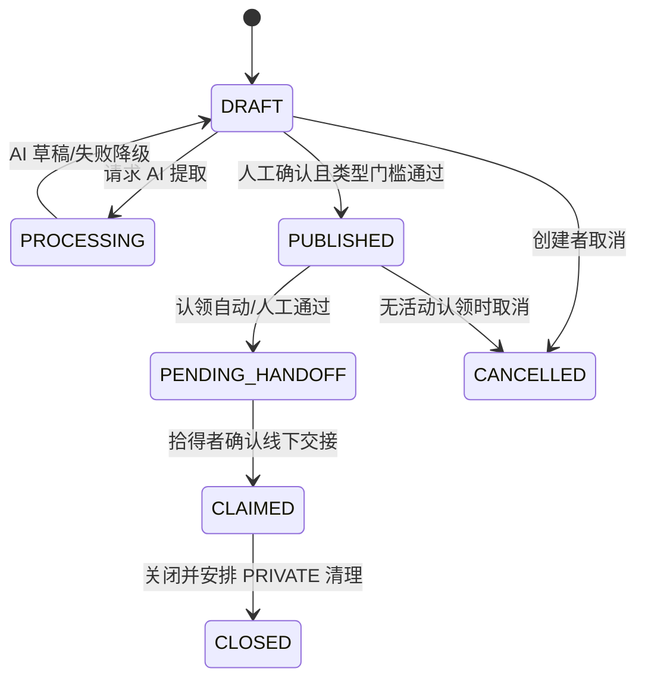

### 13.2 认领申请

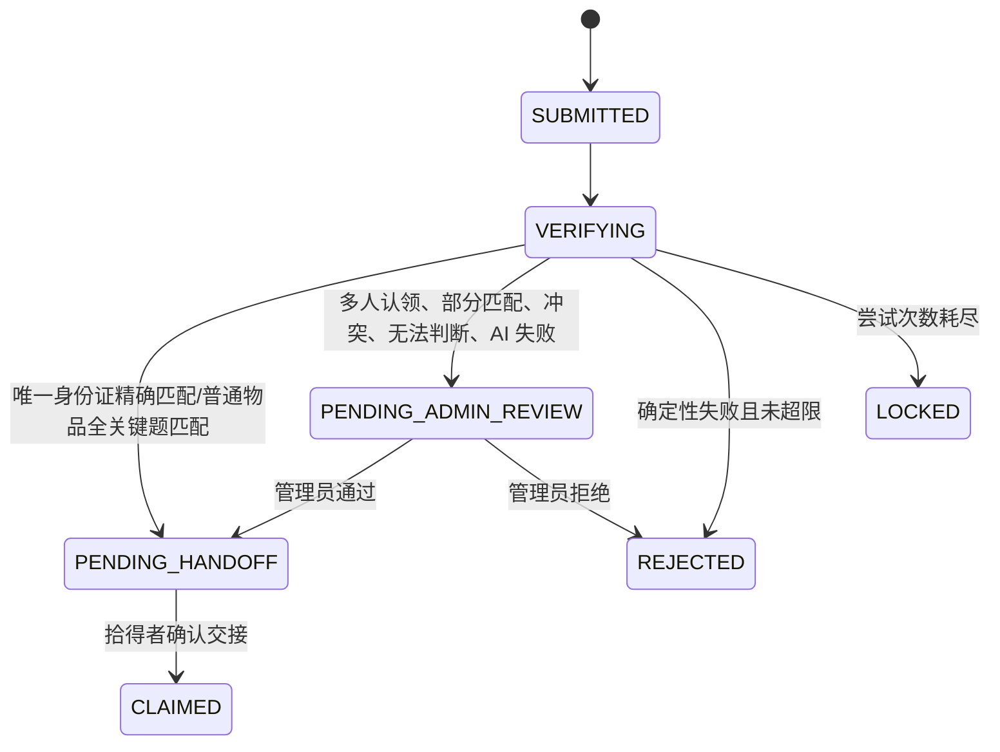

所有转换使用服务端状态机；前端传目标状态不具有决定权。

### 13.3 主动复核请求

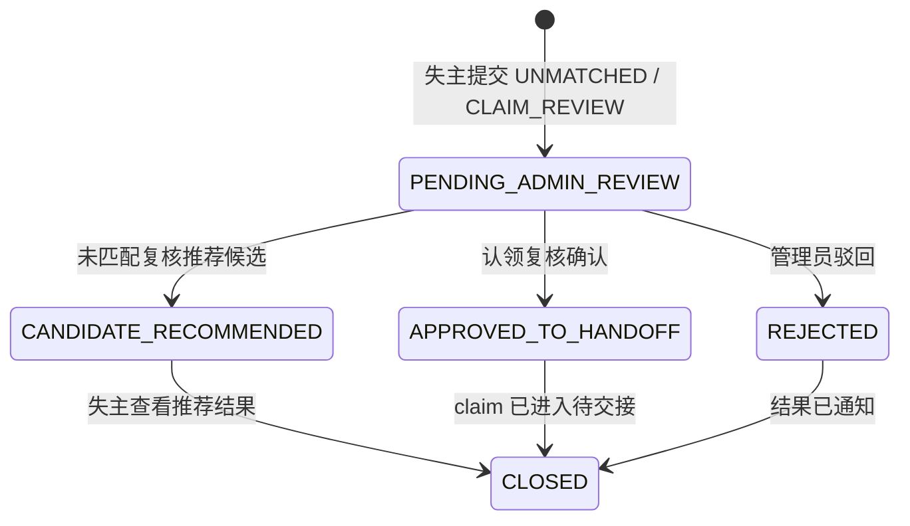

未匹配复核的 `CANDIDATE_RECOMMENDED` 不等于认领通过；失主仍需选择候选并完成身份证或普通物品核验。

## 14. 身份证规范化、HMAC 与脱敏

### 14.1 规范化

1. 去除首尾空白以及用户输入中的空格、短横线。
2. 将末位 `x` 转为 `X`。
3. 只接受 18 位居民身份证格式；前 17 位数字，末位数字或 X。
4. 校验出生日期片段和国家标准校验位；15 位旧号码不在 MVP 范围。
5. 校验失败返回通用错误，普通日志只记 `format_invalid=true`。

### 14.2 HMAC

```text
normalized = normalize_cn_resident_id(input)
digest = HMAC-SHA256(secret[key_version], normalized UTF-8)
```

- 密钥只从环境/秘密管理注入，不写仓库、数据库或日志。
- 数据库存 `digest + key_version + masked`，不存明文。
- 候选核验时对目标记录 digest 使用常量时间比较。
- 密钥轮换采用版本化双读/新写；两天 MVP 可固定一个版本，但数据模型保留版本。
- 普通 SHA-256 被拒绝，因为居民身份证格式固定，存在离线枚举风险。

### 14.3 掩码和图片

- 18 位号码展示：前 3 位 + 11 个 `*` + 后 4 位。
- 掩码用于候选发现，不用于精确判断。
- 脱敏图必须遮挡完整号码、姓名和住址等可识别区域；若只能可靠遮挡号码但其它敏感字段仍可见，则不公开图片。
- 原图访问与脱敏副本访问使用不同 API 和对象键。

## 15. 失败和降级策略

| 失败场景 | 系统处理 |
|---|---|
| 图片理解大模型超时、限流或服务异常 | 保留已上传原图、表单和当前草稿，不伪造识别结果；由拾得者手工填写名称、类型和公开描述。 |
| 图片理解输出不是合法 JSON、字段缺失或置信度过低 | 拒绝结果直接生效，记录 `MODEL_OUTPUT_INVALID` 或低置信事件，进入人工编辑页；只有拾得者确认后的字段才能成为正式业务事实。 |
| 图片模糊、损坏或无法识别有效物品 | 明确提示图片不可读，允许重新上传或手工填写；不得根据常识生成不存在的物品名称、特征或证件号码。 |
| 其他物品隐藏描述不足 | 不调用或停止问题生成，不允许正式发布；记录缺失原因并保持 `DRAFT`，提示拾得者补充能够形成 2～3 个开放式问题的隐藏描述。 |
| 隐藏问题生成超时或输出非法 | 非法 JSON 仅修复重试 1 次；仍失败则记录 `QUESTION_GENERATION_FAILED` 并保持草稿，允许拾得者补充隐藏描述后再次发起，不生成虚假问题。 |
| 认领回答核验大模型超时 | 不对业务判断反复重试，不自动通过或拒绝；保存失主原始回答和失败事件，将认领转为 `PENDING_ADMIN_REVIEW`。 |
| 认领核验输出非法、低置信、部分匹配、冲突或无法判断 | 服务端拒绝自动进入待交接，统一转管理员复核；管理员必须查看必要证据并填写确认或驳回理由，候选高分不能覆盖核验异常。 |
| Embedding 服务超时、维度错误或向量入库失败 | 记录仍可保存并标记待后台重试；演示降级可按时间、地点和信息完整度生成低可信候选，标记 `RULE_FALLBACK`，该路径的认领必须转管理员，不能自动待交接。 |
| 身份证图片识别失败或号码草稿不完整 | 多模态结果只作草稿，拾得者必须手工修正并逐位确认；未确认号码不得生成 HMAC、不得发布。身份证最终核验始终使用服务端确定性规则，不降级为 LLM 判断。 |
| 身份证号码连续不匹配、同一 HMAC 存在多条活动招领或核验服务异常 | 返回统一失败提示，不泄露错误位数或更多号码信息；同账号同候选第 2 次失败后锁定，重复记录和服务异常进入管理员复核。 |
| 身份证图片脱敏失败 | 原图始终保持 `PRIVATE`，禁止作为候选图片公开；允许拾得者手工框选遮挡区域，仍失败则只发布掩码文本、不展示图片，并记录 `REDACTION_FAILED`。 |
| 外部 AI 服务连续失败 | 同一能力连续 3 次超时或 `5xx` 后触发熔断；熔断期间图片识别转手填、问题生成保持草稿、Embedding 排队重试、回答核验转管理员。60 秒后进入半开状态试探 1 次。 |
| 管理员确认或驳回未填写理由 | 前端禁止提交，后端再次校验并拒绝写入；不改变认领状态，不产生不完整的管理员决定事件。 |
| 重复提交认领、复核、管理员决定或交接确认 | 使用幂等键和当前版本校验返回既有结果；不得重复改变状态或生成双重业务事件，重复请求及处理结果保留在请求/审计时间线中。 |
| 无真实模型 Key 或现场不允许调用外部模型 | 只能在启动时显式选择 `AI_MODE=mock`，使用确定性 Mock，并在 README、界面和证据中标明模拟能力；真实模式失败时不得静默切换 Mock 伪造成功。 |

所有降级路径共同遵守四条规则：**用户输入和草稿不丢失、模型失败不伪造成成功、失败或不确定时不自动放行、降级原因和处理来源可审计**。完整身份证号码、隐藏答案、Token、联系方式和未经清理的模型原始响应不得写入普通日志。

### 15.1 超时、重试与状态参数

| 失败点 | 超时/重试 | 降级 | 状态与证据 |
|---|---|---|---|
| 图片理解 API | 连接 3s、总 20s；仅对 429/5xx 指数退避 1 次 | 手工填写 | DRAFT + MODEL_TIMEOUT/ERROR |
| 问题生成 | 总 15s；非法 JSON 修复重试 1 次 | 补充隐藏描述后重试 | DRAFT + QUESTION_GENERATION_FAILED |
| 回答核验 | 总 15s；不对业务结果重试 | 管理员复核 | PENDING_ADMIN_REVIEW |
| embedding | 总 10s；可后台重试 | 规则低可信候选或待重试 | MATCHING_FAILED/RULE_FALLBACK |
| PostgreSQL | 事务级短重试仅限可识别序列化冲突 | 返回可重试错误 | 不产生半状态 |
| 文件脱敏 | 不自动无限重试 | 手工框选或不公开图片 | REDACTION_FAILED |
| 前端网络失败 | 使用幂等键重发创建/决定 | 恢复当前服务端状态 | 防止重复申请/决定 |

未知异常统一映射 `INTERNAL_ERROR`，通过 `request_id` 排查；响应和普通日志不包含号码、隐藏答案、token、联系方式或原图 URL。

### 15.2 熔断兜底策略

当外部 AI 服务（图片理解、embedding、问题生成、回答核验）连续失败时，系统应主动熔断，避免无意义的等待和资源浪费。

#### 熔断状态机

```text
CLOSED（正常）
  │ 连续失败 ≥ 3 次
  ▼
OPEN（熔断）
  │ 等待 60 秒
  ▼
HALF_OPEN（试探）
  │ 放行 1 次请求
  ├─ 成功 → CLOSED
  └─ 失败 → OPEN（重置等待时间）
```

#### 各场景熔断行为

| 场景 | 熔断触发条件 | 熔断后行为 | 用户感知 |
|---|---|---|---|
| 图片理解 API | 连续 3 次超时/5xx | 跳过 AI 提取，直接进入手工填写模式 | "AI 识别暂不可用，请手动填写" |
| embedding API | 连续 3 次超时/5xx | 标记记录为 `MATCHING_FAILED`，后台排队重试 | "匹配暂时不可用，稍后自动重试" |
| 问题生成 API | 连续 3 次超时/5xx | 保持草稿状态，允许拾得者稍后重试 | "AI 问题生成暂不可用，请稍后重试" |
| 回答核验 API | 连续 3 次超时/5xx | 直接转管理员复核，不等待 AI 结果 | "已提交人工复核" |
| 向量入库 | 连续 3 次失败 | 记录正常发布，候选标记为待重试 | 用户无感知，后台自动补算 |

#### 关键原则

1. **熔断不阻断主流程**：AI 是辅助能力，熔断后系统仍可手工填写、手动发布、管理员复核。
2. **状态不丢失**：熔断时已上传的图片、已填写的表单数据不丢弃，仅跳过 AI 步骤。
3. **自动恢复**：熔断 60 秒后进入半开状态，试探一次；成功则恢复，失败则继续熔断。
4. **熔断事件写审计日志**：记录熔断时间、触发原因、恢复时间，用于运维排查。
5. **前端配合**：前端 SSE 进度条在收到后端 `error` 事件时显示"AI 暂不可用"提示，不阻塞用户操作。

## 16. 可观测性与证据链

### 16.1 需要记录

- 请求 ID、actor、聚合对象、动作、结果代码、耗时。
- 模型供应商/模型/提示词/schema 版本、调用状态、token/耗时等非敏感指标。
- AI 草稿与人工确认的字段级差异；证件号码只记录“是否修改/长度变化/确认完成”，不记录值。
- 候选四项得分、理由/冲突代码和规则版本。
- 身份证尝试序号、匹配布尔值、重复记录数量分档。
- 自动/人工路由来源、管理员理由、临时原图授权事件。
- 联系方式授权开始/结束、拾得者交接确认和 PRIVATE 图片删除。

### 16.2 禁止记录

- 完整身份证号码、原始请求体、隐藏答案全文、密码/token、完整联系方式。
- PRIVATE 原图的公开 URL。
- 模型响应中未经清理的身份信息。

### 16.3 答辩追溯视图

对一条申请展示：原始公开输入摘要 → AI 提取摘要 → 拾得者修改差异 → 候选分与规则版本 → 核验类型和结果代码 → 自动/管理员决定 → 联系授权 → 交接确认。不同角色看到的字段继续遵守数据分级。

## 17. TDD 设计点与验证矩阵

### 17.1 纯函数单元测试

- 居民身份证规范化、格式/校验位、前 3 后 4 掩码。
- 同输入同密钥 HMAC 相等；不同输入/密钥不等；日志无明文。
- 候选四维评分边界、类别硬门槛、Top 5 稳定排序。
- 状态机合法/非法转换。
- 问题数、开放式、答案泄露、维度重复的 schema/规则校验。

### 17.2 服务集成测试

- FOUND 发布事务：ID 与 OTHER 数据不变量。
- 候选 DTO 字段扫描：无 MATCH_ONLY/VERIFICATION/PRIVATE。
- 身份证第 1/2 次失败、成功、超限、并发双提交。
- 相同 HMAC 两条活动记录命中后必须转管理员。
- 只有 PENDING_HANDOFF 的相关失主能读联系方式。
- 管理员无理由不能看原图；授权过期后不可访问。
- 记录关闭后原图清理任务和审计事件。
- Top 5 无合适候选时只能由失物记录创建者提交一条活动 `UNMATCHED` 复核。
- 核验失败后只有申请人可提交 `CLAIM_REVIEW`；复核不能覆盖原 HMAC/AI 结果。
- 同一招领记录存在两个活动认领时，任一核验成功都不能直接展示联系方式。

### 17.3 模型契约测试

- 合成身份证、雨伞、耳机等图片的合法 JSON。
- 图片模糊、号码缺字符、模型幻觉、非法 JSON、超时/429。
- 隐藏描述足够生成 2～3 问；信息不足返回不可发布。
- 同义回答高分、关键特征冲突转人工、模型失败不自动通过。

### 17.4 E2E 主路径

1. **居民身份证：** 拾得者上传合成图 → AI 草稿 → 逐位确认 → 脱敏发布 → 失主候选 → 输入正确号码 → 唯一记录进入待交接 → 查看联系方式 → 拾得者确认交接 → 时间线完整。
2. **普通物品：** 拾得者上传图片 → 修改名称/公开描述 → 填隐藏描述 → AI 生成 2～3 问并确认 → 失主发布并查看候选 → 回答 → 全部关键题匹配且无多人认领时待交接，否则转管理员 → 交接闭环。
3. **失主主动复核：** Top 5 无合适候选 → 提交未匹配复核 → 管理员推荐候选；或核验失败 → 提交认领复核 → 管理员确认/驳回。

### 17.5 至少三个边界/失败样例

- 模型把身份证末位 X 识别成 0：拾得者修改前不得发布，审计保留“字段被修改”而非号码值。
- 同一合成身份证被两个拾得者发布：正确号码也不得自动待交接，管理员看到重复事件。
- OTHER 隐藏描述只有“黑色雨伞”且已公开：无法生成有效问题，只能保存草稿。
- 额外样例：同账号第二次号码失败锁定；模型超时转手填；脱敏漏区时禁止公开图片；未授权读取联系方式返回 403。

## 18. 需求追踪矩阵

| 已确认需求 | 设计落点 | 验证证据 |
|---|---|---|
| 用户只有失主/拾得者，管理员统一复核 | 2.1、8.1、8.8 | RBAC 集成/E2E |
| Web + FastAPI 两技术端 | 3、4 | 启动记录/E2E |
| 拾得者图片多模态草稿且可修改 | 5.1、8.3、10.1 | 模型契约 + 修改快照 |
| 失主图片不做多模态 | 5.2、9.1 | 调用 spy / 审计断言 |
| 居民身份证专属路径 | 5.3、8.6、14 | 单元 + E2E |
| 逐位确认 | 5.1、6.3 | 发布门槛测试 |
| 掩码候选 | 2.3、14.3 | DTO 字段扫描/截图 |
| HMAC-SHA256 且无普通日志明文 | 6、14、16 | DB/日志扫描 |
| 同账号同候选最多 2 次 | 5.3、6.3、8.6 | 并发与限次测试 |
| 同号码多记录转管理员 | 5.3、6.3、7 | 集成/E2E |
| OTHER 至少一段隐藏描述、生成 2～3 问 | 5.1、6.2、10.2 | 规则/模型契约测试 |
| MiMo-V2.5 图片能力优先、mimoV2.5-pro 文本核验、手工降级 | 8.3、15 | spike/故障注入 |
| 原图保存到关闭、候选只看脱敏副本 | 2.3、8.2、14.3 | 权限/清理测试 |
| 管理员最小权限、授权临时看原图 | 5.5、8.8 | RBAC/审计测试 |
| 分类型核验通过且无多人认领才待交接，最终由拾得者确认 | 5.3、5.4、13 | 状态机/E2E |
| 失主在候选和核验阶段主动复核 | 4.7、5.5、8.8、12、13.3 | API 集成/管理员 E2E |
| 普通用户按任务进入“我丢失了/我捡到了” | 4.2、4.4～4.8 | 路由/Playwright E2E |
| 管理员使用独立页面 | 4.5、4.9 | Route Guard/权限 E2E |
| 前端不缓存完整号码、隐藏答案和临时原图 | 4.11、4.14 | 组件卸载/缓存扫描测试 |

## 19. 配置、部署与演示数据

### 19.1 配置项

```text
DATABASE_URL
JWT_SECRET
JWT_ACCESS_TTL_MINUTES
JWT_REFRESH_TTL_DAYS
ID_HMAC_KEY_V1
MIMO_BASE_URL
MIMO_API_KEY
MIMO_MULTIMODAL_MODEL
MIMO_TEXT_MODEL
EMBEDDING_BASE_URL
EMBEDDING_API_KEY
EMBEDDING_MODEL
EMBEDDING_DIMENSION
PRIVATE_STORAGE_ROOT
PUBLIC_STORAGE_ROOT
MAX_UPLOAD_BYTES
MODEL_TIMEOUT_SECONDS
```

启动时校验必需配置和 embedding 维度；维度与数据库列不一致则拒绝启动，避免运行期写入错误。

### 19.2 MVP 部署

- 单机 Docker Compose：`frontend`、`backend`、`postgres`；文件目录挂载持久卷。
- 外部 AI 使用 HTTPS；如果无 API Key，明确启动 mock 模式并在 README 标注哪些结果为模拟。
- 演示只使用合成身份证号码、合成/脱敏图片和虚构联系方式。
- 数据库 seed 包含唯一身份证成功、普通物品全部匹配、多人认领转人工、无合适候选主动复核和隐藏信息不足五组样例。

## 20. 回滚与输出有效性

### 20.1 回滚

- 模型或 prompt 版本异常：切回上一适配器配置；已保存快照不重写。
- embedding 版本改变：新列/新版本批量重算，候选快照保留旧版本用于追溯。
- 发布失败：事务回滚，图片保留为草稿资产并按过期策略清理。
- 管理员误操作：不删除旧审计事件；通过新的纠正事件恢复到允许状态，已线下交接不可仅靠系统回滚。

### 20.2 输出有效性

一次业务输出有效必须同时满足：DTO schema 合法、actor 有权限、源记录版本一致、输入快照哈希存在、规则/模型版本存在、状态转换合法、审计事件写入成功。任何一项失败，不得对外声称候选、核验或交接已完成。

## 21. Design Review 检查表

以下 14 项是 V1.3 已完成的 Review 记录；V1.4 只做增量复核，不重新否定未变化的四级权限、数据模型和安全设计。

- [x] 数据模型能够同时表达身份证与其他物品，且不存在互斥字段同时有效。
- [x] 候选 API 只暴露 PUBLIC，完整号码、隐藏答案、原图和联系方式无泄露路径。
- [x] 拾得者逐位确认、2 次限制、重复记录转管理员均有原子实现方案。
- [x] OTHER 问题生成只基于拾得者事实，无法生成时保持草稿。
- [x] 模型失败不阻断手工发布，也不导致自动放行。
- [x] 管理员原图访问具有理由、时效、单对象范围和审计。
- [x] 候选 50/20/20/10 评分没有重复计算图片、颜色或隐藏信息。
- [x] 状态机区分“核验通过/待交接”和“已认领”。
- [x] 每条 PRD P0 可映射到单元、集成或 E2E 证据。
- [x] README 将真实实现、mock、手工降级和未验证能力区分清楚。
- [x] 普通用户首页包含“我丢失了物品”和“我捡到了物品”两个任务入口，不把它们建模成永久账号角色。
- [x] 管理员使用独立 `/admin` Layout，普通用户无法加载管理员数据。
- [x] 三张角色原型中的确认、脱敏、失败和状态提示均映射到组件与 E2E 用例。
- [x] 完整号码、隐藏答案和临时原图不进入浏览器持久缓存、URL 或通用错误上报。

Review 结论：2026-07-16 由 宋姿毅 全部确认。该结论表示设计约束和接口契约获准进入开发，不表示代码、外部模型效果或运行测试已经通过。

### V1.4 增量 Review

- [ ] 确认候选分只用于 Top 5，不再与隐藏问题结果组合为综合认领可信度。
- [ ] 确认普通物品只有全部关键题匹配、模型有效且无多人认领时进入待交接。
- [ ] 确认未匹配复核与认领复核的关联对象、管理员动作和状态边界。
- [ ] 确认管理员 P0 只处理五类复核并确认/驳回，原图临时授权为不阻塞主流程的 P1。
- [ ] 确认四级权限矩阵保持 V1.3 规则不变。
- [ ] 确认功能架构图只保留核心功能、AI能力、安全防冒领、系统支撑四层，并按失主/拾得者/管理员归纳核心业务，不再展开接口级节点。

## 22. 当前完成条件与下一阶段

V1.3 的详细安全设计已经通过 Review；V1.4 在其上增加两类主动复核并简化普通物品自动路由。开发应以 `prd.md` V0.9、`design_option.md` V4.1 和本文 V1.4 为候选基线，待上方增量 Review 确认后再执行受影响任务。

当前真实状态：详细基线已恢复并完成 V1.4 最小重构；四级权限矩阵未改变；代码、模型 spike、单元测试、集成测试和 E2E 均尚未执行。
