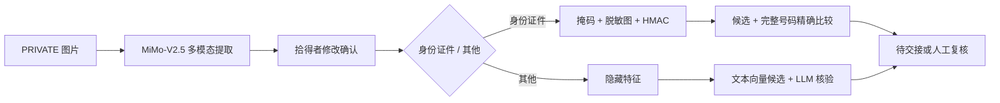

# 方案选项

**文档版本：** V4.0  
**更新日期：** 2026-07-16  
**需求基线：** PRD V0.8（已确认）  
**共同固定约束：** Web + Python + FastAPI + PostgreSQL + pgvector；身份证件/其他双流程；拾得者最终确认 AI 草稿。

> 三个方案的根本差异是“核心事实由谁产生、由谁做核验”：A 为多模态提取 + 人工确认 + 确定性核验，B 为 OCR/规则流水线，C 为端到端多模态模型判断。不是低/中/高配。

---

## 方案总览

| 方案 | 核心范式 | 图片处理 | 身份证件核验 | 其他物品核验 | 当前结论 |
|---|---|---|---|---|---|
| A：受控多模态 + 人工确认 + 分类型核验 | 混合人机协同 | 通用多模态提取草稿，拾得者确认 | 服务端 HMAC 精确比较 | 文本向量候选 + LLM 隐藏核验 | **已接受** |
| B：OCR/规则优先流水线 | 确定性组件优先 | 证件 OCR + 普通物品手工填写 | OCR 后精确比较 | 规则/关键词候选 + 规则问答 | 备选 |
| C：端到端多模态 LLM | 模型主导 | 模型直接提取、匹配、核验和解释 | 模型读取号码并判断 | 模型直接判断归属可信度 | 不推荐 |

## 方案 A：受控多模态 + 人工确认 + 分类型核验

### 核心思路

多模态模型只负责把拾得者图片变成结构化草稿；拾得者负责修改确认。确认后的文本进入 pgvector 候选匹配。认领阶段按类型分流：身份证件号码由确定性服务精确比较，其他物品由隐藏特征 LLM 核验。

### 关键技术点

| 决策 | 推荐实现 | 理由 |
|---|---|---|
| 图片上传 | FastAPI `UploadFile` | 官方支持 multipart 文件上传，适合异步读取和大小校验 |
| 多模态模型 | MiMo-V2.5 图片理解 API | 官方支持 URL/Base64 图片输入，可用于描述和分类；需对项目样例验证号码提取准确性 |
| 结构化输出 | Pydantic schema + 人工确认 | 阻止自由文本直接成为正式字段 |
| 文本候选 | text-embedding-v4 + pgvector 精确余弦检索 | 小数据量无需 ANN；pgvector 默认可做精确近邻搜索 |
| 号码保护 | 应用层 HMAC-SHA256 + 掩码 | 支持精确相等比较，避免数据库保存可直接枚举的普通哈希 |
| 图片发布 | PRIVATE 原图 + PUBLIC 脱敏副本 | 避免候选页直接暴露号码和身份信息 |
| 模型失败 | 手工填写降级 | 外部 API 不可用时仍可完成发布主流程 |

### 优势

1. 直接满足“图片自动识别且拾得者可修改”的新需求。
2. 证件号码不交给 LLM 做最终判断，核验结果确定、可测试。
3. 其他物品继续利用语义候选和隐藏特征，保留 AI 价值。
4. AI 原值、人工修改和最终值可形成清晰证据链。
5. 模型失败可降级，演示不完全依赖外部 API。

### 代价与风险

1. 需要同时实现原图、脱敏副本、AI 草稿和确认值，数据模型较复杂。
2. 通用多模态模型不等于专用 OCR，证件号码必须人工确认。
3. 两条认领路径增加状态与测试数量。
4. PRIVATE 原图发送外部模型需要明确授权和数据处理边界。

### 失败路径

| 失败 | 处理 |
|---|---|
| 多模态超时/限流 | 保存草稿，允许拾得者手工填写 |
| 号码识别错误 | 拾得者修改；保留修改前后快照 |
| 脱敏失败 | 禁止公开图片，允许只发布掩码文本 |
| 号码不匹配 | 通用错误提示；不泄露差异 |
| 尝试超限/多人命中 | 转管理员复核 |

## 方案 B：OCR/规则优先流水线

### 核心思路

身份证件使用专用 OCR 提取文字和号码；普通物品不调用通用多模态模型，由拾得者手工填写名称、描述和隐藏特征。候选主要依赖时间地点、关键词和结构化规则。

### 优势

1. 身份证件文字提取更聚焦，输出字段更确定。
2. 规则链容易做单元测试和失败定位。
3. 普通物品图片不发送多模态模型，隐私边界更窄。
4. 外部模型输出对业务状态影响较少。

### 风险与代价

1. 不满足“图片后自动识别物品名称和特征描述”的完整需求，普通物品仍需手填。
2. 需要 OCR 与文本/规则两套能力，组件数量不一定更少。
3. 同义描述和非证件物品的泛化能力弱。
4. 证件版式增加时需要维护不同规则。

### 适用条件

如果 PO 将多模态自动描述降为 P1，且只要求居民身份证号码提取，方案 B 会成为更稳妥的两天 MVP。

## 方案 C：端到端多模态 LLM

### 核心思路

把拾得者图片、失主描述/图片、时间地点和隐藏信息一起交给多模态模型，由模型直接输出候选、特征、号码匹配结论、认领可信度和解释。

### 优势

1. 业务代码最少，演示效果最“智能”。
2. 同一模型处理图片、文本、候选和核验，接口表面统一。
3. 能利用失主可选图片做视觉对比。

### 风险与代价

1. 完整证件号码和隐藏信息进入模型上下文，泄露面最大。
2. 精确号码匹配不应依赖概率模型；模型可能漏字符、补字符或解释错误。
3. 输出难以稳定复现，不利于 TDD、边界测试和答辩追问。
4. 外部 API 失败会同时破坏发布、候选和认领三段主流程。
5. 很难证明“匹配成功”由哪条确定性规则触发。

### 适用条件

只适合概念演示，不适合作为本次需要证明隐私边界、失败处理和可追溯判断的 MVP 主方案。

## 官方证据

1. [Xiaomi MiMo 图片理解文档](https://mimo.mi.com/docs/en-US/quick-start/usage-guide/multimodal-understanding/image-understanding)：支持图片 URL/Base64 输入，适用于图片描述和分类；这证明方案 A 可做图片提取，但不能证明证件号码零错误，因此保留人工确认。
2. [FastAPI Request Files](https://fastapi.tiangolo.com/tutorial/request-files/)：官方提供 `File` / `UploadFile` 接收 multipart 图片。
3. [pgvector 官方 README](https://github.com/pgvector/pgvector)：支持精确/近似近邻和余弦距离，默认精确搜索；MVP 小数据量可不建立 ANN 索引。
4. [PostgreSQL pgcrypto](https://www.postgresql.org/docs/current/pgcrypto.html)：提供 `hmac()`；官方同时提示数据库内加密的数据链路限制，因此推荐在应用层计算 HMAC 并通过 TLS 连接数据库。

## 推荐结论

方案 A 已由用户接受，方案 B、C 已拒绝。Q1～Q15 的答案已固化为方案约束；下一步进入详细设计和 Design Review，模型 spike 与运行验证仍按真实结果记录。
