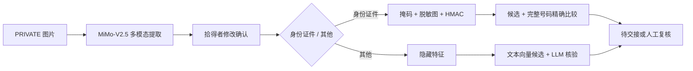

# 方案路线

> 状态：尚未进入方案对比阶段。PRD v0.2 经宋姿毅、徐胜宇确认后，基于真实约束比较至少三个本质不同的方案；当前不提前把 AI 初步设想写成最终路线。

计划比较的方向（仅为比较框架，不代表选择）：

| 方案 | 核心思路 | 优点 | 缺点 | 风险 | 适用条件 |
|---|---|---|---|---|---|
| 方案 A：确定性规则优先 | 已确认 | 已确认 | 已确认 | 已确认 | 已确认 |
| 方案 B：LLM 语义判断优先 | 已确认 | 已确认 | 已确认 | 已确认 | 已确认 |
| 方案 C：规则护栏 + AI 解释 + 人工复核 | 已确认 | 已确认 | 已确认 | 已确认 | 已确认 |

---

# 方案路线

> 状态：尚未进入方案对比阶段。PRD V0.5 经宋姿毅、徐胜宇确认后，基于真实约束比较至少三个本质不同的方案；Python + FastAPI + PostgreSQL + pgvector 已是固定约束，当前不提前把其它 AI 初步设想写成最终路线。

计划比较的方向（仅为比较框架，不代表选择）：

| 方案 | 核心思路 | 优点 | 缺点 | 风险 | 适用条件 |
|---|---|---|---|---|---|
| 方案 A：确定性规则优先 | 已确认 | 已确认 | 已确认 | 已确认 | 已确认 |
| 方案 B：LLM 语义判断优先 | 已确认 | 已确认 | 已确认 | 已确认 | 已确认 |
| 方案 C：规则护栏 + AI 解释 + 人工复核 | 已确认 | 已确认 | 已确认 | 已确认 | 已确认 |

---

# 方案选项

**文档版本：** V3.0（宋姿毅、徐胜宇确认最终选型）
**更新日期：** 2026-07-16
**固定约束**：Python + FastAPI + PostgreSQL + pgvector（已在 PRD 中确认，不可更改）

> **红线要求**：以下 ≥3 个方案在核心架构思路上有根本性区别，不是同一方案的低/中/高配。

---

## 方案总览

| 方案 | 核心思路 | 前端 | AI 策略 | 匹配方式 | 状态 |
|---|---|---|---|---|---|
| **A：向量匹配 + LLM 核验** | pgvector 双方向量化匹配 TOP-5，LLM 自动生成问题并核验 | React SPA | text-embedding-v4 + mimoV2.5-pro | 向量相似度 + 规则 | ✅ **已选** |
| B：规则优先 + 最小 AI | 确定性规则匹配，LLM 仅核验 | SSR + Jinja2 | 规则 + LLM | 规则评分 | 已拒绝 |
| C：LLM 驱动全流程 | 匹配/核验/质量检查全依赖 LLM | React SPA | 全 LLM | LLM 比较 | 已拒绝 |

---

## 方案 A：向量匹配 + LLM 核验 ✅ 已选

### 核心架构思路

**"双方信息都向量化，pgvector 做召回取 TOP-5，LLM 自动生成隐藏问题并核验回答。"**

- 匹配：失主和拾得者的公开描述均通过 text-embedding-v4 向量化 → pgvector 余弦相似度 + 时间/地点规则评分 → TOP-5
- 隐藏问题：拾得者上传隐藏特征（私密文字描述）→ mimoV2.5-pro 根据特征自动生成开放式验证问题
- 回答核验：失主回答 → mimoV2.5-pro 比对回答与隐藏特征 → 匹配/部分匹配/冲突/无法判断

### 技术选型

| 层级 | 选择 | 理由 |
|---|---|---|
| 前端 | React 18 + Vite | 组件化、热重载、交互体验最佳 |
| 数据访问 | SQLAlchemy ORM + raw SQL for pgvector | ORM 加速 CRUD，pgvector 查询用 raw SQL |
| 认证 | JWT (access + refresh) | 前后端分离标准方案 |
| Embedding | text-embedding-v4 | 双方信息向量化，中文语义理解强 |
| 匹配引擎 | pgvector 余弦相似度 | 向量匹配 → 结合规则 → TOP-5 |
| 问题生成 | mimoV2.5-pro | 根据隐藏特征自动生成开放式问题 |
| 回答核验 | mimoV2.5-pro | 语义比对，结构化输出 |

### 核心业务流程

```
┌─────────────────────────────────────────────────────────────────┐
│ 1. 发布阶段                                                      │
│                                                                  │
│   拾得者 ──→ 填写招领信息（类别/描述/时间/地点）                    │
│          ──→ 上传隐藏特征（私密描述，如"伞套内侧写有宋姿毅"）          │
│          ──→ 上传整体图片                                         │
│                                                                  │
│   失主 ──→ 填写失物信息（类别/描述/时间/地点）                      │
│                                                                  │
│   系统 ──→ text-embedding-v4 将双方公开描述向量化                   │
│         ──→ 向量存入 PostgreSQL pgvector                           │
│                                                                  │
├─────────────────────────────────────────────────────────────────┤
│ 2. 匹配阶段                                                      │
│                                                                  │
│   失主发布失物后 ──→ 系统自动触发匹配                              │
│                                                                  │
│   系统 ──→ pgvector 余弦相似度计算（失物向量 vs 所有招领向量）       │
│         ──→ 结合时间/地点规则评分                                  │
│         ──→ 取综合分 TOP-5 候选返回                                │
│                                                                  │
├─────────────────────────────────────────────────────────────────┤
│ 3. 认领阶段                                                      │
│                                                                  │
│   失主 ──→ 查看 TOP-5 候选列表（展示匹配分/匹配点/冲突点）          │
│         ──→ 选择要认领的物品                                       │
│                                                                  │
│   系统 ──→ 读取该招领记录的隐藏特征                                │
│         ──→ mimoV2.5-pro 根据隐藏特征自动生成开放式验证问题          │
│         ──→ 向失主展示问题（不泄露答案）                            │
│                                                                  │
│   失主 ──→ 回答验证问题                                            │
│                                                                  │
│   系统 ──→ mimoV2.5-pro 比对回答 vs 隐藏特征                       │
│         ──→ 输出匹配/部分匹配/冲突/无法判断                         │
│         ──→ 计算隐藏核验分                                         │
│                                                                  │
├─────────────────────────────────────────────────────────────────┤
│ 4. 路由阶段                                                      │
│                                                                  │
│   高可信（候选分≥80 + 核验分≥85 + 无冲突）──→ 自动待交接            │
│   其它 ──→ 管理员复核                                             │
│                                                                  │
│   待交接 ──→ 展示联系方式 ──→ 线下交接 ──→ 拾得者标记已认领         │
└─────────────────────────────────────────────────────────────────┘
```

### 与 PRD V0.6 的差异

| PRD 原设计 | 当前方案 | 差异原因 |
|---|---|---|
| 拾得者手动设置隐藏问题和标准答案（FR-21） | 拾得者只上传隐藏特征，LLM 自动生成问题 | 降低拾得者门槛；LLM 生成更规范的问题 |
| AI 只引导和检查问题质量（FR-22） | AI 直接生成问题 | 拾得者不需要学习编写有效问题 |
| 至少两组有效问答才可发布（FR-23） | 拾得者上传隐藏特征即可发布 | 简化发布流程 |
| 前端 | React SPA | 宋姿毅、徐胜宇确认 |

### 失败路径

| 失败场景 | 兜底策略 |
|---|---|
| text-embedding-v4 API 超时 | 降级为关键词匹配，标记"AI 不可用" |
| mimoV2.5-pro 问题生成超时 | 使用预置问题模板 |
| mimoV2.5-pro 核验超时 | 核验分按"无法判断"处理，转管理员 |
| pgvector 不可用 | 降级为纯规则匹配 |
| JWT token 过期 | 前端自动刷新 refresh token |

---

## 方案 B：规则优先 + 最小 AI（已拒绝）

### 核心架构思路

**"用确定性规则证明系统可靠，用最小 AI 调用完成题面要求。"**

- 匹配：硬规则（类别/类型/状态）+ 规则评分（时间/地点/关键词）
- 隐藏问题：拾得者手动设置问题和标准答案
- 核验：LLM API 语义比对
- 前端：Jinja2 SSR + 原生 JS

### 技术选型

| 层级 | 选择 |
|---|---|
| 前端 | Jinja2 SSR + 原生 HTML/JS/CSS |
| 数据访问 | SQLAlchemy ORM + raw SQL for pgvector |
| 认证 | Session-Cookie + bcrypt |
| Embedding | OpenAI `text-embedding-3-small` |
| 核验 AI | OpenAI GPT-4o-mini |
| 问题质量 | 预置正则规则 |

### 拒绝原因

1. **前端交互体验一般**：表单提交 + 整页刷新
2. **隐藏问题由拾得者手动编写**：学习成本高，问题质量参差不齐
3. **Embedding 模型与团队选择不符**：团队确认使用 text-embedding-v4
4. **核验模型与团队选择不符**：团队确认使用 mimoV2.5-pro

---

## 方案 C：LLM 驱动全流程（已拒绝）

### 核心架构思路

**"让 AI 做所有语义判断，系统只负责数据流转和状态管理。"**

- 匹配：LLM 直接比较两段描述的语义相似度
- 隐藏问题：LLM 生成
- 核验：LLM 语义比对
- 前端：React SPA

### 技术选型

| 层级 | 选择 |
|---|---|
| 前端 | React 18 + Vite + TailwindCSS |
| 数据访问 | asyncpg 直接 SQL |
| 认证 | JWT (access + refresh) |
| 候选匹配 | LLM 直接比较 |
| 核验 AI | LLM |
| 问题质量 | LLM |

### 拒绝原因

1. **匹配延迟过高**：每次匹配需调用 LLM，20 条记录对比 = 多次 API 调用
2. **LLM 输出不稳定**：同一输入多次调用可能不同分数
3. **外部依赖最重**：匹配 + 核验 + 质量检查三处 LLM 调用
4. **无法利用 pgvector**：已确认的 pgvector 能力被浪费

---

## 质量自查

- [x] 至少 3 个本质不同的方案（向量+LLM / 规则+LLM / 全LLM）
- [x] 不是同一方案的低/中/高配
- [x] 每个方案有完整的选型说明和拒绝理由
- [x] 已选方案标注了与 PRD 的差异

---

# 方案选项

**文档版本：** V4.0  
**更新日期：** 2026-07-16  
**需求基线：** PRD V0.8（已确认）  
**共同固定约束：** Web + Python + FastAPI + PostgreSQL + pgvector；身份证件/其他双流程；拾得者最终确认 AI 草稿。

> 三个方案的根本差异是"核心事实由谁产生、由谁做核验"：A 为多模态提取 + 人工确认 + 确定性核验，B 为 OCR/规则流水线，C 为端到端多模态模型判断。不是低/中/高配。

---

## 方案总览

| 方案 | 核心范式 | 图片处理 | 身份证件核验 | 其他物品核验 | 当前结论 |
|---|---|---|---|---|---|
| A：受控多模态 + 人工确认 + 分类型核验 | 混合人机协同 | 通用多模态提取草稿，拾得者确认 | 服务端 HMAC 精确比较 | 文本向量候选 + LLM 隐藏核验 | **已接受** |
| B：OCR/规则优先流水线 | 确定性组件优先 | 证件 OCR + 普通物品手工填写 | OCR 后精确比较 | 规则/关键词候选 + 规则问答 | 备选 |
| C：端到端多模态 LLM | 模型主导 | 模型直接提取、匹配、核验和解释 | 模型读取号码并判断 | 模型直接判断归属可信度 | 不推荐 |

## 方案 A：受控多模态 + 人工确认 + 分类型核验

### 核心思路

多模态模型只负责把拾得者图片变成结构化草稿；拾得者负责修改确认。确认后的文本进入 pgvector 候选匹配。认领阶段按类型分流：身份证件号码由确定性服务精确比较，其他物品由隐藏特征 LLM 核验。



### 关键技术点

| 决策 | 推荐实现 | 理由 |
|---|---|---|
| 图片上传 | FastAPI `UploadFile` | 官方支持 multipart 文件上传，适合异步读取和大小校验 |
| 多模态模型 | MiMo-V2.5 图片理解 API | 官方支持 URL/Base64 图片输入，可用于描述和分类；需对项目样例验证号码提取准确性 |
| 结构化输出 | Pydantic schema + 人工确认 | 阻止自由文本直接成为正式字段 |
| 文本候选 | text-embedding-v4 + pgvector 精确余弦检索 | 小数据量无需 ANN；pgvector 默认可做精确近邻搜索 |
| 号码保护 | 应用层 HMAC-SHA256 + 掩码 | 支持精确相等比较，避免数据库保存可直接枚举的普通哈希 |
| 图片发布 | PRIVATE 原图 + PUBLIC 脱敏副本 | 避免候选页直接暴露号码和身份信息 |
| 模型失败 | 手工填写降级 | 外部 API 不可用时仍可完成发布主流程 |

### 优势

1. 直接满足"图片自动识别且拾得者可修改"的新需求。
2. 证件号码不交给 LLM 做最终判断，核验结果确定、可测试。
3. 其他物品继续利用语义候选和隐藏特征，保留 AI 价值。
4. AI 原值、人工修改和最终值可形成清晰证据链。
5. 模型失败可降级，演示不完全依赖外部 API。

### 代价与风险

1. 需要同时实现原图、脱敏副本、AI 草稿和确认值，数据模型较复杂。
2. 通用多模态模型不等于专用 OCR，证件号码必须人工确认。
3. 两条认领路径增加状态与测试数量。
4. PRIVATE 原图发送外部模型需要明确授权和数据处理边界。

### 失败路径

| 失败 | 处理 |
|---|---|
| 多模态超时/限流 | 保存草稿，允许拾得者手工填写 |
| 号码识别错误 | 拾得者修改；保留修改前后快照 |
| 脱敏失败 | 禁止公开图片，允许只发布掩码文本 |
| 号码不匹配 | 通用错误提示；不泄露差异 |
| 尝试超限/多人命中 | 转管理员复核 |

## 方案 B：OCR/规则优先流水线

### 核心思路

身份证件使用专用 OCR 提取文字和号码；普通物品不调用通用多模态模型，由拾得者手工填写名称、描述和隐藏特征。候选主要依赖时间地点、关键词和结构化规则。

### 优势

1. 身份证件文字提取更聚焦，输出字段更确定。
2. 规则链容易做单元测试和失败定位。
3. 普通物品图片不发送多模态模型，隐私边界更窄。
4. 外部模型输出对业务状态影响较少。

### 风险与代价

1. 不满足"图片后自动识别物品名称和特征描述"的完整需求，普通物品仍需手填。
2. 需要 OCR 与文本/规则两套能力，组件数量不一定更少。
3. 同义描述和非证件物品的泛化能力弱。
4. 证件版式增加时需要维护不同规则。

### 适用条件

如果 PO 将多模态自动描述降为 P1，且只要求居民身份证号码提取，方案 B 会成为更稳妥的两天 MVP。

## 方案 C：端到端多模态 LLM

### 核心思路

把拾得者图片、失主描述/图片、时间地点和隐藏信息一起交给多模态模型，由模型直接输出候选、特征、号码匹配结论、认领可信度和解释。

### 优势

1. 业务代码最少，演示效果最"智能"。
2. 同一模型处理图片、文本、候选和核验，接口表面统一。
3. 能利用失主可选图片做视觉对比。

### 风险与代价

1. 完整证件号码和隐藏信息进入模型上下文，泄露面最大。
2. 精确号码匹配不应依赖概率模型；模型可能漏字符、补字符或解释错误。
3. 输出难以稳定复现，不利于 TDD、边界测试和答辩追问。
4. 外部 API 失败会同时破坏发布、候选和认领三段主流程。
5. 很难证明"匹配成功"由哪条确定性规则触发。

### 适用条件

只适合概念演示，不适合作为本次需要证明隐私边界、失败处理和可追溯判断的 MVP 主方案。

## 官方证据

1. [Xiaomi MiMo 图片理解文档](https://mimo.mi.com/docs/en-US/quick-start/usage-guide/multimodal-understanding/image-understanding)：支持图片 URL/Base64 输入，适用于图片描述和分类；这证明方案 A 可做图片提取，但不能证明证件号码零错误，因此保留人工确认。
2. [FastAPI Request Files](https://fastapi.tiangolo.com/tutorial/request-files/)：官方提供 `File` / `UploadFile` 接收 multipart 图片。
3. [pgvector 官方 README](https://github.com/pgvector/pgvector)：支持精确/近似近邻和余弦距离，默认精确搜索；MVP 小数据量可不建立 ANN 索引。
4. [PostgreSQL pgcrypto](https://www.postgresql.org/docs/current/pgcrypto.html)：提供 `hmac()`；官方同时提示数据库内加密的数据链路限制，因此推荐在应用层计算 HMAC 并通过 TLS 连接数据库。

## 推荐结论

方案 A 已由宋姿毅、徐胜宇接受，方案 B、C 已拒绝。Q1～Q15 的答案已固化为方案约束；下一步进入详细设计和 Design Review，模型 spike 与运行验证仍按真实结果记录。
