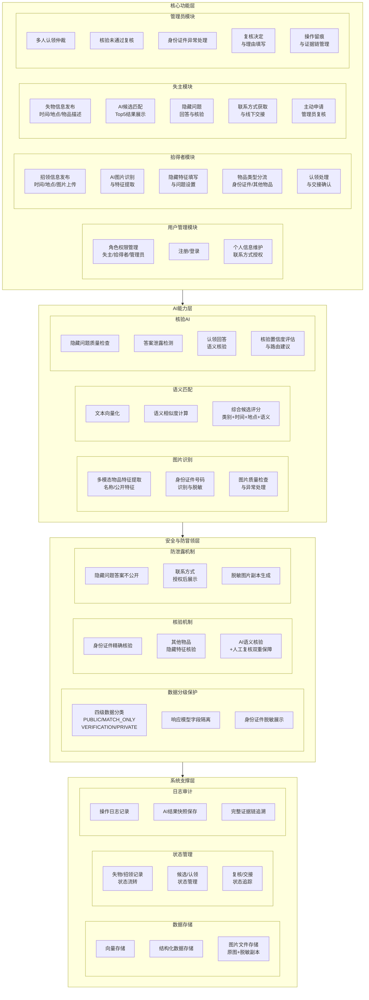
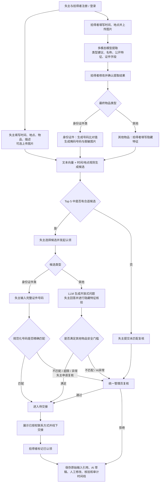
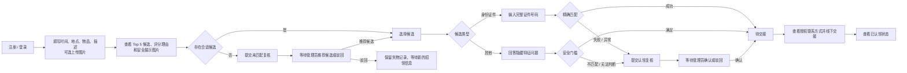
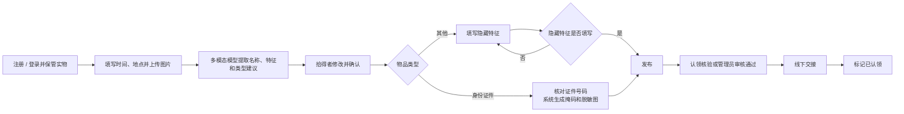
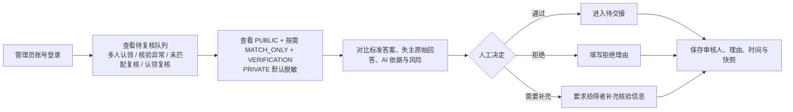

# AI 失物招领匹配与认领复核系统 PRD

**文档版本：** V0.9（物品分类与主动复核最小重构）
**基线状态：** V0.8 为已确认历史基线；V0.9 需求方向已确认，文档待复核
**项目周期：** 2 天
**项目人数：** 3 人
**产品形态：** Web 应用 Demo（React SPA 前端 + FastAPI 服务端）
**当前阶段：** 在已确认 V0.8 上做最小变更，保留详细内容与四级权限矩阵
**核心目标：** 通过多模态信息提取和文本向量匹配返回 Top 5 候选；普通物品使用隐藏问题核验，居民身份证使用服务端 HMAC 精确核验；异常或失主主动申请时由管理员复核。

---

## 1. 产品描述

### 1.1 产品概述

#### 1.1.1 产品背景

校园中的失物与招领信息通常分散在微信群、校园墙、公众号或线下登记中。失主需要反复浏览大量消息，拾得者也缺少统一、规范且兼顾防冒领的信息发布方式。对于雨伞、耳机、水杯等高度同质化物品，传统关键词检索难以理解“黑色折叠伞”“深色短柄伞”等不同描述；失主对时间、楼层和遗失地点的记忆偏差也容易导致真实候选被严格条件提前排除。

另一方面，公开颜色、品牌和整体外观只能说明两条记录可能相关，不能证明认领人是真正失主。如果拾得者把划痕、内部标记等细节全部公开，又会让冒领者直接获得答案。现有流程还缺少统一的核验标准和处理留痕，发生争议时难以还原候选为什么被推荐、认领为什么通过或被拒绝。

#### 1.1.2 产品定义

本产品是一套面向校园场景的 **AI 失物招领匹配与认领复核 Web 系统**。物品首先分为“身份证件类”和“其他物品”，系统通过多模态图片信息提取、拾得者人工确认、文本向量化候选匹配、分类型认领核验、风险分流和统一管理员复核建立闭环：

> 注册登录 → 拾得者上传图片 → 多模态模型提取物品名称与特征 → 拾得者修改并确认 → 生成 Top 5 候选和理由 → 居民身份证按 HMAC 精确核验 / 普通物品按隐藏特征核验 → 通过后进入待交接 / 多人认领、核验异常或失主主动申请时转管理员 → 拾得者确认交接 → 全流程留痕

AI 是系统能力，不是用户角色，也不负责确认物品已实际交接。实物始终由拾得者保管；拾得者线下交付后，才能在系统中标记“已认领”。

#### 1.1.3 需要解决的问题

| 对象 | 需要解决的问题 |
|---|---|
| 失主 | 如何用时间、地点、物品和描述找到 Top 5 真实候选；如何安全提交完整证件号码或回答隐藏问题；无合适候选或核验失败时如何主动申请管理员复核 |
| 拾得者 | 如何通过上传图片快速生成物品名称和特征描述；如何修正 AI 错误；身份证件如何掩码展示；其他物品如何填写有效隐藏特征 |
| 管理员 | 如何集中处理多人认领、普通物品核验未通过、证件核验异常和失主主动复核；如何依据统一材料确认或驳回并留痕 |
| 系统 | 如何区分“公开候选像不像”和“认领人是否回答正确”；如何在提升效率的同时避免 AI 误放行、答案泄露和不可追溯 |

#### 1.1.4 产品核心价值

1. **提高找回效率**：结合类别、公开描述、时间和地点生成候选，减少失主逐条搜索的成本。
2. **降低真实候选漏检**：允许近似时间、相邻地点和同义描述，不因合理记忆偏差直接排除候选。
3. **让匹配结果可理解**：同时展示匹配点、冲突点、信息缺口和候选保留原因，而不是只给一个相似度数字。
4. **降低冒领风险**：身份证件使用证件号码精确核验，其他物品使用隐藏特征核验；公开候选高分不能单独触发待交接。
5. **保留人工兜底**：多人认领、核验未通过或无法判断时进入管理员队列；失主在候选和认领阶段都可以主动申请复核。
6. **形成可信证据链**：保存原始输入、AI 结果、自动路由条件、人工审核理由、联系方式授权和拾得者交接确认。

### 1.2 产品架构图



### 1.3 技术栈

本项目为两天、三人的 Web MVP，技术选型优先考虑开发效率、接口清晰、结构化 AI 输出校验和可重复演示。

| 层级 | 技术 | 用途 | 决策状态 |
|---|---|---|---|
| Web 前端 | React 18 + Vite | 失主、拾得者、管理员三类角色视图；SPA 前后端分离 | ✅ 用户确认 |
| 后端语言 | Python | 业务服务、规则计算和 AI 接入 | ✅ 已确认 |
| Web 服务框架 | FastAPI | 构建 REST API、权限边界、接口文档和结构化响应 | ✅ 已确认 |
| 数据校验 | Pydantic（随 FastAPI 使用） | 校验请求、响应和 AI 结构化结果，按四级分类阻止非 `PUBLIC` 字段进入候选页 DTO | ✅ 随后端栈采用 |
| 数据库 | PostgreSQL | 保存用户、四级业务数据、候选、认领、审核、状态和审计日志 | ✅ 已确认 |
| 向量存储 | PostgreSQL `pgvector` 扩展 | 保存双方 `PUBLIC + MATCH_ONLY` 文本生成的向量，用于语义候选召回和相似度计算 | ✅ 已确认 |
| 数据访问 | SQLAlchemy ORM + raw SQL for pgvector | PostgreSQL 连接、事务、结构化字段用 ORM，向量查询用 raw SQL | ✅ 方案确认 |
| 图片存储 | MVP 本地文件目录 | 保存 PRIVATE 原图与 PUBLIC 脱敏副本；路径与权限分离 | 🔄 待重新评审 |
| Embedding 模型 | text-embedding-v4 | 将失主和拾得者的公开描述转为向量，存入 pgvector 用于匹配 | ✅ 用户确认 |
| 核验 AI | mimoV2.5-pro | 根据隐藏特征自动生成验证问题；比对认领回答与隐藏特征 | ✅ 用户确认 |
| 多模态识别 | MiMo-V2.5（优先验证） | 从拾得者图片中提取物品类型、名称和公开特征；身份证件额外提取号码供确认与精确核验 | ✅ 已确认，真实效果待 spike |
| 认证方式 | JWT (access + refresh) | 前后端分离标准方案；React SPA 通过 JWT 管理登录状态 | ✅ 方案确认 |

### 1.3.1 服务端职责

- 用户注册登录与失主/拾得者记录归属校验；
- 四级数据分类、管理员权限与不同响应模型隔离；
- 失物、招领、候选、认领、审核和交接状态管理；
- 候选确定性规则评分与 AI 文本语义结果合并；
- 身份证件/其他物品分流、隐藏特征发布门槛、证件号精确核验、LLM 问题生成和自动/人工路由；
- PostgreSQL 事务、四级业务数据、文本向量、审计日志和结果快照；
- 整体图片上传、访问控制和失败处理。

### 1.3.2 AI 与图像边界

- 拾得者上传图片后，多模态模型自动提取物品类型建议、物品名称和公开特征描述；拾得者必须能够修改，并对最终发布值负责。
- 对身份证件类，多模态模型可以提取证件号码，但原始输出不得进入公开响应、普通日志或候选向量；保存前由拾得者核对。
- 身份证件公开图片必须生成脱敏副本，至少遮挡证件号码和其它直接身份信息；PRIVATE 原图不得直接作为 PUBLIC 图片。
- 模型不得把无法从图片确认的内容写成事实；低置信度、输出非法、图片不可读或调用失败时，退回拾得者手工填写，不阻断草稿保存。
- 失主上传图片为可选 PRIVATE 支持材料，不进行多模态提取，不进入候选分。

---

## 2. 产品用户画像

### 2.1 角色划分

| 角色 | 角色定义 | 核心任务 |
|---|---|---|
| 失主 | 丢失物品并希望找回的注册用户 | 填写时间、地点、物品和描述，可选上传图片；身份证件输入完整号码核验，其他物品回答隐藏问题 |
| 拾得者 | 拾到并实际保管物品的注册用户 | 填写时间和地点、上传图片、修正多模态提取结果；其他物品填写隐藏特征；线下交接并标记已认领 |
| 统一管理员 | 只负责系统异常与争议审核的预置管理账号 | 处理多人认领、核验未通过、证件异常、未匹配复核和认领复核，填写确认/驳回理由 |

同一普通用户可以在不同记录中分别作为失主或拾得者。管理员不保管实物；AI 不是角色。

### 2.2 失主用户画像

| 维度 | 描述 |
|---|---|
| 典型身份 | 学生、教师、校园员工或访客 |
| 使用场景 | 发现物品遗失，希望快速找到相关招领记录并安全认领 |
| 使用特征 | 低频、突发；情绪较焦急；对具体时间、楼层或外观细节可能记忆不完整 |
| 核心痛点 | 信息渠道分散；人工浏览成本高；关键词描述不一致；不知道候选为何被推荐；公开外观不足以证明归属 |
| 核心需求 | 快速发布；获得不过度严格的候选；身份证件安全输入完整号码核验；其他物品回答未公开问题；查看核验、复核和待交接状态 |

典型用户故事：

> 作为失主，我希望系统在我记错具体楼层时仍保留合理候选；身份证件候选允许我安全输入完整号码核验，其他物品候选通过未公开特征核验，成功后获得联系方式并完成交接。

### 2.3 拾得者用户画像

| 维度 | 描述 |
|---|---|
| 典型身份 | 学生、教师、校园员工、安保或保洁人员 |
| 使用场景 | 拾到物品后自行保管，希望找到真正失主并降低错误交接风险 |
| 使用特征 | 低频、偶发；普通互联网使用水平；可能不知道哪些信息应公开、哪些应隐藏 |
| 核心痛点 | 描述不规范；公开图片可能泄露隐藏特征；不知道哪些细节值得作为隐藏特征；面对多个认领人时判断压力大 |
| 核心需求 | 上传图片后自动获得名称和特征草稿并可修改；身份证件无需填写隐藏特征但需确认提取号码；其他物品填写隐藏特征；异常申请转管理员；实际交接后更新状态 |

典型用户故事：

> 作为拾得者，我希望上传图片后系统自动识别物品名称和公开特征，我可以修改错误结果；身份证件由系统生成掩码展示且无需隐藏特征，其他物品由我补充隐藏特征，交接完成后由我标记已认领。

### 2.4 管理员用户画像

| 维度 | 描述 |
|---|---|
| 典型身份 | 校园行政、辅导员或被授权的系统审核人员 |
| 使用场景 | 集中处理未满足自动门槛、存在硬冲突、多人认领或 AI 异常的申请 |
| 使用特征 | 使用频率高于普通用户；熟悉基础后台；不接触和保管实物 |
| 核心痛点 | 认领标准不统一；AI 只给分数时无法判断；争议申请证据分散；处理后难以追溯 |
| 核心需求 | 查看公开依据、隐藏标准答案、失主原始回答和 AI 风险；通过或拒绝并填写理由；查看完整状态和审计快照 |

典型用户故事：

> 作为管理员，我希望系统把多人认领、核验异常和失主主动复核统一送入队列；审核时能够看到符合四级权限的必要证据，并让每次确认或驳回都有理由和时间记录。

---

## 3. 角色与权限边界

### 3.1 业务用户

| 角色 | 主要职责 |
|---|---|
| 失主 | 注册登录；填写时间、地点、物品、描述并可选上传图片；查看候选；身份证件输入完整号码，其他物品回答验证问题；通过后查看联系方式 |
| 拾得者 | 注册登录并保管实物；填写时间和地点、上传图片、修改并确认多模态提取结果；其他物品填写隐藏特征；交接后标记“已认领” |

同一个注册用户可以在不同记录中分别承担失主或拾得者。拾得者同时承担实物保管人职责，不再单设“实物保管人”角色，也不设置失物招领处。

### 3.2 系统审核角色

| 角色 | 主要职责 |
|---|---|
| 统一管理员 | 处理未达到自动通过条件、存在冲突或 AI 异常的认领申请；查看核验材料；作出通过/拒绝决定并填写理由。管理员不保管或线下检查实物 |

### 3.3 AI 能力边界

AI 是系统能力模块，不是用户角色。AI 可以从拾得者图片提取物品类型建议、名称、公开特征和身份证件号码草稿，通过 text-embedding-v4 生成文本向量候选，并为其他物品生成/核验隐藏问题；所有图片提取结果须由拾得者确认。AI 不能编造隐藏特征、不能公开完整证件号码，也不能标记实物已完成交接。

---

## 4. 目标与非目标

### 4.1 目标（Goals）

1. 用户通过 Web 页面完成基础注册登录；同一普通账号可以按具体记录承担失主或拾得者，管理员使用预置管理账号。
2. 失主填写时间、地点、物品和描述并可选上传图片；拾得者填写时间、地点并上传图片，由多模态模型提取名称和公开特征，拾得者可以修改并确认。
3. 服务端使用四级数据分类（`PUBLIC / MATCH_ONLY / VERIFICATION / PRIVATE`）控制字段用途和返回范围，普通用户候选页只能获得 `PUBLIC` 数据。
4. 候选匹配服务仅使用 `PUBLIC + MATCH_ONLY` 文本数据，按照类别硬门槛、公开描述 AI 向量相似度、时间、地点和完整度生成多个候选，并输出匹配点、冲突点、信息缺口和保留原因；颜色及其它公开外观内容统一包含在公开描述语义中，不重复计分。
5. 物品必须分为 `IDENTITY_DOCUMENT`（身份证件类）和 `OTHER`（其他物品）；分类由系统建议、拾得者最终确认，两个类型采用不同认领核验流程。
6. 身份证件类不要求拾得者填写隐藏特征。候选页只展示掩码证件号码和脱敏图片；失主输入完整证件号码，服务端规范化后精确比对，匹配成功进入“待交接”。
7. 普通物品要求拾得者填写隐藏特征；失主回答 LLM 根据隐藏特征生成的 2～3 个开放式问题。AI 判断全部关键回答匹配、结果有效且不存在多人认领时进入“待交接”，否则进入管理员复核。
8. 认领进入“待交接”后，系统按拾得者发布时的授权向对应失主展示联系方式；实际交接后仅拾得者可以标记“已认领”。
9. 管理员能够查看 `PUBLIC + MATCH_ONLY + VERIFICATION` 的复核材料，对多人认领、隐藏核验未通过、证件核验异常和失主主动复核执行确认或驳回并填写理由；`PRIVATE` 默认脱敏。
10. 失主在 Top 5 没有合适候选时可针对失物记录提交“未匹配复核”；选择候选但核验失败或不同意结果时可针对认领申请提交“认领复核”。
11. 系统保存原始业务输入引用、匹配与核验结果、规则/模型版本、自动或人工处理来源、审核理由、联系方式授权和交接状态，形成可追溯证据链。
12. 多模态提取超时、非法结构、低置信度或图片不可读时，系统保留原图与草稿，要求拾得者手工补全；核验 AI 异常时进入管理员复核，不伪造结果。
13. MVP 至少演示普通物品隐藏核验、居民身份证号码匹配、多人认领复核、未匹配主动复核和完整证据链。

### 4.2 非目标（Non-Goals）

1. **不做学校统一身份认证** — MVP 只实现基础注册登录和预置管理员，不实现短信验证、找回密码、第三方登录或生产账号安全体系。
2. **不使用图片相似度直接认领** — 多模态模型只提取发布草稿，不以图片相似度直接确认候选或所有权；拾得者必须确认提取结果。
3. **不部署独立向量数据库，不训练或微调模型** — 小规模文本向量直接存入 PostgreSQL `pgvector`；不引入 Milvus、Pinecone 等独立服务，不训练专用视觉/文本模型。
4. **不做复杂地图和路径推断** — 地点只做预定义层级、相邻区域或文本规则，不接地图服务、不分析用户实时轨迹。
5. **不做真实物流、线上签收或交接签名** — 系统只提供联系方式和状态记录，线下实物交接由拾得者与失主完成。
6. **不作法律意义上的物权判定** — 自动待交接和管理员通过都只是系统流程结论，不能替代法律证明。
7. **不做多组织、多校区和复杂管理员协作** — MVP 采用单系统、统一管理员角色，不做任务分派、投票、评论或跨组织权限。
8. **不做复杂申诉和追责流程** — 只实现“未匹配复核”和“认领复核”两个入口以及管理员确认/驳回；正式申诉、仲裁和责任认定不在本次范围。
9. **失主可选图片不进入多模态提取或自动评分** — 仅作为 PRIVATE 支持材料，不能替代证件号码精确比对或其他物品隐藏核验。
10. **不证明真实大规模准确率和生产安全性** — 两天 MVP 使用模拟数据验证流程、规则边界和证据链，不宣称已经适用于真实全校部署。

### 4.3 产品原则

1. AI 用于候选匹配与认领核验辅助，不是用户角色或责任主体；系统自动流转也不等于法律意义上的物品归属认定。
2. 候选匹配分只用于 Top 5 排序，不作为认领结论；普通物品认领以隐藏问题核验结果为准，身份证认领以服务端 HMAC 精确比较为准。
3. 候选匹配只使用拾得者确认后的 `PUBLIC + MATCH_ONLY`；身份证件完整号码只进入精确核验，不进入向量、解释或普通日志。
4. AI 不得编造图片中不存在的特征、隐藏特征或证件号码，也不得泄露隐藏答案和完整证件号码。
5. 身份证件号码精确匹配成功，或其他物品公开候选与隐藏核验同时达到门槛且无风险时，申请才能进入“待交接”；最终交接仍由拾得者确认。
6. 实物始终由拾得者保管，实际交接后由拾得者标记“已认领”。
7. 最终处理结果必须保存处理人、处理时间、处理理由和自动/人工处理来源。

---

## 5. 信息分类

两级“公开/隐藏”无法表达联系方式、精确地点、内部特征等数据的不同用途。系统采用四级数据分类。分级依据不是固定字段名，而是**具体字段值的用途、可见范围和处理阶段**。

### 5.1 四级权限矩阵

| 级别 | 用途 | 普通用户候选页 | 候选匹配 | 认领核验 | 管理员复核 |
|---|---|---|---|---|---|
| `PUBLIC` | 帮助用户发现候选并判断是否发起认领 | 可以看 | 可以使用 | 可作为上下文 | 可以看 |
| `MATCH_ONLY` | 系统匹配、标准化、排序与解释摘要 | 不直接展示原始值 | 可以使用 | 不作为所有权证明 | 按需查看 |
| `VERIFICATION` | 其他物品的隐藏特征核验 | 只能看到开放式问题 | 不得使用 | 可以使用但不得返回答案 | 复核时可以看 |
| `PRIVATE` | 身份、证件号码、原始图片、联系方式和认证资料 | 不能看他人的原值 | 不得使用 | 仅证件号码精确比对服务可最小化使用 | 默认脱敏，必要时授权 |

### 5.2 `PUBLIC`：公开候选信息

用于帮助失主判断“是否值得发起认领”。当前 MVP 包括：

| 字段 | 示例 | 说明 |
|---|---|---|
| 信息类型 | 失物 / 招领 | 只匹配相反类型 |
| 物品类别 | 折叠伞 | 候选类别硬门槛 |
| 物品类型 | 身份证件类 / 其他 | 决定认领核验分支 |
| 物品名称 | 黑色折叠伞 | 候选概要 |
| 主颜色 | 黑色 | 公开外观属性 |
| 模糊时间 | 7 月 16 日上午 | 不展示精确秒级时间 |
| 模糊地点 | 教学楼附近 | 不展示内部精确位置数据 |
| 公开描述 | 黑色短柄折叠伞 | 不得包含隐藏验证答案 |
| 公开图片 | 普通物品整体图，或已遮挡证件号码和身份信息的证件图 | 只能使用脱敏副本；不展示 PRIVATE 原图 |
| 证件号码掩码 | `110***********1234` | 只帮助失主识别候选，不能用于精确比对 |

`PUBLIC` 只能证明两条记录可能相关，不能证明认领成立。

##### 地点枚举（`location_public`）

前端下拉框与后端 `location_public` 字段使用以下固定枚举值：

| 枚举值 | 说明 |
|---|---|
| `宿舍区` | 学生宿舍楼区域 |
| `食堂` | 校园食堂 |
| `教学楼` | 日常上课教学楼 |
| `科教楼` | 科研/实验楼 |
| `图书馆` | 校园图书馆 |

失主和拾得者均从以上选项中选择，不支持自由输入。后端保存原始枚举值到 `location_public`（PUBLIC），同时生成标准化地点代码到 `location_normalized`（MATCH_ONLY）用于匹配评分。

##### 物品类别枚举（`public_category`）

前端下拉框使用以下分类，后端保存到 `public_category`（PUBLIC 字段，仅用于展示和筛选）：

| 枚举值 | 对应后端 `item_type` | 说明 |
|---|---|---|
| `电子产品` | `OTHER` | 手机、耳机、充电宝等电子设备 |
| `证件卡片` | `IDENTITY_DOCUMENT` | 居民身份证、校园卡、学生证等证件类 |
| `服饰配饰` | `OTHER` | 衣物、包袋、手表、眼镜等 |
| `学习用品` | `OTHER` | 书本、文具、U 盘等 |
| `其他` | `OTHER` | 以上分类未涵盖的物品 |

**关键区分：** `public_category`（5 种）同时用于**候选匹配硬过滤**和前端展示；后端 `item_type`（2 种）决定认领核验流程。当 `public_category` 为 `证件卡片` 时，`item_type` 必须为 `IDENTITY_DOCUMENT`；其余四种 `public_category` 的 `item_type` 均为 `OTHER`。

**匹配规则：** 候选匹配以 `public_category` 精确匹配为硬门槛（5 种类别各自独立匹配），不同类别之间不能成为候选。`item_type` 决定认领核验分支（身份证件用 HMAC，其他物品用隐藏问题），不影响候选匹配范围。

### 5.3 `MATCH_ONLY`：匹配内部字段

这些数据可供规则或文本 AI 匹配，但不得原样展示给普通用户。当前 MVP 包括：

| 字段 | 示例 | 用户侧替代表达 |
|---|---|---|
| 精确事件时间 | `2026-07-16 10:32:18` | “时间接近”或“相差约 20 分钟” |
| 标准化地点代码 | `TEACHING_B_3F_WEST` | “位于同一栋楼相邻区域” |
| 内部地点距离/层级差 | `42m`、相邻楼层 | 展示距离级别或保留原因，不展示精确坐标 |
| 文本标准化标签 | `folding_umbrella / short_handle` | 展示“类别和手柄描述接近” |
| 多模态提取草稿 | `身份证 / 黑色卡套` | 仅拾得者可修改；确认后拆分到 PUBLIC/MATCH_ONLY |
| 文本向量 | `vector(...)` | 只用于内部语义召回/相似度计算，不向用户或普通管理员返回原始向量 |
| 公开描述语义相似度 | `0.91` | 由 AI embedding 向量匹配得到；只展示高/中/低等级和人类可读依据 |
| 信息完整度、冲突标记 | `0.80`、`LOCATION_CONFLICT` | 展示信息缺口和冲突摘要 |

当前 MVP 允许多模态模型从拾得者图片提取名称和公开特征草稿，但不生成视觉向量、不做图片相似度认领。只有拾得者确认后的文本才能进入 `PUBLIC + MATCH_ONLY` 和文本向量。

### 5.4 `VERIFICATION`：认领验证信息

用于核验失主是否真正了解物品，不能出现在候选页或普通公开接口中。

| 数据 | 填写/产生方 | 示例 |
|---|---|---|
| 隐藏特征 | 拾得者上传 | “伞套内侧写有SZY”（LLM 在认领时据此生成验证问题） |
| 标准答案/实物隐藏特征 | 拾得者手动填写 | “伞套内侧写有 SZY” |
| 关键问题标识 | 拾得者确认 | `is_critical=true` |
| 认领原始回答 | 失主填写 | “内侧用黑色笔写着 SZY。” |
| 单题核验结果与风险 | 隔离的核验服务产生 | 匹配、部分匹配、冲突、无法判断 |

认领人只能看到开放式问题，不能看到标准答案、相似答案、即时对错或可用于反复试探的提示。候选匹配服务不得读取 `VERIFICATION` 数据；管理员复核时可以比较标准答案、原始回答和 AI 核验依据。

### 5.5 `PRIVATE`：身份与原始敏感资料

这些数据不参与候选向量匹配，也不得默认展示给管理员。身份证件号码是认领核验的特例：仅由独立精确比对逻辑使用，不进入 LLM。

| 数据 | 默认处理 | 允许展示的条件 |
|---|---|---|
| 手机号、邮箱 | 脱敏或不可见 | 认领进入待交接，且拾得者发布时已授权后，向对应失主展示 |
| 用户账号、密码哈希、认证令牌 | 仅认证服务使用 | 不向其他用户或普通管理员页面展示 |
| 原始联系方式 | 加密/受限保存（具体实现待设计） | 仅交接和安全审计所需的最小范围 |
| 身份证件完整号码 | 规范化后生成带密钥摘要，原文不进入普通日志 | 失主输入值只用于一次精确比对；普通用户和管理员默认只看掩码 |
| 身份证件原始图片 | PRIVATE 文件存储 | 只允许拾得者本人和受控脱敏服务读取；候选页只看脱敏副本 |
| 原始订单、含姓名凭证、设备完整序列号 | 当前 MVP 不采集 | 后续扩展必须单独授权并重新评审隐私边界 |
| 原始精确位置轨迹 | 当前 MVP 不采集 | 不在本项目范围内 |

### 5.6 同一字段的分级示例

四级不是“一个字段名称永远属于一个等级”，而是按字段值和用途拆分。

| 主题 | `PUBLIC` | `MATCH_ONLY` | `VERIFICATION` | `PRIVATE` |
|---|---|---|---|---|
| 地点 | 教学楼附近 | 教学楼 B 区 3F、标准化地点代码、内部距离 | LLM 根据隐藏特征生成的位置细节问题（如适用） | 用户实时位置轨迹；MVP 不采集 |
| 时间 | 7 月 16 日上午 | 10:32:18、内部时间差 | LLM 根据隐藏特征生成的时间细节问题（如适用） | 用户连续行动轨迹；MVP 不采集 |
| 图片 | 普通物品展示图 / 证件脱敏副本 | 多模态提取后经拾得者确认的文本标签 | 当前 MVP 不使用隐藏局部照片核验 | 原始上传图片，尤其是含完整证件号码的图片 |
| 证件号码 | 掩码号码 | 不参与候选向量匹配 | 不使用 LLM 核验 | 完整输入的带密钥摘要，仅供精确相等比较 |
| 联系方式 | 不属于 `PUBLIC` | 不参与匹配 | 不参与隐藏特征核验 | 拾得者手机号/邮箱，待交接且授权后展示 |

### 5.7 访问与处理规则

1. 普通用户候选页和候选详情只能返回 `PUBLIC`；不能通过“前端隐藏”替代服务端字段白名单。
2. 候选匹配引擎只使用 `PUBLIC + MATCH_ONLY`，输出给用户的是人类可读摘要，不能回传精确坐标、内部标签、完整特征或模型向量。
3. 认领验证服务只在隔离流程中使用 `VERIFICATION`；标准答案不得出现在认领人的响应、错误信息或普通日志中。
4. 管理员复核可查看 `PUBLIC + MATCH_ONLY + VERIFICATION`，但 `PRIVATE` 默认脱敏；管理员不因角色身份自动获得全部原始敏感数据。
5. `PRIVATE` 不进入候选匹配、问题生成或回答核验 LLM；唯一例外是上传时受控多模态提取可读取原图，以及证件核验服务可对号码做精确相等比较。
6. 原图在草稿阶段均按 `PRIVATE` 处理。普通物品由拾得者确认展示安全；身份证件必须生成遮挡证件号码和身份信息的 `PUBLIC` 脱敏副本。
7. `OTHER` 招领记录必须填写隐藏特征才能发布；`IDENTITY_DOCUMENT` 不要求隐藏特征，但必须存在经拾得者确认的证件类型和可用于精确比对的号码摘要。
8. 完整证件号码不得写入普通日志、向量、AI 解释或管理员列表；连续输错、多人同时匹配或比对服务异常必须留痕并转人工。
9. 任何跨级访问、原图处理、号码比对、联系方式展示和管理员查看核验材料的行为都应写入审计日志。

---

## 6. 核心业务流程

### 6.1 主流程



### 6.2 失主流程



### 6.3 拾得者流程



### 6.4 管理员流程



管理员不接收、不保管也不线下检查实物，只承担统一的系统审核职责。

### 6.5 正向场景

失主填写地点为三楼，拾得者填写地点为二楼楼梯口。

虽然地点不完全一致，但系统发现：

* 物品类别一致；
* 时间接近；
* 地点属于同一栋楼相邻区域；
* 公开外观相似。

系统保留该候选。失主准确回答 LLM 根据隐藏特征生成的验证问题；所有关键回答匹配、模型结果有效且不存在其他活动认领时，系统进入“待交接”。

### 6.6 反向场景

两条记录都是黑色折叠伞，时间和地点接近，但：

* 手柄结构不同；
* 隐藏标记不一致；
* 认领人无法准确描述局部特征。

系统不能因为公开信息相似就直接通过，必须进入管理员复核；AI 不自动拒绝，以免错误答案或表达差异直接剥夺真实失主的认领机会。

---

## 7. 功能需求

### 7.1 用户身份与权限

| 编号    | 功能     | 优先级 | 需求说明                      |
| ----- | ------ | --: | ------------------------- |
| FR-01 | 用户注册 |  P0 | 失主/拾得者使用用户名、密码和联系方式注册普通用户账号 |
| FR-02 | 用户登录 |  P0 | 注册用户登录后可按具体记录承担失主或拾得者；只能访问自己的记录和申请 |
| FR-03 | 管理员登录与权限 |  P0 | 管理员使用预置管理账号登录，可查看隐藏信息、认领回答、AI分析及待复核任务 |
| FR-04 | 四级字段隔离 |  P0 | 候选页只返回 PUBLIC；MATCH_ONLY 不原样返回；VERIFICATION 标准答案和 PRIVATE 不进入普通用户响应 |
| FR-05 | 操作人记录  |  P0 | 发布、认领、审核、交接均需记录操作人和时间     |

两天 Demo 实现最小注册登录闭环，但不实现学校统一认证、短信验证、找回密码、第三方登录和生产级账号安全。管理员账号由系统预置，普通注册不能自行获得管理员权限。

---

### 7.2 发布失物信息

| 编号    | 功能     | 优先级 | 需求说明                 |
| ----- | ------ | --: | -------------------- |
| FR-10 | 创建失物记录 |  P0 | 失主填写时间、地点、物品名称和描述，并选择身份证件类或其他；图片可选上传 |
| FR-11 | 公开信息仅用于匹配 |  P0 | 失主提供的类别、外观、时间和地点只进入候选匹配，不生成隐藏核验标准答案 |
| FR-12 | 上传失物图片 |  P1 | 失主可以上传旧照片作为 PRIVATE 支持材料；不进行多模态提取，不进入候选分 |
| FR-13 | 信息修改   |  P1 | 未进入认领流程前可以修改         |
| FR-14 | 提交校验   |  P0 | 物品类型、物品名称、公开描述、时间和地点不能为空    |
| FR-15 | 状态查看   |  P0 | 失主可查看待匹配、已有候选、核验中等状态 |
| FR-16 | 未匹配主动复核 | P0 | Top 5 没有合适物品时，失主可针对失物记录提交复核理由，请管理员重新检查已有招领记录 |
| FR-17 | 认领主动复核 | P0 | 选择候选后核验失败、无法判断或不同意结果时，失主可针对该认领申请提交复核理由 |

---

### 7.3 发布招领信息

| 编号    | 功能        | 优先级 | 需求说明                 |
| ----- | --------- | --: | -------------------- |
| FR-20 | 创建招领记录 | P0 | 拾得者填写发现时间和地点并上传图片；图片是创建招领记录的必填项 |
| FR-21 | 多模态自动提取 | P0 | 图片上传后，多模态模型自动提取物品类型建议、物品名称和公开特征描述；身份证件额外提取证件号码草稿 |
| FR-22 | 拾得者修改确认 | P0 | 所有 AI 提取字段均可修改，拾得者确认后才成为正式发布数据；保留 AI 原值与人工修改差异 |
| FR-23 | 分类型发布门槛 | P0 | 身份证件必须确认类型、名称和证件号码；其他物品必须确认名称/描述并填写隐藏特征；不满足时只能保存草稿 |
| FR-24 | 图片双版本 | P0 | 原图按 PRIVATE 保存；普通物品生成安全展示图，身份证件生成遮挡号码及身份信息的 PUBLIC 脱敏副本 |
| FR-25 | AI 失败降级 | P0 | 多模态超时、低置信度、图片不可读或结构异常时允许拾得者手工填写，不能伪造识别结果 |
| FR-26 | 联系方式授权 |  P0 | 拾得者发布时确认联系方式仅在认领核验通过并进入待交接后向对应失主展示 |
| FR-27 | 其他物品隐藏特征 | P0 | `OTHER` 类型由拾得者填写私密隐藏特征，作为 LLM 生成问题和核验回答的依据 |
| FR-28 | 身份证件号码确认 | P0 | `IDENTITY_DOCUMENT` 类型由拾得者核对提取号码；完整号码不公开、不进入向量或普通日志 |

---

### 7.4 AI候选匹配

| 编号    | 功能     | 优先级 | 需求说明                |
| ----- | ------ | --: | ------------------- |
| FR-30 | 自动生成候选 |  P0 | 新记录发布后，与相反类型记录进行匹配  |
| FR-31 | Top 5 候选返回 | P0 | 按综合匹配分返回最多 5 条候选及逐维度理由；不足 5 条时不补造 |
| FR-32 | 模糊时间匹配 |  P0 | 允许失主和拾得者填写的时间存在一定偏差 |
| FR-33 | 模糊地点匹配 |  P0 | 同楼、相邻楼层、相邻区域不能直接排除  |
| FR-34 | 文本向量语义匹配 |  P0 | AI embedding 将公开描述转为向量，通过 PostgreSQL pgvector 比较语义相似度，支持措辞不同但含义相近的文本 |
| FR-35 | 候选排序   |  P0 | 按综合匹配分从高到低展示        |
| FR-36 | 手动重新匹配 |  P1 | 用户修改信息后可以触发重新匹配     |
| FR-37 | 候选数量配置 | P1 | MVP 固定最多 5 条；后续版本才允许管理员配置展示上限 |

候选匹配仅使用拾得者确认后的 `PUBLIC + MATCH_ONLY` 文本数据。多模态原始输出、`VERIFICATION`、完整证件号码和 PRIVATE 原图不得进入候选向量或公开解释。

#### 7.4.1 候选匹配标准

候选匹配采用“类型硬门槛 + 100 分公开信息评分”。图片用于生成经确认的文本草稿，但图片本身和视觉相似度不直接计分。

##### 硬门槛

1. 只能匹配相反信息类型：`LOST <-> FOUND`。
2. 物品类别必须一致（以前端下拉框 `public_category` 为准）：`电子产品` 只与 `电子产品` 匹配，`证件卡片` 只与 `证件卡片` 匹配，`服饰配饰` 只与 `服饰配饰` 匹配，依此类推。不同类别之间不能成为候选。
3. 已认领、已撤销或已关闭记录不参与匹配。

> 注：`item_type`（`IDENTITY_DOCUMENT` / `OTHER`）决定认领核验分支，不决定候选匹配范围。匹配过滤使用更细粒度的 `public_category`（5 种），确保电子产品不会匹配到学习用品等跨类别物品。

##### 评分维度

| 维度 | 权重 | 评分原则 |
|---|---:|---|
| 时间接近度 | 20 | 1 小时内 20；1～4 小时 12；同一天 6；跨日且无合理解释 0 并标记冲突 |
| 地点接近度 | 20 | 同一地点 20；同楼/相邻楼层 14；同校园邻近区域 8；明显无关 0 并标记冲突 |
| 公开描述语义相似度 | 50 | 由 AI embedding 模型将双方 `PUBLIC + MATCH_ONLY` 公开描述转为向量，通过 PostgreSQL pgvector 计算相似度并映射为 0～50 分；不得补造输入中不存在的品牌、结构或隐藏特征 |
| 信息完整度 | 10 | 关键公开字段越完整分越高；信息缺失只降低完整度，不能自动补齐 |

颜色、品牌、名称和其它公开外观属性可由多模态模型生成草稿并由拾得者确认，确认后的文本统一参与公开描述语义分，不重复加分。图片仍不生成视觉向量、不直接参与分数。

###### 地点接近度分档映射

| 地点 A | 地点 B | 关系 | 得分 |
|---|---|---|---:|
| 教学楼 | 教学楼 | 同一地点 | 20 |
| 食堂 | 食堂 | 同一地点 | 20 |
| 宿舍区 | 宿舍区 | 同一地点 | 20 |
| 科教楼 | 科教楼 | 同一地点 | 20 |
| 图书馆 | 图书馆 | 同一地点 | 20 |
| 教学楼 | 科教楼 | 相邻建筑 | 14 |
| 食堂 | 宿舍区 | 生活区相邻 | 14 |
| 教学楼 | 图书馆 | 同校园邻近 | 8 |
| 食堂 | 教学楼 | 同校园邻近 | 8 |
| 宿舍区 | 图书馆 | 同校园邻近 | 8 |
| 宿舍区 | 科教楼 | 明显无关 | 0 |
| 食堂 | 科教楼 | 明显无关 | 0 |
| 食堂 | 图书馆 | 明显无关 | 0 |

> 注：`location_normalized` 标准化代码用于后端匹配计算，前端不展示。同一地点得 20 分；相邻建筑/生活区得 14 分；同校园但距离较远得 8 分；明显无关得 0 分并标记冲突。

##### 候选等级

| 候选匹配分 | 等级 | 系统处理 |
|---:|---|---|
| 80～100 | 高 | 优先展示，但仍不能单独确认归属 |
| 60～79 | 中 | 展示并醒目标记冲突/缺口 |
| 40～59 | 低 | 可作为补充候选展示，默认标记需谨慎核验 |
| 0～39 | 不召回 | 不进入默认候选列表，可在管理员诊断日志中查看原因 |

如存在明确的品牌/型号/结构硬冲突，候选最高只能为“中”；如公开信息完整度低于 60%，候选最高只能为“低”。阈值属于 Demo 初始规则，必须通过边界样例验证后才能在答辩中说明其有效范围。

---

### 7.5 匹配依据展示

| 编号    | 功能      | 优先级 | 需求说明             |
| ----- | ------- | --: | ---------------- |
| FR-40 | 展示候选匹配分 |  P0 | 展示公开信息候选分和高、中、低等级，并声明不是所有权概率 |
| FR-41 | 展示匹配点   |  P0 | 说明类别、公开描述语义、时间和地点等一致信息  |
| FR-42 | 展示冲突点   |  P0 | 说明地点、品牌或结构描述等差异  |
| FR-43 | 展示保留原因  |  P0 | 解释存在冲突时为什么仍然保留候选 |
| FR-44 | 避免确定性表述 |  P0 | 不得直接显示“这是你的物品”   |
| FR-45 | 认领入口    |  P0 | 用户可针对候选发起认领      |

候选页面示例：

```text
候选匹配度：82%

匹配点：
- 都是黑色折叠伞
- 时间相差约20分钟
- 位于同一栋教学楼

冲突点：
- 失主填写三楼
- 招领记录填写二楼楼梯口

保留原因：
两个地点属于相邻区域，物品可能被移动，因此仍保留为候选。
```

---

### 7.6 分类型认领核验

| 编号    | 功能       | 优先级 | 需求说明              |
| ----- | -------- | --: | ----------------- |
| FR-50 | 发起认领 | P0 | 用户针对候选提交申请；系统根据候选的 `item_type` 固定进入证件号码或隐藏特征分支 |
| FR-51 | 身份证件号码输入 | P0 | 身份证件类要求失主输入完整证件号码；页面不得回显拾得记录的完整号码 |
| FR-52 | 身份证件精确比对 | P0 | 对双方输入进行格式规范化后做精确相等比较；匹配成功进入待交接，不计算隐藏核验分 |
| FR-53 | 证件号码防试探 | P0 | 同一账号对同一候选最多 2 次；失败只返回通用提示，不说明错误位数、不显示更多掩码位；超限、多人命中或服务异常转管理员 |
| FR-54 | 其他物品问题生成 | P0 | 系统根据拾得者隐藏特征生成开放式问题；问题不得直接泄露隐藏特征原文 |
| FR-55 | 其他物品回答核验 | P0 | LLM 比对认领人回答与隐藏特征，输出匹配/部分匹配/冲突/无法判断 |
| FR-56 | 保存核验输入 | P0 | 保存必要的原始回答或号码比对事件，但普通日志不得保存完整证件号码 |
| FR-57 | 补充材料 | P1 | 其他物品可上传补充材料；身份证件不以补充图片替代号码精确匹配 |
| FR-58 | 防答案泄露 | P0 | 错误后不得展示隐藏特征原文、证件完整号码或可逐位试探的提示 |
| FR-59 | 重复认领标记 | P1 | 用户多次认领不同物品时产生风险提示 |

身份证件类不要求隐藏特征。系统仅保存用于精确比对的受保护号码值和掩码值；失主输入完整号码后做一次精确相等比较。匹配成功表示“认领核验通过并进入待交接”，不表示物品已经交付。

其他物品由拾得者上传隐藏特征。失主选择认领时，LLM 根据隐藏特征自动生成开放式问题；问题必须为开放式、不得包含隐藏特征原文、不得暗示正确答案。

问题生成示例：

拾得者隐藏特征：

> 杯底有绿色圆形贴纸，上面写着数字7。

LLM 生成的问题（合格）：

> 请描述杯底是否存在特殊标记，包括颜色、形状和内容。

LLM 生成的问题（不合格，泄露原文）：

> 杯底是不是有一个写着7的绿色圆形贴纸？

---

### 7.7 普通物品 AI 判断与自动流转

| 编号    | 功能       | 优先级 | 需求说明                  |
| ----- | -------- | --: | --------------------- |
| FR-60 | 回答语义比对   |  P0 | mimoV2.5-pro 比较认领回答与拾得者隐藏特征是否语义一致     |
| FR-61 | 分问题输出结果  |  P0 | 每个问题显示匹配、部分匹配、冲突或无法判断 |
| FR-62 | 生成风险提示   |  P0 | 识别关键特征错误、回答模糊、重复试探等情况 |
| FR-63 | 输出结构化核验结论 |  P0 | 对每题输出匹配、部分匹配、冲突或无法判断，并汇总是否全部关键回答匹配 |
| FR-64 | 输出路由建议 |  P0 | 输出“核验匹配”或“转管理员复核”，不向失主泄露标准答案 |
| FR-65 | 给出判断依据   |  P0 | 说明哪些证据支持、哪些证据存在冲突     |
| FR-66 | 表达不确定性   |  P0 | 信息不足时明确输出无法判断         |
| FR-67 | 匹配后待交接 |  P0 | 关键回答全部匹配、模型结果有效且不存在多人认领时进入待交接；这不是确认实际交接或法律归属 |

LLM 对 2～3 个问题分别输出 `匹配 / 部分匹配 / 冲突 / 无法判断`。这些结果用于解释和路由，不再与候选分组合成额外的“综合认领可信度”；候选分只负责 Top 5 排序。

| 单题结果 | 单题分值 | 判定要求 |
|---|---:|---|
| 匹配 | 100 | 核心事实一致；数字、字母、序列片段等精确特征需规范化后完全一致 |
| 部分匹配 | 60 | 方向一致但缺少非关键细节，或表达存在可解释差异 |
| 无法判断 | 30 | 回答过于笼统、问题质量不足或模型无法稳定判断 |
| 冲突 | 0 | 颜色、位置、内容、数量等关键事实与标准答案矛盾 |

AI 每题必须输出结果、简短依据和判断置信度。输出结构不合法、置信度低于 `0.8` 或模型调用失败时按“无法判断”处理并转管理员，不允许自动待交接。多模态提取结果只有经拾得者确认后才能参与候选匹配，图片本身不参与认领核验。

#### 7.7.1 自动进入“待交接”的全部条件

以下条件只适用于 `OTHER`，且必须同时成立：

1. 拾得者已填写隐藏特征并确认 2～3 个问题；
2. 失主已一次性回答全部问题；
3. 所有关键问题均为“匹配”，不存在部分匹配、冲突或无法判断；
4. 每题模型置信度均不低于 `0.8`，模型输出结构有效；
5. 当前招领记录不存在其他活动认领申请；
6. 没有答案泄露、重复试探或 AI 异常风险。

任一条件不满足，认领申请进入管理员复核，不由系统自动拒绝。自动通过时保存问题结果、模型版本、并发认领检查和处理时间。

#### 7.7.2 身份证件进入“待交接”的条件

1. 候选记录类型为 `IDENTITY_DOCUMENT`；
2. 拾得者已确认系统提取或人工修正的证件号码；
3. 失主输入的完整号码经统一规范化后与受保护比对值精确一致；
4. 未超过尝试次数，不存在其他活动认领、号码解析异常或比对服务异常。

身份证件分支不调用隐藏问题 LLM，也不把完整号码交给模型。服务端规范化后计算 HMAC 并做常量时间精确比较；条件满足后进入待交接。失败只返回通用提示，失主可提交认领复核。

---

### 7.8 人工复核

| 编号    | 功能     | 优先级 | 需求说明                  |
| ----- | ------ | --: | --------------------- |
| FR-70 | 待复核列表  |  P0 | 管理员查看多人认领、隐藏核验未通过、证件核验异常、未匹配复核和认领复核 |
| FR-70A | 未匹配复核处理 | P0 | 管理员查看失物记录与已有招领记录，可推荐候选或驳回并填写理由 |
| FR-70B | 认领复核处理 | P0 | 管理员查看具体候选、核验输入与 AI/规则结果，确认进入待交接或驳回 |
| FR-71 | 查看完整证据 |  P0 | 查看公开信息、隐藏特征、认领回答和AI分析 |
| FR-72 | 通过认领   |  P0 | 管理员审核通过后将申请转为待交接，但不代替拾得者确认实物已交付 |
| FR-73 | 拒绝认领   |  P0 | 管理员拒绝申请               |
| FR-74 | 要求补充信息 |  P1 | 管理员可要求拾得者完善隐藏特征后重新发起核验 |
| FR-75 | 审核理由必填 |  P0 | 通过或拒绝必须填写处理理由         |
| FR-76 | 多人认领处理 |  P0 | 同一物品有多人认领时强制进入人工复核    |
| FR-77 | 关键冲突处理 |  P0 | 隐藏特征存在关键冲突时不得自动通过     |
| FR-78 | 审核结果通知 |  P1 | 用户可在系统内查看审核结果         |
| FR-79 | 证件异常复核 | P0 | 处理号码尝试超限、多人认领、提取/确认不一致或精确比对服务异常；管理员默认只看掩码和事件，不看完整号码 |

以下情况必须进入人工复核：

* 多人认领同一物品；
* 关键隐藏特征回答冲突；
* 普通物品存在部分匹配、冲突、无法判断或模型异常；
* 用户连续修改或试探答案；
* 公开信息高度相似，但实物细节明显不同；
* AI服务异常或无法判断；
* 身份证件号码连续不匹配、多人同时认领、提取结果与拾得者确认冲突或比对服务异常；
* Top 5 无合适候选且失主提交未匹配复核；
* 失主对具体认领核验结果提交认领复核。

管理员依据系统中拾得者预先保存的标准答案进行审核，不承担实物保管或现场检查职责。

---

### 7.9 交接与结果保存

| 编号    | 功能     | 优先级 | 需求说明                       |
| ----- | ------ | --: | -------------------------- |
| FR-80 | 进入待交接 |  P0 | 分类型核验通过且无多人认领，或管理员确认后进入待交接，并向失主展示拾得者已授权的联系方式 |
| FR-81 | 拾得者确认交接 |  P0 | 只有发布该招领记录的拾得者可在实际交付后标记已认领 |
| FR-82 | 更新物品状态 |  P0 | 交接完成后更新为已认领或已关闭            |
| FR-83 | 保存处理依据 |  P0 | 自动流转保存阈值、分数和风险快照；人工流转保存审核理由 |
| FR-84 | 保存结果快照 |  P0 | 保存认领时使用的记录和AI结果，避免后续修改影响历史 |
| FR-85 | 操作日志   |  P0 | 保存发布、修改、认领、审核和交接操作         |
| FR-86 | 查询历史   |  P1 | 用户和管理员可查看历史处理记录            |
| FR-87 | 交接异常转复核 | P1 | 拾得者或失主发现异常时可暂停交接并转管理员，不能直接标记完成 |

---

## 8. 状态设计

### 8.1 失物／招领记录状态

```text
草稿（身份证件未确认号码 / 其他物品未填写隐藏特征时不能发布）
  ↓
待匹配 -> 已有候选 -> 核验中
                         ↓
              自动核验通过 / 管理员审核通过
                         ↓
                      待交接
                         ↓
                 拾得者确认“已认领”
```

其他状态：

* 已撤销
* 已过期
* 已关闭

### 8.2 认领申请状态

```text
待回答
  ↓
AI核验中
  ↓
关键回答全部匹配且无多人认领 ──否──> 待管理员复核 -> 审核通过 / 审核拒绝
  ↓是                                             ↓
自动核验通过 ----------------------------------> 待交接
                                         ↓
                              拾得者确认已完成交接
```

AI 不自动拒绝认领。自动核验通过和管理员审核通过只是进入待交接的两条路径；最终“已认领”状态只能由实际保管物品的拾得者在交接后提交。

身份证件分支将“AI核验中”替换为“号码核验中”；HMAC 精确匹配且无其他活动认领时进入待交接，失败不返回号码差异，失主可以提交认领复核。

失主主动复核不改变原始匹配或核验结果：未匹配复核关联 `lost_record_id`，认领复核关联 `claim_id`；管理员的推荐、确认或驳回作为新的审计事件追加保存。

---

## 9. AI模块要求

### 9.1 多模态发布辅助模块

输入：拾得者上传的 PRIVATE 原图、时间和地点。

输出：

```json
{
  "suggested_item_type": "IDENTITY_DOCUMENT",
  "item_name": "居民身份证",
  "public_feature_description": "证件外有透明卡套",
  "document_number_candidate": "仅进入受控字段",
  "confidence": 0.93,
  "warnings": ["公开副本必须遮挡号码和身份信息"]
}
```

约束：所有字段均为草稿；拾得者可修改且必须确认。模型不得把低置信度字段写成确定事实，原始号码不得进入普通日志和公开响应。

### 9.2 候选召回模块

输入：

* 公开物品类别；
* 公开描述；
* 时间；
* 地点；
* 品牌、颜色等属性。

不输入：原始图片、隐藏特征、完整证件号码、联系方式。

输出：

```json
{
  "match_score": 82,
  "matched_points": [
    "物品类别一致",
    "时间相差20分钟",
    "地点位于同一栋楼"
  ],
  "conflict_points": [
    "楼层记录不一致"
  ],
  "retention_reason": "地点相邻且时间接近，因此保留为候选"
}
```

### 9.3 其他物品隐藏问题自动生成模块

输入：

* 拾得者上传的隐藏特征（私密文字描述，如"伞套内侧写有SZY"）；
* 拾得者的公开描述摘要（用于避免生成与公开信息重复的问题）。

输出：

* 2～3 个开放式验证问题，每个问题针对隐藏特征的不同维度；
* 问题不得包含隐藏特征原文或明显暗示。

约束：

* 只适用于 `OTHER`；由 mimoV2.5-pro 根据拾得者填写的隐藏特征生成，不根据图片识别草稿或常识编造隐藏事实；
* 生成的问题必须为开放式（"请描述…"），不得为是非题（"是不是…"）或选择题；
* 问题不得包含隐藏特征原文中的关键词、数字、字母序列等可直接用于冒领的信息；
* 问题应引导认领人从多个角度描述物品细节，而非指向单一特征；
* 问题在招领发布前基于隐藏描述生成并由拾得者确认可回答性；认领时只向失主展示问题文本，不重新生成，也不展示隐藏特征或答案要点。

### 9.4 其他物品回答核验模块

输入：

* 拾得者隐藏特征（私密文字描述）；
* LLM 生成的验证问题；
* 认领人的原始回答；
* 可选补充材料说明。

输出：

```json
{
  "question_results": [
    {
      "result": "匹配",
      "confidence": 0.94,
      "reason": "认领人准确描述了红色环形缝线"
    },
    {
      "result": "部分匹配",
      "confidence": 0.82,
      "reason": "认领人提到了字母标记，但未准确说明内容"
    }
  ],
  "risk_flags": [
    "第二项回答不完整"
  ],
  "routing": "MANUAL_REVIEW",
  "auto_handover_eligible": false
}
```

### 9.5 身份证件号码核验模块

输入：候选记录 ID、失主输入的完整证件号码、当前用户与尝试计数。

处理：在服务端规范化号码，生成带密钥摘要，与拾得记录保存的摘要做常量时间精确比较；不得调用 LLM 或 embedding。

输出：`MATCHED / NOT_MATCHED / LOCKED / MANUAL_REVIEW`。普通响应不得包含完整号码、错误位置、相似度或拾得记录的更多位数。

---

## 10. 页面需求

| 页面/视图 | 使用角色 | 核心内容 |
|---|---|---|
| 注册/登录 | 失主、拾得者、管理员 | 普通用户注册登录；管理员使用预置账号登录 |
| 首页/我的记录 | 失主、拾得者 | 发布失物、发布招领、查看本人记录和状态 |
| 发布失物 | 失主 | 时间、地点、物品、描述和可选图片 |
| 发布招领 | 拾得者 | 时间、地点、图片上传、多模态提取草稿修改确认；其他物品隐藏特征；联系方式授权 |
| 候选列表/详情 | 失主 | TOP-5 候选分、匹配点、冲突点、普通物品安全图或身份证件脱敏图/掩码号码 |
| 身份证件核验 | 失主 | 输入完整证件号码；不回显拾得记录原值或差异 |
| 其他物品隐藏核验 | 失主 | 回答 LLM 根据隐藏特征生成的问题，不展示隐藏特征原文或即时对错 |
| 认领状态/待交接 | 失主、拾得者 | 自动/人工处理来源、待交接状态；通过后向失主展示拾得者联系方式 |
| 管理员复核 | 管理员 | 异常申请队列、完整核验证据、通过/拒绝和理由 |
| 交接确认/历史 | 拾得者；三角色按权限查看历史 | 拾得者标记已认领；查看可追溯时间线 |

---

## 11. 核心数据对象

### 11.1 物品记录 `item_record`

```text
id
record_type
publisher_id
item_type                    # IDENTITY_DOCUMENT / OTHER（决定核验分支）
public_category              # 电子产品/证件卡片/服饰配饰/学习用品/其他（决定候选匹配过滤）

# PUBLIC
public_item_name
public_color
public_brand
public_description
public_time_range
public_location
public_image_path
masked_document_number       # 仅身份证件 PUBLIC 掩码

# MATCH_ONLY
exact_event_time
normalized_location_code
normalized_text_tags
text_embedding             # MATCH_ONLY，PostgreSQL pgvector
information_completeness
multimodal_raw_result        # AI 草稿，仅拾得者本人/审计可见
multimodal_confidence
finder_confirmed_at

# PRIVATE
finder_contact
contact_release_consent
private_original_image_path
document_number_hmac         # 身份证件精确比对值，不进入向量/LLM/普通日志

status
created_at
updated_at
```

### 11.2 隐藏特征 `hidden_feature`

```text
id
found_record_id
hidden_description       # VERIFICATION，拾得者上传的隐藏特征原文，仅核验服务和管理员可读
created_by_finder_id
created_at
```

仅 `item_type=OTHER` 创建隐藏特征；身份证件不创建该对象。

### 11.2.1 生成的验证问题 `generated_verification_question`（认领时按需生成，不持久化或可选持久化）

```text
id
claim_id
found_record_id
question_text            # VERIFICATION，LLM 根据隐藏特征生成的开放式问题，认领人可见
hidden_feature_id        # 关联的隐藏特征
generated_by_model       # mimoV2.5-pro
created_at
```

### 11.3 候选记录 `match_candidate`

```text
id
lost_record_id
found_record_id
match_score
vector_similarity
matched_points
conflict_points
retention_reason
ai_summary
model_version
created_at
```

### 11.4 认领申请 `claim_application`

```text
id
candidate_id
claimant_id
answers                   # VERIFICATION
verification_mode         # DOCUMENT_NUMBER / HIDDEN_FEATURE
question_results
risk_flags
ai_recommendation
processing_source
attempt_count
document_match_result     # 不保存失主输入的完整号码
status
created_at
```

### 11.5 人工审核 `review_record`

```text
id
claim_id
reviewer_id
decision
review_reason
ai_result_snapshot
created_at
```

### 11.6 操作日志 `operation_log`

```text
id
operator_id
operation_type
target_type
target_id
before_status
after_status
operation_detail
created_at
```

---

## 12. 非功能需求

### 12.1 安全与隐私

1. 普通用户候选页只返回 `PUBLIC`，必须使用后端响应白名单；前端隐藏不能代替数据隔离。
2. `MATCH_ONLY` 只能供候选服务和按需管理员诊断使用，不原样返回精确坐标、内部标签、距离或模型特征。
3. `VERIFICATION` 标准答案只供隔离的核验服务和管理员复核，不能通过认领响应、错误信息或普通日志返回。
4. `PRIVATE` 不进入候选匹配、问题生成或回答核验提示词。受控多模态提取读取 PRIVATE 原图是唯一 AI 例外，必须记录目的、模型和时间。
5. 身份证件号码属于当前 MVP 的受限输入：只保存掩码和带密钥摘要；不得写入普通日志、向量、公开响应或管理员列表。银行卡号、订单原图和实时轨迹仍不采集。
6. 所有认领、管理员查看核验材料、跨级访问、联系方式展示和状态修改都需要留痕。
7. 拾得者联系方式仅在认领进入“待交接”且拾得者发布时已授权的情况下向对应失主展示。
8. 普通用户注册不能获得管理员权限；密码不得明文存储（具体认证实现由设计阶段确定）。
9. 原始图片默认按 `PRIVATE` 处理；身份证件必须生成遮挡号码和直接身份信息的 PUBLIC 脱敏副本；其他物品由拾得者确认安全展示。
10. 证件号码精确比对必须限制尝试次数，使用统一错误提示；比对异常、多人认领或尝试超限进入人工复核。

### 12.2 性能

两天Demo目标：

* 单次候选匹配在5秒内返回；
* 单次多模态提取在15秒内返回结果或进入手工填写降级；
* 单次隐藏回答核验在10秒内完成；
* 系统至少支持20条测试记录；
* 页面基础操作无明显阻塞。

### 12.3 可解释性

所有AI结果至少包含：

* 结论；
* 支持依据；
* 冲突依据；
* 置信度或评分；
* 不确定性说明。

禁止仅返回一个相似度数字。

### 12.4 异常处理

当AI调用失败时：

1. 保存错误日志；
2. 不删除用户已提交的数据；
3. 将任务标记为“AI判断失败”；
4. 转入人工复核；
5. 页面明确提示不能自动判断。

---

## 13. 验收标准

### 13.1 功能验收

| 场景          | 预期结果                |
| ----------- | ------------------- |
| 普通用户注册登录 | 注册用户可以按记录发布失物或招领，不能访问管理员能力 |
| 发布失物信息      | 信息成功保存，候选页只返回 PUBLIC，其他级别字段不泄露 |
| 失主可选图片 | 图片可保存为 PRIVATE 支持材料；未确认的自动识别能力不得进入候选分 |
| 四级候选响应 | 普通用户候选接口只包含 PUBLIC；MATCH_ONLY 原始值、VERIFICATION 和 PRIVATE 均不存在 |
| 匹配服务输入 | 只包含拾得者确认后的 PUBLIC + MATCH_ONLY 文本，不包含隐藏特征、完整证件号码或原图 |
| 管理员复核响应 | 包含 PUBLIC + 按需 MATCH_ONLY + VERIFICATION；PRIVATE 默认脱敏 |
| 发布招领信息 | 拾得者填写时间地点并上传图片；多模态结果可修改；身份证件确认号码即可发布，其他物品还需隐藏特征 |
| 多模态识别 | 模型提取名称和特征草稿，AI 原值与拾得者修改值均可追溯；失败可手工填写 |
| 身份证件公开展示 | 号码和直接身份信息被遮挡，候选页不得返回原图或完整号码 |
| 图片参与范围 | 图片用于发布辅助提取，不使用视觉相似度直接匹配或认领；候选向量只来自确认后的文本 |
| 地点存在偏差      | 相邻地点仍能生成候选          |
| 公开信息相似      | 候选页面展示相同点和冲突点       |
| 身份证件认领 | 失主输入完整号码，精确匹配后进入待交接；错误不泄露差异，超限转人工 |
| 其他物品认领 | 系统展示 LLM 根据隐藏特征生成且不泄露原文的开放式问题 |
| 回答语义相同但文字不同 | AI能够识别语义一致          |
| 关键隐藏特征错误    | 系统不得直接通过            |
| 多人认领        | 自动进入人工复核            |
| Top 5 无合适候选 | 失主可提交未匹配复核；管理员可推荐已有招领候选或驳回 |
| 核验失败或无法判断 | 失主可提交认领复核；管理员确认后进入待交接或驳回 |
| AI服务失败      | 保留日志并转人工处理          |
| 管理员审核       | 必须填写处理理由            |
| 普通物品核验匹配 | 关键回答全部匹配、模型有效且无多人认领时进入待交接 |
| 普通物品核验未通过 | 部分匹配、冲突、无法判断或 AI 异常进入管理员复核，不自动拒绝 |
| 联系方式展示 | 只有进入待交接后，失主才能看到拾得者已授权的联系方式 |
| 完成交接        | 只有拾得者可在实际交接后将物品更新为已认领，并保存完整记录 |

### 13.2 关键演示验收

#### 正向案例

地点或楼层填写不一致，但隐藏特征回答准确。

预期：

* 系统没有提前排除真实候选；
* 展示地点冲突；
* 全部关键回答匹配、模型结果有效且无多人认领时进入待交接；否则由管理员复核确认后进入待交接。

#### 身份证件正向案例

拾得者上传身份证件图片，系统提取证件类型和号码，拾得者修正一位 OCR 错误后确认；候选页只展示掩码号码和脱敏图片。失主输入完整号码并精确匹配。

预期：保存 AI 原值和人工修改证据；不泄露完整号码；核验成功进入待交接，不调用隐藏问题 LLM。

#### 反向案例

物品公开外观高度相似，但隐藏特征不一致。

预期：

* 系统能生成候选；
* 不因公开相似度高而直接确认；
* AI提示关键冲突；
* 最终拒绝或转人工复核。

---

## 14. 两天三人建议分工

| 人员  | 主要任务                   |
| --- | ---------------------- |
| 成员A | 数据库、后端接口、状态流转、审核与日志    |
| 成员B | 多模态提取、候选匹配、分类型核验、AI结果结构化 |
| 成员C | 前端页面、接口联调、测试案例、演示与文档   |

第一天完成：

> 发布记录 → 生成候选 → 展示依据

第二天完成：

> 证件号码/隐藏特征核验 → 自动或人工路由 → 结果保存

---

## 15. PRD 确认基线与后续验证事项

### 15.1 历史基线与本轮变更

1. 产品为 Web 系统，包含 Web 前端和服务端。
2. 业务用户为失主、拾得者；统一管理员是审核角色；AI 不是角色。
3. 实物始终由拾得者保管，不设置失物招领处。
4. 失主发布的信息按 `PUBLIC + MATCH_ONLY` 分级后只用于候选匹配，不作为认领标准答案。
5. 其他物品由拾得者填写隐藏特征，LLM 在认领时据此生成开放式验证问题；身份证件类不填写隐藏特征。
6. 拾得者上传图片后由多模态模型提取名称和特征草稿，拾得者可修改并确认；此项替代 V0.7 的“不使用图像识别”边界。
7. 实现普通用户注册登录；管理员使用预置账号。
8. 普通物品关键回答全部匹配且无多人认领时进入待交接；多人认领、核验异常以及失主主动复核由管理员处理。
9. 进入待交接后向失主展示拾得者授权联系方式；实际交接后仅拾得者可标记已认领。
10. Python + FastAPI、PostgreSQL + pgvector 保持固定；多模态模型、图片脱敏方式、证件号保护方式以及原 V3 前端/认证/AI 选型需在 design_option.md V4 重新评审。
11. 候选匹配不再把颜色与公开外观属性单独计分；统一使用 AI embedding 对公开描述进行向量匹配，公开描述语义相似度占候选分 50 分，时间 20 分、地点 20 分、完整度 10 分。
12. 数据继续采用四级分类；PRIVATE 原图只在受控上传提取阶段进入多模态模型，完整证件号码只进入精确比对，不进入候选向量或 LLM。
13. 原第 13 章 MVP 范围已合并为第 4 章“目标与非目标”，避免需求范围在文档中重复和漂移。

PRD V0.6 曾由用户确认，V0.7 同步了上一轮方案。2026-07-16 用户新增身份证件/其他双类型、多模态图片识别和证件号码认领要求，形成 V0.8。用户随后确认 Q1～Q15 与方案 A。V0.9 在 V0.8 详细基线上只做最小重构：保留四级权限矩阵和候选评分，简化普通物品自动流转，并增加未匹配复核与认领复核。

### 15.2 已确认设计约束与待验证效果

下列范围和规则已经确认，不再作为 PRD 待确认项：

1. OTHER 自由文本核验采用“确定性输入检查 + AI 语义比对”；所有关键问题匹配、置信度合格且无多人认领时进入待交接，其他结果转管理员。
2. 候选 50/20/20/10 分数只用于 Top 5 排序与理由展示，不再与隐藏核验结果组合成综合认领可信度。
3. 隐藏描述至少一段；AI 只能基于该描述生成 2～3 个开放式问题，无法生成有效问题时仅保存草稿。
4. 多模态和文本能力优先使用官方支持图片理解、OpenAI 兼容接口的 MiMo-V2.5；结构化输出稳定性属于后续 spike 验证项。
5. 身份证件类 MVP 只包含居民身份证。
6. 证件候选显示前 3 后 4 的掩码；同一账号对同一候选最多尝试 2 次；重复号码记录禁止自动待交接并转管理员。
7. 失主可选图片只作为 PRIVATE 支持材料，不调用多模态、不进入候选分。
8. 拾得者必须逐位确认模型提取或人工修正的证件号码；未确认只能保存草稿。
9. 号码在应用层规范化后计算 HMAC-SHA256；数据库保存 HMAC 和掩码，普通日志不保存明文。
10. 身份证原图保存到记录关闭；候选页只访问脱敏副本；管理员默认只看掩码和事件，明确授权的异常复核才可临时查看原图，完整号码仍不可见。

当前 PRD 的自动流转结论是：

> **居民身份证以服务端 HMAC 精确匹配作为认领核验，普通物品以隐藏问题回答核验作为认领核验；多人认领、核验异常或失主主动申请时由管理员确认或驳回。两条路径通过后都只进入“待交接”，最终“已认领”仍只能由拾得者在线下交接后确认。**
