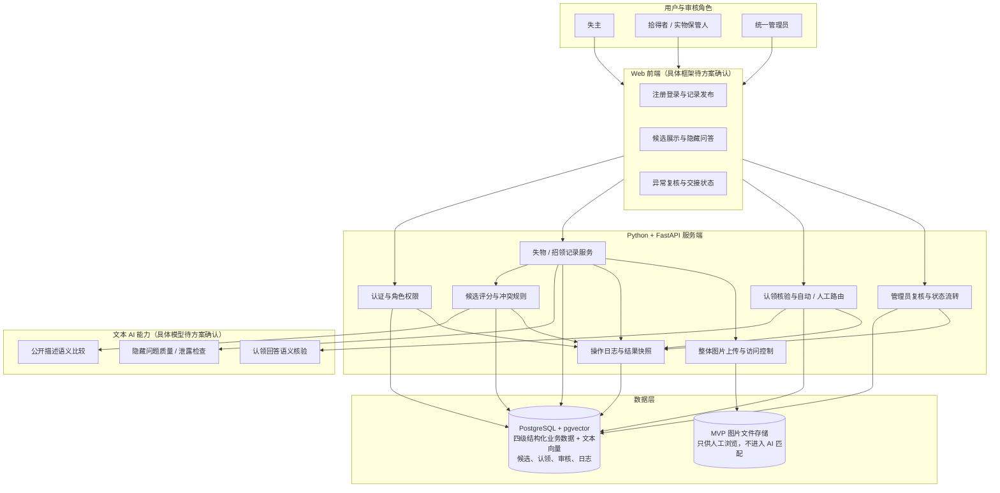
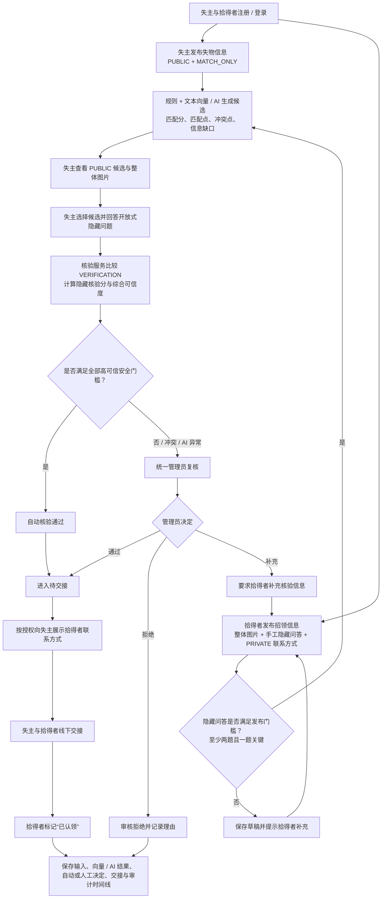
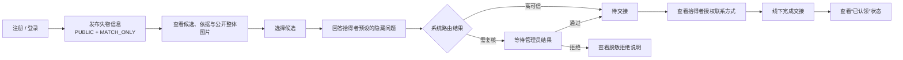
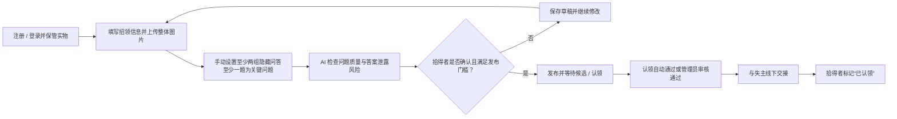
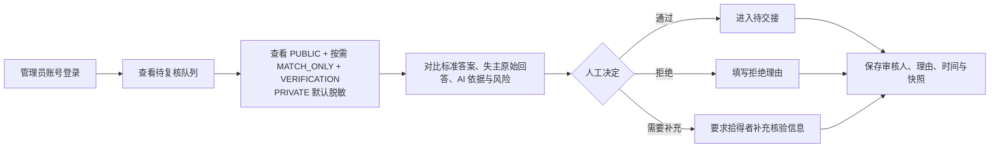

# AI 失物招领匹配与认领复核系统 PRD

**文档版本：** V0.6
**基线状态：** 已确认（2026-07-16）
**项目周期：** 2 天
**项目人数：** 3 人
**产品形态：** Web 应用 Demo
**当前阶段：** PRD 已确认，下一阶段为方案比较与选择
**核心目标：** 通过 AI 提升失物与招领信息的匹配效率，同时利用隐藏特征核验、人工复核和操作留痕降低冒领风险。

---

## 1. 产品描述

### 1.1 产品概述

#### 1.1.1 产品背景

校园中的失物与招领信息通常分散在微信群、校园墙、公众号或线下登记中。失主需要反复浏览大量消息，拾得者也缺少统一、规范且兼顾防冒领的信息发布方式。对于雨伞、耳机、水杯等高度同质化物品，传统关键词检索难以理解“黑色折叠伞”“深色短柄伞”等不同描述；失主对时间、楼层和遗失地点的记忆偏差也容易导致真实候选被严格条件提前排除。

另一方面，公开颜色、品牌和整体外观只能说明两条记录可能相关，不能证明认领人是真正失主。如果拾得者把划痕、内部标记等细节全部公开，又会让冒领者直接获得答案。现有流程还缺少统一的核验标准和处理留痕，发生争议时难以还原候选为什么被推荐、认领为什么通过或被拒绝。

#### 1.1.2 产品定义

本产品是一套面向校园场景的 **AI 失物招领匹配与认领复核 Web 系统**。系统通过结构化信息发布、`PUBLIC + MATCH_ONLY` 文本候选匹配、`VERIFICATION` 隐藏问答核验、风险分流和统一管理员复核，建立以下闭环：

> 注册登录 → 发布失物/招领 → AI 生成候选并展示依据 → 失主回答拾得者预设的隐藏问题 → 高可信自动待交接/异常转管理员 → 展示拾得者联系方式 → 拾得者确认交接 → 全流程留痕

AI 是系统能力，不是用户角色，也不负责确认物品已实际交接。实物始终由拾得者保管；拾得者线下交付后，才能在系统中标记“已认领”。

#### 1.1.3 需要解决的问题

| 对象 | 需要解决的问题 |
|---|---|
| 失主 | 如何在记忆不完整、描述不统一时快速找到真实候选；如何理解候选的匹配点与冲突点；如何通过未公开细节证明认领资格 |
| 拾得者 | 如何规范发布公开信息和整体图片；如何避免公开隐藏答案；如何设置客观有效的核验问题；如何降低与多个认领人反复沟通和错误交接的风险 |
| 管理员 | 如何只处理未达到高可信门槛、存在冲突或 AI 异常的申请；如何依据统一材料审核；如何保留决定理由和证据链 |
| 系统 | 如何区分“公开候选像不像”和“认领人是否回答正确”；如何在提升效率的同时避免 AI 误放行、答案泄露和不可追溯 |

#### 1.1.4 产品核心价值

1. **提高找回效率**：结合类别、公开描述、时间和地点生成候选，减少失主逐条搜索的成本。
2. **降低真实候选漏检**：允许近似时间、相邻地点和同义描述，不因合理记忆偏差直接排除候选。
3. **让匹配结果可理解**：同时展示匹配点、冲突点、信息缺口和候选保留原因，而不是只给一个相似度数字。
4. **降低冒领风险**：公开候选信息与拾得者手动设置的隐藏问答分离；公开高分不能单独触发待交接。
5. **减少管理员重复工作**：仅把未满足自动门槛、存在硬冲突、多人认领或 AI 异常的申请送入管理员队列。
6. **形成可信证据链**：保存原始输入、AI 结果、自动路由条件、人工审核理由、联系方式授权和拾得者交接确认。

### 1.2 产品架构图



架构边界：

- Web 前端和 FastAPI 服务端是两个技术端；失主、拾得者、管理员是角色。
- 候选匹配服务只读取 `PUBLIC + MATCH_ONLY` 文本，不读取整体图片、`VERIFICATION` 标准答案或 `PRIVATE` 数据。
- 回答核验 AI 只在隔离流程中比较拾得者标准答案与失主回答，普通用户接口不得返回标准答案。
- 整体图片只存储并展示，不调用图像识别模型、不进入候选分或认领可信度。
- PostgreSQL 保存四级结构化业务数据和审计数据；pgvector 扩展保存公开文本的向量表示。隐藏问答必须通过服务端权限控制与公开响应模型隔离。

### 1.3 技术栈

本项目为两天、三人的 Web MVP，技术选型优先考虑开发效率、接口清晰、结构化 AI 输出校验和可重复演示。

| 层级 | 技术 | 用途 | 决策状态 |
|---|---|---|---|
| Web 前端 | 待 `design_option.md` 比较确认 | 失主、拾得者、管理员三类角色视图 | 待确认，不在 PRD 阶段擅自选型 |
| 后端语言 | Python | 业务服务、规则计算和 AI 接入 | 已确认 |
| Web 服务框架 | FastAPI | 构建 REST API、权限边界、接口文档和结构化响应 | 已确认 |
| 数据校验 | Pydantic（随 FastAPI 使用） | 校验请求、响应和 AI 结构化结果，按四级分类阻止非 `PUBLIC` 字段进入候选页 DTO | 随后端栈采用，细节待设计 |
| 数据库 | PostgreSQL | 保存用户、四级业务数据、候选、认领、审核、状态和审计日志 | 已确认，替代此前 MySQL 决策 |
| 向量存储 | PostgreSQL `pgvector` 扩展 | 保存 `PUBLIC + MATCH_ONLY` 文本生成的向量，用于小规模语义候选召回/相似度计算 | 已确认采用，具体 embedding 模型与索引待设计 |
| 数据访问 | 待设计阶段确认 | PostgreSQL 连接、事务、结构化字段与向量查询；ORM/驱动将在技术方案中比较 | 待确认 |
| 图片存储 | MVP 本地文件目录 | 保存拾得者上传的整体图片，仅供人工查看 | 初步确定，待设计失败处理 |
| AI 服务 | 外部文本大模型 API，具体模型待确认 | 公开描述语义比较、问题质量检查、回答语义核验 | 待方案确认 |
| 图像识别 | 不采用 | 图片不做特征提取、相似度比较或自动认领判断 | 已确认拒绝 |
| 认证方式 | 待设计阶段确认 | 普通用户注册登录、预置管理员登录；比较 Session/JWT 的 MVP 成本 | 需求已确认，实现待设计 |

### 1.3.1 服务端职责

- 用户注册登录与失主/拾得者记录归属校验；
- 四级数据分类、管理员权限与不同响应模型隔离；
- 失物、招领、候选、认领、审核和交接状态管理；
- 候选确定性规则评分与 AI 文本语义结果合并；
- 隐藏问答发布门槛、回答核验和自动/人工路由；
- PostgreSQL 事务、四级业务数据、文本向量、审计日志和结果快照；
- 整体图片上传、访问控制和失败处理。

### 1.3.2 AI 与图像边界

- AI 只使用文本能力，不自行训练或微调模型。
- 不使用图片识别提取物品类别、颜色、品牌或隐藏特征。
- 拾得者上传的整体图片仅帮助失主人工判断是否值得认领。
- AI 输出必须经过结构校验；超时、非法结构或低置信度统一转管理员复核。

---

## 2. 产品用户画像

### 2.1 角色划分

| 角色 | 角色定义 | 核心任务 |
|---|---|---|
| 失主 | 丢失物品并希望找回的注册用户 | 发布失物公开信息、查看候选、回答隐藏问题、核验通过后联系拾得者 |
| 拾得者 | 拾到并实际保管物品的注册用户 | 发布招领和整体图片、手动设置隐藏问答、授权联系方式、线下交接并标记已认领 |
| 统一管理员 | 只负责系统异常与争议审核的预置管理账号 | 复核非高可信、冲突、多人认领和 AI 异常申请，填写通过/拒绝理由 |

同一普通用户可以在不同记录中分别作为失主或拾得者。管理员不保管实物；AI 不是角色。

### 2.2 失主用户画像

| 维度 | 描述 |
|---|---|
| 典型身份 | 学生、教师、校园员工或访客 |
| 使用场景 | 发现物品遗失，希望快速找到相关招领记录并安全认领 |
| 使用特征 | 低频、突发；情绪较焦急；对具体时间、楼层或外观细节可能记忆不完整 |
| 核心痛点 | 信息渠道分散；人工浏览成本高；关键词描述不一致；不知道候选为何被推荐；公开外观不足以证明归属 |
| 核心需求 | 快速发布；获得不过度严格的候选；查看匹配点与冲突点；回答未公开问题；查看核验、复核和待交接状态 |

典型用户故事：

> 作为失主，我希望系统在我记错具体楼层时仍保留合理候选，并告诉我地点冲突为什么没有直接排除；当我准确回答拾得者预设的隐藏问题后，可以获得联系方式并完成认领。

### 2.3 拾得者用户画像

| 维度 | 描述 |
|---|---|
| 典型身份 | 学生、教师、校园员工、安保或保洁人员 |
| 使用场景 | 拾到物品后自行保管，希望找到真正失主并降低错误交接风险 |
| 使用特征 | 低频、偶发；普通互联网使用水平；可能不知道哪些信息应公开、哪些应隐藏 |
| 核心痛点 | 描述不规范；公开图片可能泄露隐藏特征；不知道如何设置有效问题；面对多个认领人时判断压力大 |
| 核心需求 | 快速发布公开信息和整体图片；获得隐藏问题编写/泄露提示；手动确认标准答案；把异常申请交给管理员；实际交接后更新状态 |

典型用户故事：

> 作为拾得者，我希望上传整体图片供失主查看，但系统不根据图片擅自提取特征；我可以根据实物手动设置隐藏问题，系统帮助检查问题是否泄露答案，并在交接完成后由我标记已认领。

### 2.4 管理员用户画像

| 维度 | 描述 |
|---|---|
| 典型身份 | 校园行政、辅导员或被授权的系统审核人员 |
| 使用场景 | 集中处理未满足自动门槛、存在硬冲突、多人认领或 AI 异常的申请 |
| 使用特征 | 使用频率高于普通用户；熟悉基础后台；不接触和保管实物 |
| 核心痛点 | 认领标准不统一；AI 只给分数时无法判断；争议申请证据分散；处理后难以追溯 |
| 核心需求 | 查看公开依据、隐藏标准答案、失主原始回答和 AI 风险；通过或拒绝并填写理由；查看完整状态和审计快照 |

典型用户故事：

> 作为管理员，我希望系统先自动分流高可信申请，只把冲突和异常申请送入队列；审核时能够同时看到原始输入、AI 分析与隐藏问答证据，并让每次决定都有理由和时间记录。

---

## 3. 角色与权限边界

### 3.1 业务用户

| 角色 | 主要职责 |
|---|---|
| 失主 | 注册登录、发布失物信息、查看候选、发起认领、回答拾得者设置的隐藏问题、在核验通过后查看拾得者联系方式 |
| 拾得者 | 注册登录、保管实物、发布招领信息和整体图片、手动设置隐藏问题与标准答案、完成线下交接后标记“已认领” |

同一个注册用户可以在不同记录中分别承担失主或拾得者。拾得者同时承担实物保管人职责，不再单设“实物保管人”角色，也不设置失物招领处。

### 3.2 系统审核角色

| 角色 | 主要职责 |
|---|---|
| 统一管理员 | 处理未达到自动通过条件、存在冲突或 AI 异常的认领申请；查看核验材料；作出通过/拒绝决定并填写理由。管理员不保管或线下检查实物 |

### 3.3 AI 能力边界

AI 是系统能力模块，不是用户角色。AI 可以生成公开候选、解释匹配依据、向拾得者提供隐藏问题编写建议、检查问题是否泄露答案、比较认领回答与预存答案；AI 不能替拾得者编造隐藏特征，也不能标记实物已完成交接。

---

## 4. 目标与非目标

### 4.1 目标（Goals）

1. 用户通过 Web 页面完成基础注册登录；同一普通账号可以按具体记录承担失主或拾得者，管理员使用预置管理账号。
2. 失主能够发布失物的公开描述；拾得者能够发布招领信息、经过确认的整体图片、私密联系方式以及至少两组隐藏问答，其中至少一题标记为关键问题。
3. 服务端使用四级数据分类（`PUBLIC / MATCH_ONLY / VERIFICATION / PRIVATE`）控制字段用途和返回范围，普通用户候选页只能获得 `PUBLIC` 数据。
4. 候选匹配服务仅使用 `PUBLIC + MATCH_ONLY` 文本数据，按照类别硬门槛、公开描述 AI 向量相似度、时间、地点和完整度生成多个候选，并输出匹配点、冲突点、信息缺口和保留原因；颜色及其它公开外观内容统一包含在公开描述语义中，不重复计分。
5. 拾得者上传的整体图片仅供失主人工浏览，不进行图像识别、图片相似度计算或特征提取，不进入候选匹配分和认领可信度。
6. 失主针对候选回答拾得者预设的开放式问题；认领验证服务使用 `VERIFICATION` 数据计算隐藏核验分，但不得向失主返回标准答案或即时对错。
7. 候选分、隐藏核验分和综合认领可信度同时达到门槛且无硬冲突/风险时，申请自动进入“待交接”；其它情况进入统一管理员复核，不由 AI 自动拒绝。
8. 认领进入“待交接”后，系统按拾得者发布时的授权向对应失主展示联系方式；实际交接后仅拾得者可以标记“已认领”。
9. 管理员能够查看 `PUBLIC + MATCH_ONLY + VERIFICATION` 的复核材料，对异常申请执行通过或拒绝并填写理由；`PRIVATE` 默认脱敏，仅按交接和授权需要展示。
10. 系统保存原始业务输入引用、匹配与核验结果、规则/模型版本、自动或人工处理来源、审核理由、联系方式授权和交接状态，形成可追溯证据链。
11. AI 超时、非法结构、低判断置信度或信息不足时，系统保留用户数据并转入管理员复核，不伪造结果。
12. MVP 至少演示一条高可信自动待交接主路径、一条冲突转管理员路径、一个 AI/权限失败场景，以及正常、边界、失败、回归和端到端验证证据。

### 4.2 非目标（Non-Goals）

1. **不做学校统一身份认证** — MVP 只实现基础注册登录和预置管理员，不实现短信验证、找回密码、第三方登录或生产账号安全体系。
2. **不做图像识别或图片 AI 匹配** — 整体图片只供人工浏览，不提取类别、颜色、品牌、局部特征或相似度。
3. **不部署独立向量数据库，不训练或微调模型** — 小规模文本向量直接存入 PostgreSQL `pgvector`；不引入 Milvus、Pinecone 等独立服务，不训练专用视觉/文本模型。
4. **不做复杂地图和路径推断** — 地点只做预定义层级、相邻区域或文本规则，不接地图服务、不分析用户实时轨迹。
5. **不做真实物流、线上签收或交接签名** — 系统只提供联系方式和状态记录，线下实物交接由拾得者与失主完成。
6. **不作法律意义上的物权判定** — 自动待交接和管理员通过都只是系统流程结论，不能替代法律证明。
7. **不做多组织、多校区和复杂管理员协作** — MVP 采用单系统、统一管理员角色，不做任务分派、投票、评论或跨组织权限。
8. **不做复杂申诉和追责流程** — 只保留审核结果、理由与审计记录；正式申诉、仲裁和责任认定不在本次范围。
9. **不支持订单原图、购买凭证或失主旧照片作为自动评分材料** — 此类内容属于 `PRIVATE` 扩展能力，本次不上传、不进入 AI 和认领评分。
10. **不证明真实大规模准确率和生产安全性** — 两天 MVP 使用模拟数据验证流程、规则边界和证据链，不宣称已经适用于真实全校部署。

### 4.3 产品原则

1. AI 用于候选匹配与认领核验辅助，不是用户角色或责任主体；系统自动流转也不等于法律意义上的物品归属认定。
2. 候选匹配分与认领可信度必须分开。
3. 匹配引擎只使用 `PUBLIC + MATCH_ONLY`；认领验证使用 `VERIFICATION`；`PRIVATE` 不进入匹配或 AI 推理。
4. AI 不得编造隐藏特征，也不得泄露隐藏答案。
5. 只有公开候选匹配与隐藏问答核验同时达到高可信门槛、且无硬冲突时，申请才可自动进入“待交接”；其余情况必须进入管理员复核。
6. 实物始终由拾得者保管，实际交接后由拾得者标记“已认领”。
7. 最终处理结果必须保存处理人、处理时间、处理理由和自动/人工处理来源。

---

## 5. 信息分类

两级“公开/隐藏”无法表达联系方式、精确地点、内部特征等数据的不同用途。系统采用四级数据分类。分级依据不是固定字段名，而是**具体字段值的用途、可见范围和处理阶段**。

### 5.1 四级权限矩阵

| 级别 | 用途 | 普通用户候选页 | 匹配服务 | 管理员复核 |
|---|---|---|---|---|
| `PUBLIC` | 帮助用户发现候选并判断是否发起认领 | 可以看 | 可以使用 | 可以看 |
| `MATCH_ONLY` | 只用于系统匹配、标准化、排序与解释摘要 | 不直接展示原始值 | 可以使用 | 按需查看 |
| `VERIFICATION` | 用于判断认领人是否了解未公开的实物特征 | 不能看到标准答案；只看到开放式问题 | 候选匹配不得使用 | 复核时可以看 |
| `PRIVATE` | 身份、联系方式、认证信息和原始敏感资料 | 不能看他人的数据 | 不使用 | 默认脱敏，仅在授权和业务必要时查看 |

### 5.2 `PUBLIC`：公开候选信息

用于帮助失主判断“是否值得发起认领”。当前 MVP 包括：

| 字段 | 示例 | 说明 |
|---|---|---|
| 信息类型 | 失物 / 招领 | 只匹配相反类型 |
| 物品类别 | 折叠伞 | 候选类别硬门槛 |
| 物品名称 | 黑色折叠伞 | 候选概要 |
| 主颜色 | 黑色 | 公开外观属性 |
| 模糊时间 | 7 月 16 日上午 | 不展示精确秒级时间 |
| 模糊地点 | 教学楼附近 | 不展示内部精确位置数据 |
| 公开描述 | 黑色短柄折叠伞 | 不得包含隐藏验证答案 |
| 公开整体图片 | 经拾得者确认不含隐藏特征的整体照片 | 只供人工浏览，不进入 AI 或评分 |

`PUBLIC` 只能证明两条记录可能相关，不能证明认领成立。

### 5.3 `MATCH_ONLY`：匹配内部字段

这些数据可供规则或文本 AI 匹配，但不得原样展示给普通用户。当前 MVP 包括：

| 字段 | 示例 | 用户侧替代表达 |
|---|---|---|
| 精确事件时间 | `2026-07-16 10:32:18` | “时间接近”或“相差约 20 分钟” |
| 标准化地点代码 | `TEACHING_B_3F_WEST` | “位于同一栋楼相邻区域” |
| 内部地点距离/层级差 | `42m`、相邻楼层 | 展示距离级别或保留原因，不展示精确坐标 |
| 文本标准化标签 | `folding_umbrella / short_handle` | 展示“类别和手柄描述接近” |
| 文本向量 | `vector(...)` | 只用于内部语义召回/相似度计算，不向用户或普通管理员返回原始向量 |
| 公开描述语义相似度 | `0.91` | 由 AI embedding 向量匹配得到；只展示高/中/低等级和人类可读依据 |
| 信息完整度、冲突标记 | `0.80`、`LOCATION_CONFLICT` | 展示信息缺口和冲突摘要 |

当前 MVP 不从图片提取 `MATCH_ONLY` 标签。图片类别、颜色、视觉向量和图片相似度均不生成、不存储、不参与匹配。

### 5.4 `VERIFICATION`：认领验证信息

用于核验失主是否真正了解物品，不能出现在候选页或普通公开接口中。

| 数据 | 填写/产生方 | 示例 |
|---|---|---|
| 隐藏核验问题 | 拾得者手动设置 | “请描述伞套内侧是否有标记，以及标记内容。” |
| 标准答案/实物隐藏特征 | 拾得者手动填写 | “伞套内侧写有 SZY” |
| 关键问题标识 | 拾得者确认 | `is_critical=true` |
| 认领原始回答 | 失主填写 | “内侧用黑色笔写着 SZY。” |
| 单题核验结果与风险 | 隔离的核验服务产生 | 匹配、部分匹配、冲突、无法判断 |

认领人只能看到开放式问题，不能看到标准答案、相似答案、即时对错或可用于反复试探的提示。候选匹配服务不得读取 `VERIFICATION` 数据；管理员复核时可以比较标准答案、原始回答和 AI 核验依据。

### 5.5 `PRIVATE`：身份与原始敏感资料

这些数据不参与候选匹配，也不得默认展示给管理员。

| 数据 | 默认处理 | 允许展示的条件 |
|---|---|---|
| 手机号、邮箱 | 脱敏或不可见 | 认领进入待交接，且拾得者发布时已授权后，向对应失主展示 |
| 用户账号、密码哈希、认证令牌 | 仅认证服务使用 | 不向其他用户或普通管理员页面展示 |
| 原始联系方式 | 加密/受限保存（具体实现待设计） | 仅交接和安全审计所需的最小范围 |
| 原始订单、含姓名凭证、设备完整序列号 | 当前 MVP 不采集 | 后续扩展必须单独授权并重新评审隐私边界 |
| 原始精确位置轨迹 | 当前 MVP 不采集 | 不在本项目范围内 |

### 5.6 同一字段的分级示例

四级不是“一个字段名称永远属于一个等级”，而是按字段值和用途拆分。

| 主题 | `PUBLIC` | `MATCH_ONLY` | `VERIFICATION` | `PRIVATE` |
|---|---|---|---|---|
| 地点 | 教学楼附近 | 教学楼 B 区 3F、标准化地点代码、内部距离 | 拾得者预设的未公开位置细节问题（如适用） | 用户实时位置轨迹；MVP 不采集 |
| 时间 | 7 月 16 日上午 | 10:32:18、内部时间差 | 拾得者设置的时间细节问题（如适用） | 用户连续行动轨迹；MVP 不采集 |
| 图片 | 经确认不含隐藏特征的整体展示图 | 当前 MVP 不做图片标签/向量 | 当前 MVP 不使用隐藏局部照片核验 | 草稿阶段未确认安全的原始上传；不得公开 |
| 联系方式 | 不属于 `PUBLIC` | 不参与匹配 | 不参与隐藏问答 | 拾得者手机号/邮箱，待交接且授权后展示 |

### 5.7 访问与处理规则

1. 普通用户候选页和候选详情只能返回 `PUBLIC`；不能通过“前端隐藏”替代服务端字段白名单。
2. 候选匹配引擎只使用 `PUBLIC + MATCH_ONLY`，输出给用户的是人类可读摘要，不能回传精确坐标、内部标签、完整特征或模型向量。
3. 认领验证服务只在隔离流程中使用 `VERIFICATION`；标准答案不得出现在认领人的响应、错误信息或普通日志中。
4. 管理员复核可查看 `PUBLIC + MATCH_ONLY + VERIFICATION`，但 `PRIVATE` 默认脱敏；管理员不因角色身份自动获得全部原始敏感数据。
5. `PRIVATE` 不进入候选匹配、问题质量检查或回答核验的模型输入。
6. 拾得者整体图片在草稿阶段按 `PRIVATE` 处理；拾得者确认不含隐藏答案后，展示副本才能标记为 `PUBLIC`。当前 MVP 依赖人工确认，不使用视觉模型自动检测泄露。
7. 拾得者必须设置至少两组有效隐藏问答且至少一题为关键问题，招领记录才能从草稿进入匹配池。
8. 任何跨级别访问、联系方式解密/展示和管理员查看核验材料的行为都应写入审计日志。

---

## 6. 核心业务流程

### 6.1 主流程



### 6.2 失主流程



### 6.3 拾得者流程



### 6.4 管理员流程



管理员不接收、不保管也不线下检查实物，只承担统一的系统审核职责。

### 6.5 正向场景

失主填写地点为三楼，拾得者填写地点为二楼楼梯口。

虽然地点不完全一致，但系统发现：

* 物品类别一致；
* 时间接近；
* 地点属于同一栋楼相邻区域；
* 公开外观相似。

系统保留该候选。失主准确回答至少两组隐藏问题，且候选分、隐藏核验分和综合认领可信度均达到高可信门槛后，系统自动进入“待交接”。

### 6.6 反向场景

两条记录都是黑色折叠伞，时间和地点接近，但：

* 手柄结构不同；
* 隐藏标记不一致；
* 认领人无法准确描述局部特征。

系统不能因为公开信息相似就直接通过，必须进入管理员复核；AI 不自动拒绝，以免错误答案或表达差异直接剥夺真实失主的认领机会。

---

## 7. 功能需求

### 7.1 用户身份与权限

| 编号    | 功能     | 优先级 | 需求说明                      |
| ----- | ------ | --: | ------------------------- |
| FR-01 | 用户注册 |  P0 | 失主/拾得者使用用户名、密码和联系方式注册普通用户账号 |
| FR-02 | 用户登录 |  P0 | 注册用户登录后可按具体记录承担失主或拾得者；只能访问自己的记录和申请 |
| FR-03 | 管理员登录与权限 |  P0 | 管理员使用预置管理账号登录，可查看隐藏信息、认领回答、AI分析及待复核任务 |
| FR-04 | 四级字段隔离 |  P0 | 候选页只返回 PUBLIC；MATCH_ONLY 不原样返回；VERIFICATION 标准答案和 PRIVATE 不进入普通用户响应 |
| FR-05 | 操作人记录  |  P0 | 发布、认领、审核、交接均需记录操作人和时间     |

两天 Demo 实现最小注册登录闭环，但不实现学校统一认证、短信验证、找回密码、第三方登录和生产级账号安全。管理员账号由系统预置，普通注册不能自行获得管理员权限。

---

### 7.2 发布失物信息

| 编号    | 功能     | 优先级 | 需求说明                 |
| ----- | ------ | --: | -------------------- |
| FR-10 | 创建失物记录 |  P0 | 失主填写类别、颜色、描述、时间和地点   |
| FR-11 | 公开信息仅用于匹配 |  P0 | 失主提供的类别、外观、时间和地点只进入候选匹配，不生成隐藏核验标准答案 |
| FR-12 | 上传失物旧照片 |  P2 | 本次 MVP 不实现；后续可作为管理员人工补充证明，不进入 AI 匹配 |
| FR-13 | 信息修改   |  P1 | 未进入认领流程前可以修改         |
| FR-14 | 提交校验   |  P0 | 类别、公开描述、时间和地点不能为空    |
| FR-15 | 状态查看   |  P0 | 失主可查看待匹配、已有候选、核验中等状态 |

---

### 7.3 发布招领信息

| 编号    | 功能        | 优先级 | 需求说明                 |
| ----- | --------- | --: | -------------------- |
| FR-20 | 创建招领记录    |  P0 | 拾得者填写物品公开信息          |
| FR-21 | 手动设置隐藏问答 |  P0 | 拾得者手动填写至少两组开放式问题和标准答案，其中至少一题标记为关键问题 |
| FR-22 | AI 填写引导与质量检查 |  P0 | AI 提示可检查部位、问题是否客观、是否在文案/图片中泄露答案；拾得者确认最终内容 |
| FR-23 | 隐藏问答发布门槛 |  P0 | 少于两组有效问答时只能保存草稿，不能进入公开匹配池 |
| FR-24 | 上传整体图片 |  P0 | 拾得者可上传物品整体图片供失主人工浏览；不调用图像识别模型、不进入匹配分 |
| FR-25 | 图片与敏感内容提示 |  P0 | 提醒遮挡隐藏特征及身份证、银行卡等敏感内容；公开图片不得泄露标准答案 |
| FR-26 | 联系方式授权 |  P0 | 拾得者发布时确认联系方式仅在认领核验通过并进入待交接后向对应失主展示 |

---

### 7.4 AI候选匹配

| 编号    | 功能     | 优先级 | 需求说明                |
| ----- | ------ | --: | ------------------- |
| FR-30 | 自动生成候选 |  P0 | 新记录发布后，与相反类型记录进行匹配  |
| FR-31 | 多候选返回  |  P0 | 返回相似度最高的若干候选，不只返回一条 |
| FR-32 | 模糊时间匹配 |  P0 | 允许失主和拾得者填写的时间存在一定偏差 |
| FR-33 | 模糊地点匹配 |  P0 | 同楼、相邻楼层、相邻区域不能直接排除  |
| FR-34 | 文本向量语义匹配 |  P0 | AI embedding 将公开描述转为向量，通过 PostgreSQL pgvector 比较语义相似度，支持措辞不同但含义相近的文本 |
| FR-35 | 候选排序   |  P0 | 按综合匹配分从高到低展示        |
| FR-36 | 手动重新匹配 |  P1 | 用户修改信息后可以触发重新匹配     |
| FR-37 | 候选数量限制 |  P1 | 默认展示前5条候选           |

候选匹配仅使用 `PUBLIC + MATCH_ONLY` 文本数据，`VERIFICATION` 标准答案和 `PRIVATE` 数据不得进入候选计算或公开解释。

#### 7.4.1 候选匹配标准

候选匹配采用“硬门槛 + 100 分公开信息评分”。图片只展示，不参与任何分数。

##### 硬门槛

1. 只能匹配相反信息类型：`LOST <-> FOUND`。
2. 物品大类必须一致；雨伞不能与耳机成为候选。
3. 已认领、已撤销或已关闭记录不参与匹配。

##### 评分维度

| 维度 | 权重 | 评分原则 |
|---|---:|---|
| 时间接近度 | 20 | 1 小时内 20；1～4 小时 12；同一天 6；跨日且无合理解释 0 并标记冲突 |
| 地点接近度 | 20 | 同一地点 20；同楼/相邻楼层 14；同校园邻近区域 8；明显无关 0 并标记冲突 |
| 公开描述语义相似度 | 50 | 由 AI embedding 模型将双方 `PUBLIC + MATCH_ONLY` 公开描述转为向量，通过 PostgreSQL pgvector 计算相似度并映射为 0～50 分；不得补造输入中不存在的品牌、结构或隐藏特征 |
| 信息完整度 | 10 | 关键公开字段越完整分越高；信息缺失只降低完整度，不能自动补齐 |

颜色、品牌、名称和其它公开外观属性仍可包含在用户的公开描述中，但它们属于同一段描述的语义信息，不再设置独立评分维度，也不得与向量语义分重复加分。图片仍不生成向量、不参与该维度。

##### 候选等级

| 候选匹配分 | 等级 | 系统处理 |
|---:|---|---|
| 80～100 | 高 | 优先展示，但仍不能单独确认归属 |
| 60～79 | 中 | 展示并醒目标记冲突/缺口 |
| 40～59 | 低 | 可作为补充候选展示，默认标记需谨慎核验 |
| 0～39 | 不召回 | 不进入默认候选列表，可在管理员诊断日志中查看原因 |

如存在明确的品牌/型号/结构硬冲突，候选最高只能为“中”；如公开信息完整度低于 60%，候选最高只能为“低”。阈值属于 Demo 初始规则，必须通过边界样例验证后才能在答辩中说明其有效范围。

---

### 7.5 匹配依据展示

| 编号    | 功能      | 优先级 | 需求说明             |
| ----- | ------- | --: | ---------------- |
| FR-40 | 展示候选匹配分 |  P0 | 展示公开信息候选分和高、中、低等级，并声明不是所有权概率 |
| FR-41 | 展示匹配点   |  P0 | 说明类别、公开描述语义、时间和地点等一致信息  |
| FR-42 | 展示冲突点   |  P0 | 说明地点、品牌或结构描述等差异  |
| FR-43 | 展示保留原因  |  P0 | 解释存在冲突时为什么仍然保留候选 |
| FR-44 | 避免确定性表述 |  P0 | 不得直接显示“这是你的物品”   |
| FR-45 | 认领入口    |  P0 | 用户可针对候选发起认领      |

候选页面示例：

```text
候选匹配度：82%

匹配点：
- 都是黑色折叠伞
- 时间相差约20分钟
- 位于同一栋教学楼

冲突点：
- 失主填写三楼
- 招领记录填写二楼楼梯口

保留原因：
两个地点属于相邻区域，物品可能被移动，因此仍保留为候选。
```

---

### 7.6 隐藏验证与认领申请

| 编号    | 功能       | 优先级 | 需求说明              |
| ----- | -------- | --: | ----------------- |
| FR-50 | 发起认领     |  P0 | 用户针对某条候选提交认领申请    |
| FR-51 | 展示拾得者问题 |  P0 | 认领时展示拾得者已确认的开放式隐藏问题，AI 不临时生成事实 |
| FR-52 | 问题去提示化检查 |  P0 | AI 可检查问题是否包含正确答案或明显选项，最终由拾得者修改确认 |
| FR-53 | 提交自由文本回答 |  P0 | 认领人通过文字描述物品细节     |
| FR-54 | 多问题核验    |  P0 | 拾得者发布前手动设置至少 2 个、最多 4 个核验问题 |
| FR-55 | 回答次数限制   |  P0 | 同一认领申请最多提交2次      |
| FR-56 | 保存原始回答   |  P0 | 每次回答均保存，不得覆盖历史记录  |
| FR-57 | 补充材料     |  P1 | 可上传订单截图、旧照片或编号证明  |
| FR-58 | 防试探机制    |  P0 | 回答错误后不得展示标准答案     |
| FR-59 | 重复认领标记   |  P1 | 用户多次认领不同物品时产生风险提示 |

隐藏问题由拾得者在发布招领记录时手动设置。AI 可以提出“请检查杯底、内壁、连接处、标签或局部磨损”等方向，也可以审查问题质量，但不能根据图片或常识编造答案。

问题示例：

隐藏答案：

> 杯底有绿色圆形贴纸，上面写着数字7。

系统问题：

> 请描述杯底是否存在特殊标记，包括颜色、形状和内容。

系统不得询问：

> 杯底是不是有一个写着7的绿色圆形贴纸？

---

### 7.7 AI认领辅助判断与自动流转

| 编号    | 功能       | 优先级 | 需求说明                  |
| ----- | -------- | --: | --------------------- |
| FR-60 | 回答语义比对   |  P0 | 比较认领回答与隐藏答案是否语义一致     |
| FR-61 | 分问题输出结果  |  P0 | 每个问题显示匹配、部分匹配、冲突或无法判断 |
| FR-62 | 生成风险提示   |  P0 | 识别关键特征错误、回答模糊、重复试探等情况 |
| FR-63 | 输出隐藏核验分与认领可信度 |  P0 | 隐藏核验分、候选匹配分和综合认领可信度必须分开显示 |
| FR-64 | 输出路由建议 |  P0 | 输出“满足自动待交接条件”或“转管理员复核”，不自动拒绝 |
| FR-65 | 给出判断依据   |  P0 | 说明哪些证据支持、哪些证据存在冲突     |
| FR-66 | 表达不确定性   |  P0 | 信息不足时明确输出无法判断         |
| FR-67 | 高可信自动待交接 |  P0 | 仅同时满足全部安全门槛时自动进入待交接；这不是确认实际交接或法律归属 |

隐藏核验分由每个问题的 `匹配 / 部分匹配 / 冲突 / 无法判断` 结果汇总。问题等权；如拾得者把某题标记为关键问题，该题出现冲突时直接禁止自动流转。

| 单题结果 | 单题分值 | 判定要求 |
|---|---:|---|
| 匹配 | 100 | 核心事实一致；数字、字母、序列片段等精确特征需规范化后完全一致 |
| 部分匹配 | 60 | 方向一致但缺少非关键细节，或表达存在可解释差异 |
| 无法判断 | 30 | 回答过于笼统、问题质量不足或模型无法稳定判断 |
| 冲突 | 0 | 颜色、位置、内容、数量等关键事实与标准答案矛盾 |

隐藏核验分为各题分值的平均值。AI 每题必须输出结果、依据和自身判断置信度；输出结构不合法、判断置信度低于 `0.8` 或模型调用失败时，该题按“无法判断”处理并转管理员，不允许自动待交接。

综合认领可信度构成：

| 依据         | 参考权重 |
| ---------- | ---: |
| 公开候选匹配分 | 40% |
| 隐藏核验分 | 60% |

图片不参与认领可信度。该权重和阈值仅用于 Demo，必须通过测试样例验证，不在 MVP 中提供后台配置。

#### 7.7.1 自动进入“待交接”的全部条件

以下条件必须同时成立：

1. 候选匹配分 `>= 80`；
2. 隐藏核验分 `>= 85`；
3. 综合认领可信度 `>= 85`；
4. 拾得者预先设置并确认了至少两组有效隐藏问答，且至少一题为关键问题；
5. 所有关键问题均为“匹配”，不存在关键冲突；
6. 没有信息泄露、重复试探、多人认领、AI 异常或“无法判断”等风险标记。

任一条件不满足，认领申请都进入统一管理员复核，不自动拒绝。自动通过时记录规则版本、三个分数、AI 结果快照和自动处理时间。

---

### 7.8 人工复核

| 编号    | 功能     | 优先级 | 需求说明                  |
| ----- | ------ | --: | --------------------- |
| FR-70 | 待复核列表  |  P0 | 管理员只查看未达到自动待交接门槛、存在冲突/多人认领或 AI 异常的申请 |
| FR-71 | 查看完整证据 |  P0 | 查看公开信息、隐藏特征、认领回答和AI分析 |
| FR-72 | 通过认领   |  P0 | 管理员审核通过后将申请转为待交接，但不代替拾得者确认实物已交付 |
| FR-73 | 拒绝认领   |  P0 | 管理员拒绝申请               |
| FR-74 | 要求补充信息 |  P1 | 管理员可要求拾得者完善隐藏问答后重新发起核验 |
| FR-75 | 审核理由必填 |  P0 | 通过或拒绝必须填写处理理由         |
| FR-76 | 多人认领处理 |  P0 | 同一物品有多人认领时强制进入人工复核    |
| FR-77 | 关键冲突处理 |  P0 | 隐藏特征存在关键冲突时不得自动通过     |
| FR-78 | 审核结果通知 |  P1 | 用户可在系统内查看审核结果         |

以下情况必须进入人工复核：

* 多人认领同一物品；
* 关键隐藏特征回答冲突；
* 未同时满足候选分、隐藏核验分和综合认领可信度的高可信门槛；
* 用户连续修改或试探答案；
* 公开信息高度相似，但实物细节明显不同；
* AI服务异常或无法判断；
* 认领人对处理结果提出异议。

管理员依据系统中拾得者预先保存的标准答案进行审核，不承担实物保管或现场检查职责。

---

### 7.9 交接与结果保存

| 编号    | 功能     | 优先级 | 需求说明                       |
| ----- | ------ | --: | -------------------------- |
| FR-80 | 进入待交接 |  P0 | 高可信自动核验或管理员审核通过后进入待交接，并向失主展示拾得者已授权的联系方式 |
| FR-81 | 拾得者确认交接 |  P0 | 只有发布该招领记录的拾得者可在实际交付后标记已认领 |
| FR-82 | 更新物品状态 |  P0 | 交接完成后更新为已认领或已关闭            |
| FR-83 | 保存处理依据 |  P0 | 自动流转保存阈值、分数和风险快照；人工流转保存审核理由 |
| FR-84 | 保存结果快照 |  P0 | 保存认领时使用的记录和AI结果，避免后续修改影响历史 |
| FR-85 | 操作日志   |  P0 | 保存发布、修改、认领、审核和交接操作         |
| FR-86 | 查询历史   |  P1 | 用户和管理员可查看历史处理记录            |
| FR-87 | 交接异常转复核 | P1 | 拾得者或失主发现异常时可暂停交接并转管理员，不能直接标记完成 |

---

## 8. 状态设计

### 8.1 失物／招领记录状态

```text
草稿（拾得者隐藏问答不足时不能发布）
  ↓
待匹配 -> 已有候选 -> 核验中
                         ↓
              自动核验通过 / 管理员审核通过
                         ↓
                      待交接
                         ↓
                 拾得者确认“已认领”
```

其他状态：

* 已撤销
* 已过期
* 已关闭

### 8.2 认领申请状态

```text
待回答
  ↓
AI核验中
  ↓
满足高可信门槛 ──否──> 待管理员复核 -> 审核通过 / 审核拒绝
  ↓是                                  ↓
自动核验通过 -----------------------> 待交接
                                         ↓
                              拾得者确认已完成交接
```

AI 不自动拒绝认领。自动核验通过和管理员审核通过只是进入待交接的两条路径；最终“已认领”状态只能由实际保管物品的拾得者在交接后提交。

---

## 9. AI模块要求

### 9.1 候选召回模块

输入：

* 公开物品类别；
* 公开描述；
* 时间；
* 地点；
* 品牌、颜色等属性。

不输入：公开整体图片、隐藏问题、标准答案、联系方式。

输出：

```json
{
  "match_score": 82,
  "matched_points": [
    "物品类别一致",
    "时间相差20分钟",
    "地点位于同一栋楼"
  ],
  "conflict_points": [
    "楼层记录不一致"
  ],
  "retention_reason": "地点相邻且时间接近，因此保留为候选"
}
```

### 9.2 隐藏问题填写引导与质量检查模块

输入：

* 拾得者正在填写的问题文本；
* 拾得者手动录入的标准答案；
* 公开描述中已经展示的特征摘要。

输出：

* 可检查的物品部位或特征维度建议；
* 问题是否客观、是否过于宽泛、是否泄露答案的提示；
* 修改建议，最终由拾得者决定是否采用。

约束：

* 不根据图片识别或常识生成隐藏事实；
* 不替拾得者保存未经确认的问题或答案；
* 不把标准答案改写进问题；
* 隐藏信息不足时阻止发布并提示拾得者继续检查实物。

### 9.3 回答核验模块

输入：

* 隐藏答案；
* 认领人的原始回答；
* 可选补充材料说明。

输出：

```json
{
  "verification_score": 76,
  "question_results": [
    {
      "result": "匹配",
      "reason": "认领人准确描述了红色环形缝线"
    },
    {
      "result": "部分匹配",
      "reason": "认领人提到了字母标记，但未准确说明内容"
    }
  ],
  "risk_flags": [
    "第二项回答不完整"
  ],
  "routing": "MANUAL_REVIEW",
  "auto_handover_eligible": false
}
```

---

## 10. 页面需求

| 页面/视图 | 使用角色 | 核心内容 |
|---|---|---|
| 注册/登录 | 失主、拾得者、管理员 | 普通用户注册登录；管理员使用预置账号登录 |
| 首页/我的记录 | 失主、拾得者 | 发布失物、发布招领、查看本人记录和状态 |
| 发布失物 | 失主 | 填写仅用于公开候选匹配的信息 |
| 发布招领 | 拾得者 | 公开信息、整体图片、联系方式授权、手动隐藏问答、AI 质量提示 |
| 候选列表/详情 | 失主 | 候选分、匹配点、冲突点、公开整体图片、认领入口 |
| 隐藏核验 | 失主 | 回答拾得者预设问题，不展示标准答案或即时对错 |
| 认领状态/待交接 | 失主、拾得者 | 自动/人工处理来源、待交接状态；通过后向失主展示拾得者联系方式 |
| 管理员复核 | 管理员 | 异常申请队列、完整核验证据、通过/拒绝和理由 |
| 交接确认/历史 | 拾得者；三角色按权限查看历史 | 拾得者标记已认领；查看可追溯时间线 |

---

## 11. 核心数据对象

### 11.1 物品记录 `item_record`

```text
id
record_type
publisher_id

# PUBLIC
public_category
public_item_name
public_color
public_brand
public_description
public_time_range
public_location
public_image_path

# MATCH_ONLY
exact_event_time
normalized_location_code
normalized_text_tags
text_embedding             # MATCH_ONLY，PostgreSQL pgvector
information_completeness

# PRIVATE
finder_contact
contact_release_consent

status
created_at
updated_at
```

### 11.2 核验问题 `verification_question`

```text
id
found_record_id
question_text            # VERIFICATION，认领人可见问题但不可见答案
expected_answer          # VERIFICATION，仅核验服务和管理员复核可读
is_critical
quality_check_result
created_by_finder_id
created_at
```

### 11.3 候选记录 `match_candidate`

```text
id
lost_record_id
found_record_id
match_score
vector_similarity
matched_points
conflict_points
retention_reason
ai_summary
model_version
created_at
```

### 11.4 认领申请 `claim_application`

```text
id
candidate_id
claimant_id
answers                   # VERIFICATION
verification_score
claim_confidence
question_results
risk_flags
ai_recommendation
processing_source
attempt_count
status
created_at
```

### 11.5 人工审核 `review_record`

```text
id
claim_id
reviewer_id
decision
review_reason
ai_result_snapshot
created_at
```

### 11.6 操作日志 `operation_log`

```text
id
operator_id
operation_type
target_type
target_id
before_status
after_status
operation_detail
created_at
```

---

## 12. 非功能需求

### 12.1 安全与隐私

1. 普通用户候选页只返回 `PUBLIC`，必须使用后端响应白名单；前端隐藏不能代替数据隔离。
2. `MATCH_ONLY` 只能供候选服务和按需管理员诊断使用，不原样返回精确坐标、内部标签、距离或模型特征。
3. `VERIFICATION` 标准答案只供隔离的核验服务和管理员复核，不能通过认领响应、错误信息或普通日志返回。
4. `PRIVATE` 不进入匹配或 AI 提示词，默认脱敏并遵循最小授权原则。
5. 身份证号、银行卡号、订单原图、完整序列号和实时位置轨迹不属于当前 MVP 输入；服务端应拒绝或提示用户不要提交。
6. 所有认领、管理员查看核验材料、跨级访问、联系方式展示和状态修改都需要留痕。
7. 拾得者联系方式仅在认领进入“待交接”且拾得者发布时已授权的情况下向对应失主展示。
8. 普通用户注册不能获得管理员权限；密码不得明文存储（具体认证实现由设计阶段确定）。
9. 整体图片草稿默认按 `PRIVATE` 处理；拾得者确认不含隐藏答案后，展示副本才成为 `PUBLIC`，且不得进入 AI 匹配提示词。

### 12.2 性能

两天Demo目标：

* 单次候选匹配在5秒内返回；
* 单次隐藏回答核验在10秒内完成；
* 系统至少支持20条测试记录；
* 页面基础操作无明显阻塞。

### 12.3 可解释性

所有AI结果至少包含：

* 结论；
* 支持依据；
* 冲突依据；
* 置信度或评分；
* 不确定性说明。

禁止仅返回一个相似度数字。

### 12.4 异常处理

当AI调用失败时：

1. 保存错误日志；
2. 不删除用户已提交的数据；
3. 将任务标记为“AI判断失败”；
4. 转入人工复核；
5. 页面明确提示不能自动判断。

---

## 13. 验收标准

### 13.1 功能验收

| 场景          | 预期结果                |
| ----------- | ------------------- |
| 普通用户注册登录 | 注册用户可以按记录发布失物或招领，不能访问管理员能力 |
| 发布失物信息      | 信息成功保存，候选页只返回 PUBLIC，其他级别字段不泄露 |
| 四级候选响应 | 普通用户候选接口只包含 PUBLIC；MATCH_ONLY 原始值、VERIFICATION 和 PRIVATE 均不存在 |
| 匹配服务输入 | 只包含 PUBLIC + MATCH_ONLY 文本，不包含 VERIFICATION、PRIVATE 或图片 |
| 管理员复核响应 | 包含 PUBLIC + 按需 MATCH_ONLY + VERIFICATION；PRIVATE 默认脱敏 |
| 发布招领信息      | 拾得者可上传整体图片并手动设置至少两组隐藏问答；问答不足时只能保存草稿 |
| 图片参与范围 | 整体图片可由失主浏览，但不进入 AI 输入和任何匹配/认领分数 |
| 地点存在偏差      | 相邻地点仍能生成候选          |
| 公开信息相似      | 候选页面展示相同点和冲突点       |
| 发起认领        | 系统展示拾得者预设且不泄露答案的开放式问题 |
| 回答语义相同但文字不同 | AI能够识别语义一致          |
| 关键隐藏特征错误    | 系统不得直接通过            |
| 多人认领        | 自动进入人工复核            |
| AI服务失败      | 保留日志并转人工处理          |
| 管理员审核       | 必须填写处理理由            |
| 高可信核验 | 同时满足全部安全门槛时自动进入待交接，并记录自动处理依据 |
| 非高可信核验 | 任一门槛不满足时进入统一管理员复核，不自动拒绝 |
| 联系方式展示 | 只有进入待交接后，失主才能看到拾得者已授权的联系方式 |
| 完成交接        | 只有拾得者可在实际交接后将物品更新为已认领，并保存完整记录 |

### 13.2 关键演示验收

#### 正向案例

地点或楼层填写不一致，但隐藏特征回答准确。

预期：

* 系统没有提前排除真实候选；
* 展示地点冲突；
* 满足全部高可信门槛时自动进入待交接；否则由管理员复核通过后进入待交接。

#### 反向案例

物品公开外观高度相似，但隐藏特征不一致。

预期：

* 系统能生成候选；
* 不因公开相似度高而直接确认；
* AI提示关键冲突；
* 最终拒绝或转人工复核。

---

## 14. 两天三人建议分工

| 人员  | 主要任务                   |
| --- | ---------------------- |
| 成员A | 数据库、后端接口、状态流转、审核与日志    |
| 成员B | 候选匹配、问题生成、回答核验、AI结果结构化 |
| 成员C | 前端页面、接口联调、测试案例、演示与文档   |

第一天完成：

> 发布记录 → 生成候选 → 展示依据

第二天完成：

> 隐藏验证 → AI分析 → 人工复核 → 结果保存

---

## 15. PRD 确认基线与后续验证事项

### 15.1 已确认需求基线

1. 产品为 Web 系统，包含 Web 前端和服务端。
2. 业务用户为失主、拾得者；统一管理员是审核角色；AI 不是角色。
3. 实物始终由拾得者保管，不设置失物招领处。
4. 失主发布的信息按 `PUBLIC + MATCH_ONLY` 分级后只用于候选匹配，不作为认领标准答案。
5. 隐藏问题与标准答案由拾得者手动设置，AI 只引导和检查。
6. 拾得者可上传整体图片供失主人工浏览，但不使用图像识别模型、不参与 AI 匹配。
7. 实现普通用户注册登录；管理员使用预置账号。
8. 高可信申请满足全部安全门槛时自动进入待交接，其余统一由管理员复核。
9. 进入待交接后向失主展示拾得者授权联系方式；实际交接后仅拾得者可标记已认领。
10. 后端采用 Python + FastAPI；业务数据库采用 PostgreSQL，并通过 pgvector 同时保存结构化业务数据和公开文本向量。该决策替代此前 MySQL 选择；前端、数据访问、认证和具体 AI/embedding 模型留待方案与设计阶段确认。
11. 候选匹配不再把颜色与公开外观属性单独计分；统一使用 AI embedding 对公开描述进行向量匹配，公开描述语义相似度占候选分 50 分，时间 20 分、地点 20 分、完整度 10 分。
12. 数据采用 `PUBLIC / MATCH_ONLY / VERIFICATION / PRIVATE` 四级分类；候选页只看 PUBLIC，匹配用 PUBLIC + MATCH_ONLY，核验用 VERIFICATION，PRIVATE 默认脱敏且不进入 AI。
13. 原第 13 章 MVP 范围已合并为第 4 章“目标与非目标”，避免需求范围在文档中重复和漂移。

本 PRD V0.6 已由用户于 2026-07-16 确认为当前需求基线。后续如果需求内容发生变化，应保留本版本记录并从 V0.7 起新增迭代，不静默覆盖本基线。

### 15.2 进入 Design Review 前需要验证

1. 自由文本隐藏回答由 AI 语义比对时，是否必须增加确定性关键词/字符串规则作为自动流转护栏。
2. 候选分 `80`、隐藏核验分 `85`、综合认领可信度 `85` 的阈值在测试样例上是否合理。
3. “至少两题且至少一题为关键问题”的发布门槛是否会让无明显独特特征的普通物品难以发布，需要用样例验证。

当前 PRD 的自动流转结论是：

> **公开候选高分本身不能直接确认。只有候选匹配分、隐藏核验分和综合认领可信度同时达到门槛，至少两题有效且无硬冲突/风险时，系统才自动进入“待交接”；否则统一管理员复核。最终“已认领”只能由拾得者在线下交接后确认。**
