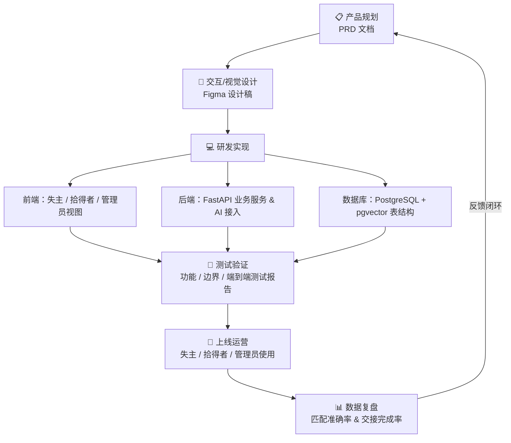
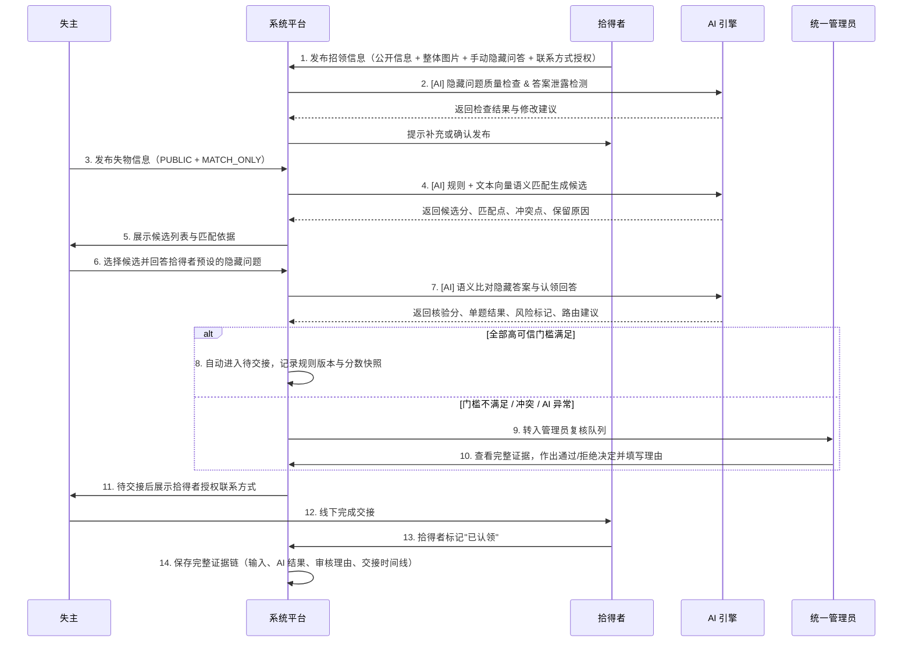
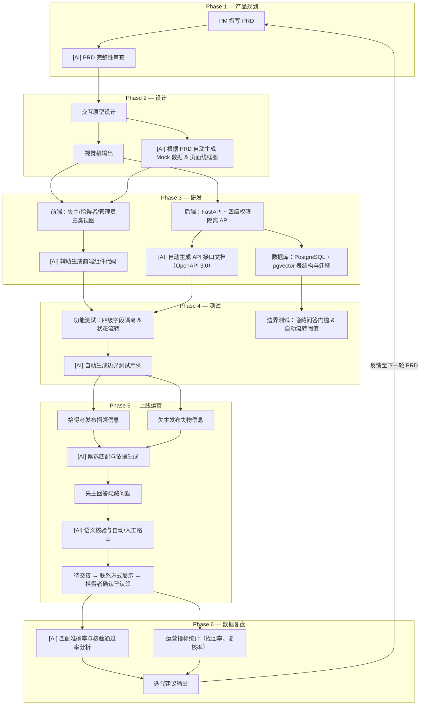
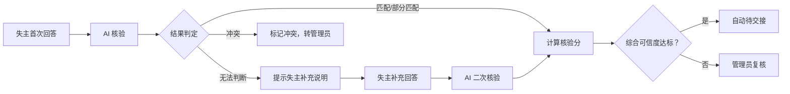

# AI 失物招领匹配与认领复核系统 — 项目产物端到端流转图

> **产品目标**：通过 AI 提升校园失物与招领信息的匹配效率，利用四级数据分类（PUBLIC / MATCH_ONLY / VERIFICATION / PRIVATE）、隐藏特征核验、人工复核和操作留痕，在降低冒领风险的同时形成可追溯证据链。

---

## Step 1: PRD 到复盘的流转图

### 1.1 技术产物流转总览



### 1.2 业务动作流（嵌套在运营阶段）



### 1.3 全流程整合视图



---

## Step 2: 角色输入输出标注

### 2.1 产品经理 (PM)

| 阶段 | 输入（Input） | 输出（Output） |
|------|--------------|---------------|
| 产品规划 | 校园失物招领痛点调研、冒领风险分析 | **PRD 文档**（含四级数据分类、匹配标准、核验流程、验收标准） |
| 设计阶段 | — | PRD 评审意见、需求优先级排序表 |
| 研发阶段 | 技术方案评审反馈 | 需求变更单（如有） |
| 测试阶段 | QA 提交的缺陷报告 | 需求确认回复、缺陷优先级判定 |
| 运营阶段 | 用户反馈、匹配准确率数据 | 版本迭代计划、阈值调优需求 |
| 数据复盘 | AI 复盘报告、找回率统计 | **迭代 PRD 文档**（下一轮） |

### 2.2 UI/UX 设计师 (Design)

| 阶段 | 输入（Input） | 输出（Output） |
|------|--------------|---------------|
| 产品规划 | PRD 文档 | — |
| 设计阶段 | PRD 文档、三角色用户画像 | **交互原型稿（Axure/Figma）**、**视觉设计稿**、候选展示/核验页面设计规范 |
| 研发阶段 | 研发反馈（技术可行性） | 切图标注文件、设计走查清单 |
| 测试阶段 | UI 还原度问题反馈 | 设计修正稿 |
| 运营阶段 | 用户体验反馈 | UI 优化方案 |
| 数据复盘 | 用户行为热力图 | 设计迭代建议 |

### 2.3 研发工程师 (RD — 前端/后端)

| 阶段 | 输入（Input） | 输出（Output） |
|------|--------------|---------------|
| 产品规划 | PRD 文档 | 技术可行性评估报告 |
| 设计阶段 | 交互原型稿、视觉设计稿 | — |
| 研发阶段 | 设计稿、PRD 文档 | **前端代码仓库**、**FastAPI 后端 API 接口文档（OpenAPI 3.0）**、**PostgreSQL + pgvector ER 图 & 迁移脚本**、四级权限中间件、单元测试代码 |
| 测试阶段 | QA 缺陷工单 | Bug 修复补丁、修复确认记录 |
| 运营阶段 | 线上告警、用户反馈 | 热修复补丁、性能优化版本 |
| 数据复盘 | 性能监控数据、错误日志 | 技术债务清单、架构优化方案 |

### 2.4 测试工程师 (QA)

| 阶段 | 输入（Input） | 输出（Output） |
|------|--------------|---------------|
| 产品规划 | PRD 文档 | 测试策略文档 |
| 设计阶段 | 交互原型稿 | — |
| 研发阶段 | API 接口文档、数据库 ER 图 | **测试用例文档**、**自动化测试脚本** |
| 测试阶段 | 可测试的构建版本 | **测试执行报告**、**缺陷报告**、四级字段隔离验证报告、自动流转阈值边界测试报告 |
| 运营阶段 | 线上用户投诉 | 线上问题复现报告、回归测试确认 |
| 数据复盘 | 缺陷统计数据 | 质量改进建议、测试覆盖率报告 |

### 2.5 运营 / 校园管理员 (Ops)

| 阶段 | 输入（Input） | 输出（Output） |
|------|--------------|---------------|
| 产品规划 | PRD 文档 | 业务流程确认意见 |
| 设计阶段 | 高保真原型 | 操作流程确认反馈 |
| 研发阶段 | 用户手册草稿 | **操作手册 / SOP 文档** |
| 测试阶段 | 测试环境账号 | UAT 验收确认签字 |
| 运营阶段 | 认领申请队列、管理员复核任务 | **复核处理记录**、**异常申请统计表**、交接确认记录 |
| 数据复盘 | AI 分析报告、找回率统计 | **运营复盘报告**、流程改进建议 |

---

## Step 3: AI 可参与点（AI Enhancement）

以下标记 **[AI]** 的节点为 AI 可介入的具体环节：

### AI 节点 1：PRD 完整性审查 & 自动补全

- **位置**：产品规划阶段
- **AI 能力**：AI 对 PRD 文档进行语义分析，自动检测缺失的非功能需求（如隐藏问答最大数量、回答次数上限、联系方式授权条件），并生成补充建议。例如：PRD 中写了"拾得者设置隐藏问题"但未说明问题数量上限，AI 自动提示"建议补充：最多 4 个核验问题，至少 2 个有效且至少 1 个关键问题"。

### AI 节点 2：根据 PRD 自动生成 Mock 数据 & 页面原型

- **位置**：设计阶段
- **AI 能力**：AI 解析 PRD 中的用户故事和四级数据分类，自动生成 Mock 数据集（如 50 条模拟失物/招领记录、20 条认领申请）和低保真页面线框图，覆盖失主、拾得者、管理员三类视图，供设计师快速起步。

### AI 节点 3：辅助生成前端组件代码 & API 接口文档

- **位置**：研发阶段
- **AI 能力**：
  - **前端**：AI 根据设计稿截图或字段描述，自动生成 React/Vue 组件骨架代码（含候选卡片、隐藏问答表单、管理员复核面板等）。
  - **后端**：AI 根据 PostgreSQL + pgvector 的 ER 图和业务描述，自动生成 FastAPI 路由和 OpenAPI 3.0 接口文档，并附带四级权限注解和请求/响应示例。

### AI 节点 4：自动生成边界测试用例

- **位置**：测试阶段
- **AI 能力**：AI 分析 API 接口文档和 PRD 中的业务规则，自动生成边界测试用例。例如：
  - 隐藏问答不足 2 组时能否发布招领记录
  - 关键问题回答冲突时是否禁止自动流转
  - 候选分 79 vs 80 边界时的路由行为
  - 同一认领申请第 3 次提交是否被拒绝
  - AI 超时时是否正确转入管理员复核
  - 联系方式在非待交接状态下是否对失主不可见

### AI 节点 5：隐藏问题质量检查与答案泄露检测

- **位置**：运营阶段（拾得者发布招领时）
- **AI 能力**：
  - **质量检查**：AI 检查拾得者设置的问题是否客观、是否过于宽泛、是否包含可检查的特征维度。
  - **泄露检测**：AI 检测问题文本中是否直接包含了标准答案（如"杯底是不是有一个写着 7 的绿色圆形贴纸？"），并提示拾得者修改为开放式问题（如"请描述杯底是否存在特殊标记"）。

### AI 节点 6：候选匹配与语义相似度计算

- **位置**：运营阶段（失物/招领记录发布后）
- **AI 能力**：
  - AI 将 `PUBLIC + MATCH_ONLY` 公开描述通过 embedding 模型转为向量，通过 PostgreSQL pgvector 计算语义相似度。
  - 结合类别硬门槛、时间接近度、地点接近度和信息完整度，生成综合候选分（0-100）。
  - 输出匹配点、冲突点、信息缺口和保留原因，而非仅返回一个相似度数字。
  - 支持"黑色折叠伞"与"深色短柄伞"等不同描述的语义理解，避免因措辞差异排除真实候选。

### AI 节点 7：认领回答语义核验与自动路由

- **位置**：运营阶段（失主回答隐藏问题后）
- **AI 能力**：
  - AI 在隔离流程中比较认领人原始回答与拾得者预存的 `VERIFICATION` 标准答案。
  - 对每个问题输出"匹配 / 部分匹配 / 冲突 / 无法判断"及判断依据和置信度。
  - 汇总生成隐藏核验分和综合认领可信度。
  - 输出路由建议：满足全部高可信安全门槛时建议自动待交接；否则建议转管理员复核。
  - AI 不自动拒绝认领，以避免错误答案或表达差异直接剥夺真实失主的机会。

---

## Step 4: 断点分析与修复方案

### 4.1 发现的断点：AI 语义核验的"无法判断"导致真实失主流失

**断点描述**：

失主准确描述了物品隐藏特征（如"伞套内侧有手写标记"），但措辞与拾得者预存的标准答案（"伞套内侧写有 SZY"）存在表述差异。AI 将该题判定为"无法判断"（置信度 0.75，低于 0.8 门槛），导致隐藏核验分从 100 降至 30，综合认领可信度跌破 85 门槛，申请被转入管理员复核。如果管理员响应不及时，失主可能在 DDL 前无法完成认领。

**根因分析**：

| 层面 | 问题 |
|------|------|
| PRD 文档 | 未明确"部分匹配"与"无法判断"的判定边界，导致 AI 在语义相近但表述不同时保守判定为"无法判断" |
| AI 模块 | 核验模块对"无法判断"的置信度阈值（0.8）可能过于严格，未区分"信息不足"和"表述差异"两种场景 |
| 流程设计 | 单次核验后无失主补充说明的机会，直接降级到管理员复核 |
| 测试覆盖 | 缺少"语义相同但文字不同"的专项边界测试用例 |

### 4.2 修复方案

#### 修复 1：在 PRD 中细化"部分匹配"与"无法判断"的判定标准（文档层面）

在 PRD 隐藏核验分章节增加判定细则：

```markdown
## 单题结果判定细则

| 结果 | 判定条件 | 示例 |
|------|---------|------|
| 匹配 | 核心事实一致；精确特征规范化后完全一致 | 标准答案"SZY"，回答"SZY" |
| 部分匹配 | 方向一致但缺少非关键细节，或表述存在可解释差异 | 标准答案"写有 SZY"，回答"有手写字母" |
| 无法判断 | 回答过于笼统（如"不知道"）、问题质量不足或模型超时 | 回答"好像有标记" |
| 冲突 | 关键事实与标准答案矛盾 | 标准答案"红色"，回答"蓝色" |
```

#### 修复 2：引入"二次补充"机制（流程层面）



#### 修复 3：调整置信度阈值与降级策略（技术层面）

```python
# 核验结果处理逻辑
def process_verification_result(ai_result):
    if ai_result.confidence >= 0.8:
        return ai_result.result  # 直接采用
    elif ai_result.confidence >= 0.6:
        # 置信度中等：标记为"待确认"，允许失主补充
        return VerificationResult(
            result="NEEDS_CLARIFICATION",
            allow_supplement=True
        )
    else:
        # 置信度低：转管理员，不自动判定
        return VerificationResult(
            result="MANUAL_REVIEW",
            reason="AI 置信度不足，需人工复核"
        )
```

#### 修复 4：增加专项边界测试用例（测试层面）

```markdown
## 语义核验边界测试用例

| 编号 | 场景 | 标准答案 | 认领回答 | 预期结果 |
|------|------|---------|---------|---------|
| TC-V01 | 精确特征一致 | "SZY" | "SZY" | 匹配 |
| TC-V02 | 表述差异但语义一致 | "写有 SZY" | "有手写字母SZY" | 部分匹配或匹配 |
| TC-V03 | 方向一致但细节缺失 | "红色环形缝线" | "有缝线" | 部分匹配 |
| TC-V04 | 完全不相关 | "绿色贴纸" | "没有标记" | 冲突 |
| TC-V05 | 回答过于笼统 | "SZY" | "不知道" | 无法判断 |
| TC-V06 | 拼写/格式差异 | "No.2026" | "2026号" | 匹配（规范化后） |
```

#### 修复 5：核验结果可解释性增强（产品层面）

每次核验结果必须包含：

```json
{
  "question_id": 1,
  "result": "部分匹配",
  "confidence": 0.72,
  "matched_evidence": "认领人提到了字母标记",
  "missing_evidence": "未准确说明标记内容为 SZY",
  "suggestion": "建议允许失主补充说明具体字母内容"
}
```

---

## 附录：完整项目里程碑

| 阶段 | 产出物 | 负责角色 | 预计周期 |
|------|--------|---------|---------|
| 产品规划 | PRD 文档、四级数据分类矩阵、匹配标准 | PM | 1 天 |
| 交互设计 | 交互原型稿、设计规范（三角色视图） | Design | 1 天 |
| 视觉设计 | 高保真设计稿、切图标注 | Design | 0.5 天 |
| 技术评审 | 技术方案文档、API 接口文档、PostgreSQL + pgvector ER 图 | RD | 0.5 天 |
| 前端开发 | 前端代码（失主/拾得者/管理员视图）、单元测试 | RD-FE | 1.5 天 |
| 后端开发 | FastAPI 后端代码、四级权限中间件、AI 接入、数据库迁移 | RD-BE | 1.5 天 |
| 联调测试 | 集成测试、四级字段隔离验证、缺陷修复 | RD + QA | 1 天 |
| 预发布验证 | Staging 环境验收、自动流转阈值边界测试 | QA + Ops | 0.5 天 |
| 正式上线 | 生产环境部署、监控配置 | RD + Ops | 0.5 天 |
| 运营期 | 认领申请处理、管理员复核、交接确认 | 失主 + 拾得者 + 管理员 | 持续 |
| 数据复盘 | 匹配准确率分析、找回率统计、迭代建议 | PM + AI | 0.5 天 |

---

> **文档版本**：v1.0
> **生成日期**：2026-07-16
> **适用范围**：AI 失物招领匹配与认领复核系统 MVP 版本
