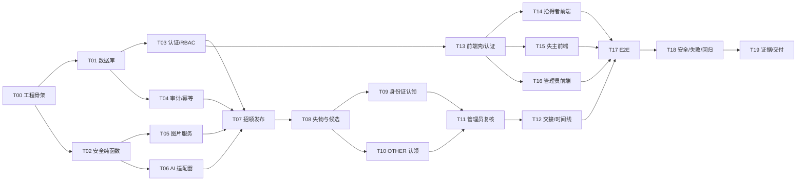

# TDD 实施任务计划：AI 失物招领匹配与认领复核系统

> **文档版本：** V1.0  
> **日期：** 2026-07-16  
> **状态：** 可执行，尚未开始编码  
> **执行基线：** `prd.md` V0.8、`design_option.md` V4.1、`docs/design/end-to-end-system-design.md` V1.3、`dev.md` V1.0

实施时逐项执行，不批量预填结果。每个任务严格执行 Red → Green → Refactor，并把实际命令和结果写入 `evidence/development-records/TXX.md`。若在单独会话执行本计划，先使用计划执行方法逐任务推进；实现功能先使用 TDD，遇到失败先按系统化调试定位，声称完成前执行全量验证。

---

## 1. 目标、架构和全局规则

**目标：** 两天内交付 React Web + FastAPI + PostgreSQL/pgvector MVP，真实跑通发布、候选、分类型核验、自动/人工路由、交接和审计。

**架构：** 单体仓库、模块化 FastAPI 后端；React 按 feature 拆分；PostgreSQL 同时存结构化数据和公开文本向量；PRIVATE/PUBLIC 文件物理隔离；外部 AI 通过端口适配器，支持 real/mock 明确切换。

**全局红线：**

1. 完整身份证号码、隐藏答案、原图路径、token 和 HMAC key/value 不进入 API 输出、普通日志、URL 或浏览器持久缓存。
2. 身份证使用确定性代码核验，不调用 LLM；失主图片不调用多模态。
3. 模型失败、低置信、重复号码、关键冲突都不能自动进入待交接。
4. `CLAIMED` 不能由 AI 或候选分直接产生，正常路径只由对应拾得者确认线下交接。
5. 只使用合成/脱敏数据；任何真实个人资料不得进入仓库、截图和演示数据库。

---

## 2. 依赖关系与关键路径



关键路径：T00 → T01/T02 → T03/T04/T05/T06 → T07 → T08 → T09/T10 → T11 → T12 → T17 → T18 → T19。

---

## 3. Day 1：工程、数据与核心后端

### Task T00：建立可重复启动的工程骨架

**目标：** 创建后端、前端、数据库和 mock 服务骨架，锁定依赖并建立最小测试基线。

**文件：**

- 新建：`docker-compose.yml`、`.env.example`、`.gitignore`
- 新建：`backend/pyproject.toml`、`backend/app/main.py`、`backend/app/core/config.py`
- 新建：`backend/tests/unit/test_health.py`
- 新建：`frontend/package.json`、`frontend/vite.config.ts`、`frontend/src/main.tsx`
- 新建：`frontend/src/app/App.tsx`、`frontend/tests/app-smoke.test.tsx`
- 新建：`ai-mock/app.py`

**Red：**

1. `test_health.py` 要求 `/api/health/live` 返回 `{"status":"ok"}`，`/ready` 在数据库不可用时返回 503。
2. `app-smoke.test.tsx` 要求首页出现“我丢失了物品”和“我捡到了物品”。
3. 先运行测试，确认因入口/页面尚未实现而失败。

**Green：**

1. 创建 FastAPI app、health router 和配置校验。
2. 创建 React 入口和最小首页，仅展示两个任务入口，不实现业务。
3. Compose 定义 `postgres:16`、`backend`、`frontend`、`ai-mock`，并为 PostgreSQL 初始化 vector 扩展预留迁移。

**验证命令：**

```powershell
docker compose build
docker compose up -d postgres
docker compose run --rm backend pytest tests/unit/test_health.py -q
docker compose run --rm frontend npm run test -- --run tests/app-smoke.test.tsx
```

**预期：** 后端 2 个 health 行为通过；前端 1 个 smoke 用例通过；不声称数据库 ready，直到 T01 迁移完成。

**验收与证据：** `docker compose config` 无错误；锁文件已生成；`.env.example` 无密钥；保存 `evidence/development-records/T00.md`。

**依赖：** 无。  
**建议提交：** `chore(scaffold): initialize backend frontend postgres and ai mock`

---

### Task T01：建立枚举、数据模型与分步迁移

**目标：** 实现详细设计 6、7 章的数据结构和不变量基础。

**文件：**

- 新建：`backend/app/db/base.py`、`session.py`、`enums.py`
- 新建：`backend/app/{auth,items,images,multimodal,matching,verification,reviews,audit}/models.py`
- 新建：`backend/alembic/versions/0001_enable_vector_and_enums.py` 至 `0006_audit_and_idempotency.py`
- 新建：`backend/tests/integration/db/test_migrations.py`、`test_model_constraints.py`

**Red：**

1. 断言 12 组枚举值与设计一致。
2. 断言空库 upgrade 后存在核心表、vector 扩展与 embedding 列。
3. 断言 IDENTITY_DOCUMENT 不能同时保存有效 verification set；OTHER 不能保存 identity secret。
4. 断言 PUBLIC asset 只能是 `PUBLIC_REDACTED + CONFIRMED`。

**Green：**

1. 按 `dev.md` 六个迁移顺序创建模型和约束。
2. 为 `item_records` 增加 `version`；为所有聚合增加 UTC 时间和 owner id。
3. 为 HMAC、尝试、候选、审计建立设计规定的索引；不加 ANN 索引和 HMAC 唯一约束。

**验证命令：**

```powershell
docker compose run --rm backend pytest tests/integration/db/test_migrations.py tests/integration/db/test_model_constraints.py -q
docker compose run --rm backend alembic downgrade base
docker compose run --rm backend alembic upgrade head
```

**预期：** 迁移与约束测试通过；downgrade/upgrade 均退出 0。

**验收与证据：** 数据库中没有完整号码列；migration SQL 不含真实敏感值；保存 schema/扩展检查结果。

**依赖：** T00。  
**建议提交：** `feat(db): add pgvector schema constraints and migrations`

---

### Task T02：实现安全纯函数、评分与状态机

**目标：** 先完成不依赖数据库的高风险规则，为后续服务提供唯一实现。

**文件：**

- 新建：`backend/app/verification/identity.py`、`other.py`
- 新建：`backend/app/matching/scoring.py`
- 新建：`backend/app/items/state_machine.py`
- 新建：`backend/tests/unit/verification/test_identity.py`、`test_other_rules.py`
- 新建：`backend/tests/unit/matching/test_scoring.py`
- 新建：`backend/tests/unit/items/test_state_machine.py`

**必须锁定的接口：**

```python
normalize_cn_id(value: str) -> str
validate_cn_id(value: str) -> bool
compute_id_hmac(normalized: str, key: bytes) -> str
mask_cn_id(normalized: str) -> str
score_candidate(features: CandidateFeatures) -> CandidateScore
validate_question_set(draft: QuestionSetDraft) -> QuestionSetValidation
can_transition_record(current: RecordStatus, target: RecordStatus) -> bool
can_transition_claim(current: ClaimStatus, target: ClaimStatus) -> bool
```

**Red：**

- 覆盖 18 位、末位 X/x、非法长度、非法校验位、空白/全角输入、掩码前 3 后 4。
- 覆盖同 key/同号码 HMAC 相等、不同号码/不同 key 不等；函数异常不包含原号码。
- 覆盖类别硬门槛、50/20/20/10 边界、Top 5 稳定排序与相同分数 tie-break。
- 覆盖问题少于 2、多于 3、非开放式、重复维度、答案泄露。
- 覆盖所有合法和非法状态转换，特别是禁止直接 `DRAFT → CLAIMED`、`PENDING_REVIEW → CLAIMED`。

**Green：** 写满足测试的最小纯函数；HMAC 使用 SHA-256，比较使用 `hmac.compare_digest`；状态转换表集中定义。

**验证命令：**

```powershell
docker compose run --rm backend pytest tests/unit/verification tests/unit/matching tests/unit/items -q
```

**预期：** 全部纯函数测试通过，测试输出/异常文本无完整号码。

**依赖：** T00。  
**建议提交：** `feat(core): implement deterministic verification scoring and state machines`

---

### Task T03：实现注册、登录、刷新与资源级 RBAC

**目标：** 建立 USER/ADMIN 账号权限和按记录判断失主/拾得者的授权基础。

**文件：**

- 新建：`backend/app/auth/{schemas.py,security.py,service.py,rbac.py}`
- 新建：`backend/app/api/deps.py`、`backend/app/api/routes/auth.py`
- 修改：`backend/app/api/router.py`、`backend/app/main.py`
- 新建：`backend/tests/unit/auth/test_security.py`
- 新建：`backend/tests/integration/api/test_auth.py`、`test_rbac.py`

**Red：**

1. 注册成功、重复 email、错误密码、refresh、refresh 撤销。
2. 管理员不能通过公开注册创建。
3. USER 不能访问 `/api/admin/*`；ADMIN 不能因角色自动读取任意 PRIVATE 资源。
4. 用户 A 不能读取/修改用户 B 的 LOST/FOUND 草稿。

**Green：** Argon2 密码哈希；短时 access + 可撤销 refresh；`require_user`、`require_admin`、`require_record_owner`、`require_claim_party` 依赖函数。实现：

```text
POST /api/auth/register
POST /api/auth/login
POST /api/auth/refresh
```

**验证命令：**

```powershell
docker compose run --rm backend pytest tests/unit/auth tests/integration/api/test_auth.py tests/integration/api/test_rbac.py -q
```

**预期：** 授权矩阵用例通过；错误体只含稳定错误码。

**依赖：** T01。  
**建议提交：** `feat(auth): add jwt sessions and resource level authorization`

---

### Task T04：实现审计、脱敏日志与幂等基础

**目标：** 让后续每个业务状态变化都有同事务事件，并防止敏感数据进入日志。

**文件：**

- 新建：`backend/app/audit/{schemas.py,service.py,projection.py}`
- 新建：`backend/app/core/{logging.py,idempotency.py,clock.py,ids.py}`
- 新建：`backend/app/api/errors.py`
- 新建：`backend/tests/unit/audit/test_redaction.py`、`test_projection.py`
- 新建：`backend/tests/integration/audit/test_audit_transaction.py`、`test_idempotency.py`

**Red：**

- 构造含完整号码、phone、token、hidden_answer、对象路径的请求/异常，扫描日志不存在原值。
- 普通用户时间线不含管理员内部备注；管理员默认投影不含完整号码。
- 同主体、同 `Idempotency-Key`、同请求只产生一次业务变化和一个决定事件；不同请求复用键返回冲突。
- 业务事务回滚时审计事件同时回滚。

**Green：** JSON 日志 filter、错误码映射、append-only audit service、角色投影、幂等结果表与装饰/服务。

**验证命令：**

```powershell
docker compose run --rm backend pytest tests/unit/audit tests/integration/audit -q
```

**依赖：** T01、T03。  
**建议提交：** `feat(audit): add redacted audit projection and idempotency`

---

### Task T05：实现图片上传、存储隔离与身份证脱敏

**目标：** PRIVATE 原图与 PUBLIC 脱敏副本物理隔离，并提供受控资产生命周期。

**文件：**

- 新建：`backend/app/images/{schemas.py,storage.py,redaction.py,service.py}`
- 新建：`backend/app/api/routes/uploads.py`
- 新建：`backend/tests/unit/images/test_validation.py`、`test_redaction.py`
- 新建：`backend/tests/integration/images/test_storage_access.py`、`test_cleanup.py`

**Red：**

- JPEG/PNG/WebP 合法；伪 MIME、错误魔数、超大小、超像素拒绝。
- 上传只返回随机 `asset_id`，不返回文件路径。
- PRIVATE 文件不可从公共静态路由访问。
- 脱敏副本对指定号码区域像素不可恢复；未确认副本不能变 PUBLIC。
- 记录关闭后删除 PRIVATE 原图并写 `PRIVATE_IMAGE_DELETED`。

**Green：** 实现 `StoragePort`、本地目录适配器、图片验证、不可逆遮挡、确认与清理任务。

**验证命令：**

```powershell
docker compose run --rm backend pytest tests/unit/images tests/integration/images -q
```

**依赖：** T01、T02、T04。  
**建议提交：** `feat(images): isolate private assets and create confirmed redactions`

---

### Task T06：实现 OpenAI 兼容 AI 端口、mock 与契约测试

**目标：** 隔离多模态、问题生成、回答核验和 embedding 的供应商细节，并证明失败降级。

**文件：**

- 新建：`backend/app/multimodal/{ports.py,schemas.py,openai_compatible.py,mock.py}`
- 新建：`backend/app/matching/embedding.py`
- 完善：`ai-mock/app.py`、新增 `ai-mock/fixtures/*.json`
- 新建：`backend/tests/contract/test_extraction_contract.py`、`test_question_contract.py`、`test_verification_contract.py`、`test_embedding_contract.py`

**锁定接口：**

```python
extract_found_item(image_ref, context) -> ExtractionDraft
generate_questions(hidden_description) -> QuestionSetDraft
verify_answers(question_set, answers) -> VerificationResult
embed_public_text(texts: list[str]) -> list[list[float]]
```

**Red：** 合法 JSON、字段缺失、非法枚举、夹带 Markdown、超时、429、500、维度错误、模型幻觉、低置信；断言 PRIVATE 原图只传给提取端口，完整号码/失主图片不传给任何模型。

**Green：** httpx 兼容客户端、超时和有限重试、Pydantic 严格校验、响应清理、模型元数据、确定性 mock。

**验证命令：**

```powershell
docker compose up -d ai-mock
docker compose run --rm backend pytest tests/contract -q
```

**预期：** 契约正常与故障用例通过；失败返回可处理错误，不返回伪造成功。

**依赖：** T00、T02、T04。  
**建议提交：** `feat(ai): add validated openai compatible ports and deterministic mock`

---

### Task T07：实现拾得者招领草稿、确认与发布

**目标：** 跑通 M3 的 ID/OTHER 双分支发布硬门槛。

**文件：**

- 新建：`backend/app/items/{schemas.py,policies.py,service.py}`
- 新建：`backend/app/api/routes/found_records.py`
- 新建：`backend/tests/integration/items/test_found_draft.py`、`test_found_identity_publish.py`、`test_found_other_publish.py`

**Red：**

1. 创建 FOUND 草稿后触发提取，AI 草稿不能直接成为 confirmed 值。
2. 版本过期的确认返回 `409 VERSION_CONFLICT`。
3. ID：未逐位确认、号码非法、无确认脱敏副本均不能发布。
4. OTHER：隐藏描述不足、问题少于 2、问题未确认均只能保存 DRAFT。
5. 模型失败允许人工填写公开字段，但不得绕过类型专属发布门槛。
6. 发布事务同时写快照、状态与审计。

**Green：** 实现以下 8 个接口：

```text
POST /api/uploads
POST /api/found-records
POST /api/found-records/{id}/extract
PUT  /api/found-records/{id}/confirmation
POST /api/found-records/{id}/identity-confirmation
POST /api/found-records/{id}/redaction
POST /api/found-records/{id}/questions
POST /api/found-records/{id}/publish
```

**验证命令：**

```powershell
docker compose run --rm backend pytest tests/integration/items/test_found_draft.py tests/integration/items/test_found_identity_publish.py tests/integration/items/test_found_other_publish.py -q
```

**依赖：** T03～T06。  
**建议提交：** `feat(found): add human confirmed multimodal publishing workflows`

---

### Task T08：实现失物发布、向量候选与 PUBLIC DTO

**目标：** 实现 M2 和 50/20/20/10 候选评分，候选页面只暴露 PUBLIC。

**文件：**

- 新建：`backend/app/matching/{schemas.py,service.py}`
- 新建：`backend/app/api/routes/{lost_records.py,candidates.py}`
- 新建：`backend/tests/integration/matching/test_candidate_query.py`、`test_candidate_scoring.py`、`test_candidate_dto_privacy.py`

**Red：**

- 创建 LOST 时失主图片保存但 AI 调用 spy 为 0。
- SQL 硬过滤只取方向相反、同类型、PUBLISHED、活动 FOUND。
- 语义/时间/地点/完整度按 50/20/20/10；明显时间地点冲突不能被语义分掩盖。
- Top 5 稳定；低于展示阈值不返回。
- 对候选 JSON 递归扫描：不存在 embedding、精确坐标、隐藏描述、答案键、HMAC、联系方式、PRIVATE asset/url。

**Green：** 实现：

```text
POST /api/lost-records
GET  /api/lost-records/{id}/candidates
GET  /api/candidates/{id}
```

保存候选快照、模型/规则版本与安全理由代码；MVP 用 pgvector 精确余弦。

**验证命令：**

```powershell
docker compose run --rm backend pytest tests/integration/matching -q
```

**依赖：** T03、T04、T06、T07。  
**建议提交：** `feat(matching): add public text vector candidates and safe projections`

---

## 4. Day 2 上午：核验、复核、交接与前端

### Task T09：实现居民身份证认领与 2 次原子限制

**目标：** 使用 HMAC 精确核验，不泄露号码，并处理重复活动记录。

**文件：**

- 新建：`backend/app/verification/service.py`
- 新建：`backend/app/api/routes/claims.py`
- 新建：`backend/tests/integration/verification/test_identity_claim.py`、`test_identity_attempt_concurrency.py`、`test_duplicate_identity_routing.py`

**Red：**

1. 正确唯一号码：申请进入 `PENDING_HANDOFF`，不直接 `CLAIMED`。
2. 第 1 次错误保留可再次尝试；第 2 次错误后锁定；第 3 次不计算 HMAC 比较并返回 `ATTEMPT_LOCKED`。
3. 两个并发失败请求不能把次数写成 1 或超过 2。
4. 相同 HMAC 对应两条活动 FOUND：正确输入仍进入 `PENDING_REVIEW`。
5. 格式错误与不匹配对外统一为 `IDENTITY_NOT_VERIFIED`；响应、DB 可读字段和日志无完整号码。

**Green：** 实现 `POST /api/candidates/{id}/claims/identity`；同一事务中行锁/原子计数、比较、重复检查、状态和审计。

**验证命令：**

```powershell
docker compose run --rm backend pytest tests/integration/verification/test_identity_claim.py tests/integration/verification/test_identity_attempt_concurrency.py tests/integration/verification/test_duplicate_identity_routing.py -q
```

**依赖：** T02、T04、T08。  
**建议提交：** `feat(identity): enforce hmac verification attempts and duplicate routing`

---

### Task T10：实现 OTHER 开放式问题认领与安全路由

**目标：** 失主只能看问题文本并一次提交答案；高可信才自动待交接，其余转管理员。

**文件：**

- 完善：`backend/app/verification/{other.py,service.py,schemas.py}`
- 修改：`backend/app/api/routes/claims.py`
- 新建：`backend/tests/integration/verification/test_other_questions_api.py`、`test_other_claim_routing.py`、`test_other_model_failure.py`

**Red：**

- `GET questions` 只返回 id/text，不返回 answer key、隐藏描述和模型内部依据。
- 全部关键题匹配、candidate ≥80、hidden ≥85、overall ≥85、confidence ≥0.8、无风险时进入 `PENDING_HANDOFF`。
- 关键冲突、缺失、低置信、非法 JSON、超时、规则冲突全部进入 `PENDING_REVIEW`，不自动拒绝真实失主，也不自动放行。
- 同一 claim 的答案只允许提交一次；重复提交不覆盖原证据。

**Green：** 实现：

```text
GET  /api/candidates/{id}/questions
POST /api/candidates/{id}/claims/answers
```

保存输入快照哈希、题目/模型版本、每题结果代码、总体规则结果和安全解释。

**验证命令：**

```powershell
docker compose run --rm backend pytest tests/integration/verification/test_other_questions_api.py tests/integration/verification/test_other_claim_routing.py tests/integration/verification/test_other_model_failure.py -q
```

**依赖：** T04、T06、T08。  
**建议提交：** `feat(other): add open question claims with conservative routing`

---

### Task T11：实现管理员异常队列、临时原图与复核决定

**目标：** 管理员只处理异常，默认最小可见；原图访问有理由、时效、单对象和审计。

**文件：**

- 新建：`backend/app/reviews/{schemas.py,service.py}`
- 新建：`backend/app/api/routes/admin.py`
- 新建：`backend/tests/integration/reviews/test_review_queue.py`、`test_original_access.py`、`test_admin_decision.py`

**Red：**

- 队列只含待复核申请，默认展示掩码、事件和结果代码。
- 无理由不能申请原图；access id 只能访问一个 asset、一次、在 TTL 内；过期/二次访问拒绝。
- 原图响应不含文件系统路径，完整号码始终不可读。
- `APPROVE/REJECT` 必须有理由和 `Idempotency-Key`；重复请求不重复写事件。
- USER 调用任何 admin 接口返回 403。

**Green：** 实现 6 个接口：

```text
GET  /api/admin/reviews
GET  /api/admin/reviews/{id}
POST /api/admin/reviews/{id}/original-access
GET  /api/admin/original-access/{access_id}
POST /api/admin/reviews/{id}/decision
GET  /api/admin/audit-events
```

**验证命令：**

```powershell
docker compose run --rm backend pytest tests/integration/reviews -q
```

**依赖：** T03、T04、T05、T09、T10。  
**建议提交：** `feat(admin): add least privilege reviews and ephemeral original access`

---

### Task T12：实现联系方式授权、交接完成与角色时间线

**目标：** 完成从核验/复核到线下交接和 `CLAIMED/CLOSED` 的闭环。

**文件：**

- 新建：`backend/app/api/routes/handoffs.py`、`records.py`
- 完善：`backend/app/items/service.py`、`backend/app/audit/projection.py`
- 新建：`backend/tests/integration/handoffs/test_contact_access.py`、`test_handoff_complete.py`、`test_timeline_projection.py`

**Red：**

- 仅 `PENDING_HANDOFF` 的相关失主可读拾得者联系方式；其他用户、待复核、已拒绝均不可读。
- 只有对应拾得者可确认；失主、其他拾得者、未认证用户被拒绝。
- 幂等交接只产生一次状态变化。
- 成功事务把 claim 设 `CLAIMED`，关联记录设 `CLOSED`，撤销联系授权并写事件。
- 三种角色时间线字段不同且无越权数据。

**Green：** 实现：

```text
GET  /api/claims/{id}/contact
POST /api/claims/{id}/handoff-complete
GET  /api/records/{id}/timeline
```

**验证命令：**

```powershell
docker compose run --rm backend pytest tests/integration/handoffs -q
```

**依赖：** T04、T09～T11。  
**建议提交：** `feat(handoff): close claims with scoped contact and audit timelines`

---

### Task T13：实现前端应用壳、认证和角色路由守卫

**目标：** 建立普通用户双入口和独立管理员 Layout，不在浏览器持久化敏感值。

**文件：**

- 新建：`frontend/src/app/{router.tsx,providers.tsx,queryClient.ts}`
- 新建：`frontend/src/api/{client.ts,types.ts,errors.ts}`
- 新建：`frontend/src/features/auth/{api.ts,hooks.ts,LoginPage.tsx,RegisterPage.tsx,guards.tsx}`
- 新建：`frontend/src/features/home/HomePage.tsx`
- 新建：`frontend/src/components/{UserLayout.tsx,AdminLayout.tsx,ErrorState.tsx}`
- 新建：`frontend/tests/auth-routing.test.tsx`、`home.test.tsx`

**Red：**

- 未登录访问业务页跳登录；USER 访问 `/admin` 显示无权且不发 admin 数据请求；ADMIN 进入独立 Layout。
- 首页两个主按钮跳 `/lost/new` 与 `/found/new`。
- access token 只保存在内存；refresh 使用受控机制；测试扫描 local/session storage 无 token 和敏感表单值。

**Green：** 实现 API client、provider、route guards、双入口首页、独立 Layout 和统一错误映射。

**验证命令：**

```powershell
docker compose run --rm frontend npm run test -- --run tests/auth-routing.test.tsx tests/home.test.tsx
docker compose run --rm frontend npm run typecheck
```

**依赖：** T03。  
**建议提交：** `feat(frontend): add auth shell dual task home and admin guard`

---

### Task T14：实现“我捡到了物品”四步向导

**目标：** 按原型实现上传、AI 草稿确认、分类核验、预览发布和交接入口。

**文件：**

- 新建：`frontend/src/features/found-items/{api.ts,types.ts,FoundWizardPage.tsx}`
- 新建：`frontend/src/features/found-items/components/{ImageUploadStep.tsx,AiDraftStep.tsx,IdentityConfirmationStep.tsx,OtherVerificationStep.tsx,PublishPreviewStep.tsx}`
- 新建：`frontend/tests/found-wizard.test.tsx`、`found-sensitive-state.test.tsx`

**Red：**

- 上传后显示 AI loading/success/failure；失败允许手填。
- AI 值与人工修改值清晰区分；未确认不能下一步。
- ID 要求逐位确认和脱敏预览；不把完整号码放 URL、缓存或错误上报；卸载后清空。
- OTHER 信息不足时显示“保存草稿”，不显示发布成功。
- 服务端发布门槛错误映射到具体步骤。

**Green：** 实现组件与 API hooks；复用原型布局；以服务端状态为真源。

**验证命令：**

```powershell
docker compose run --rm frontend npm run test -- --run tests/found-wizard.test.tsx tests/found-sensitive-state.test.tsx
```

**依赖：** T07、T13。  
**建议提交：** `feat(frontend): implement finder publishing wizard`

---

### Task T15：实现“我丢失了物品”候选、双认领与进度页

**目标：** 实现失物表单、PUBLIC 候选、身份证/OTHER 认领和交接进度。

**文件：**

- 新建：`frontend/src/features/lost-items/{api.ts,LostCreatePage.tsx,LostDetailPage.tsx}`
- 新建：`frontend/src/features/candidates/{CandidateList.tsx,CandidateDetailPage.tsx}`
- 新建：`frontend/src/features/claims/{IdentityClaimForm.tsx,OtherClaimForm.tsx,ClaimProgressPage.tsx}`
- 新建：`frontend/tests/owner-flow.test.tsx`、`candidate-privacy.test.tsx`、`claim-errors.test.tsx`

**Red：**

- 失主图片上传不触发 AI 状态或提取接口。
- 候选只渲染 PUBLIC 字段和安全理由。
- ID 错误不显示错误位或内部原因；第 2 次失败显示锁定。
- OTHER 只显示开放问题；答案提交后从表单内存清除。
- 只有 `PENDING_HANDOFF` 才请求/显示联系方式；`CLAIMED` 显示时间线结果。

**Green：** 实现页面、hooks、错误/空/加载态和敏感清理。

**验证命令：**

```powershell
docker compose run --rm frontend npm run test -- --run tests/owner-flow.test.tsx tests/candidate-privacy.test.tsx tests/claim-errors.test.tsx
```

**依赖：** T08～T10、T12、T13。  
**建议提交：** `feat(frontend): implement owner candidates claims and progress`

---

### Task T16：实现管理员异常工作台

**目标：** 实现独立异常队列、最小证据详情、临时原图和复核决定。

**文件：**

- 新建：`frontend/src/features/admin/{api.ts,AdminQueuePage.tsx,AdminReviewPage.tsx,AdminAuditPage.tsx}`
- 新建：`frontend/src/features/admin/components/{MaskedEvidencePanel.tsx,OriginalAccessDialog.tsx,DecisionForm.tsx}`
- 新建：`frontend/tests/admin-console.test.tsx`、`admin-original-access.test.tsx`

**Red：**

- 默认只显示掩码和事件；原图按钮必须先填理由。
- access 过期/已用后立即清理 object URL，不缓存。
- 决定理由为空不能提交；重复点击只发送同一幂等键。
- UI 中不存在完整号码字段或“显示完整号码”入口。

**Green：** 实现队列筛选、复核详情、原图对话框、决定表单和审计查询。

**验证命令：**

```powershell
docker compose run --rm frontend npm run test -- --run tests/admin-console.test.tsx tests/admin-original-access.test.tsx
```

**依赖：** T11、T13。  
**建议提交：** `feat(frontend): implement least privilege admin review console`

---

## 5. Day 2 下午：E2E、失败验证与交付

### Task T17：建立 E2E seed 并跑通三条端到端路径

**目标：** 用真实前端、API 和 PostgreSQL 证明核心状态变化，不把组件 mock 当 E2E。

**文件：**

- 新建：`backend/app/db/seed_demo.py`
- 新建：`e2e/playwright.config.ts`
- 新建：`e2e/fixtures/{users.ts,assets.ts,db.ts}`
- 新建：`e2e/specs/identity-happy-path.spec.ts`、`other-high-confidence.spec.ts`、`duplicate-id-admin-review.spec.ts`
- 新建：`e2e/assets/` 下合成/脱敏图片

**seed：**

1. 唯一合成身份证：正确号码可进入待交接。
2. 重复合成身份证：两条活动 FOUND 使用同 HMAC，必须转管理员。
3. OTHER 高可信：公开描述与时间地点相近，隐藏回答全部匹配。
4. OTHER 信息不足：只含已公开描述，保持 DRAFT。

**Red：** 先写三条 Playwright 用例并确认因页面/接口尚未完整联调失败。

**Green：** 修复最小联调问题，使：

- ID：拾得者发布 → 失主认领 → 联系方式 → 拾得者交接 → 时间线 `CLAIMED/CLOSED`。
- OTHER：隐藏问题高可信 → `PENDING_HANDOFF` → 完成交接。
- 重复 ID：失主正确输入 → 管理员队列 → 管理员批准 → 待交接；全过程无完整号码展示。

**验证命令：**

```powershell
docker compose up --build -d
docker compose exec backend alembic upgrade head
docker compose exec backend python -m app.db.seed_demo --reset
npx playwright test --config e2e/playwright.config.ts
```

**预期：** 3 条 E2E 通过；保存 HTML report、关键截图、状态查询结果和使用的 `AI_MODE`。

**依赖：** T12、T14～T16。  
**建议提交：** `test(e2e): prove identity other and admin review workflows`

---

### Task T18：执行边界、失败、安全与回归验证

**目标：** 证明系统会拒绝、降级、转人工和防泄露，而不只是 happy path。

**文件：**

- 新建：`e2e/specs/failure-cases.spec.ts`、`security-boundaries.spec.ts`
- 新建：`backend/tests/security/test_sensitive_log_scan.py`、`test_api_projection_scan.py`
- 新建：`frontend/tests/browser-storage-scan.test.tsx`
- 更新：`docs/validation/cases-and-results.md`、`docs/validation/risk-and-edge-cases.md`

**至少执行的失败/边界：**

1. 模型将身份证末位 X 识别为 0：拾得者修改确认前不能发布。
2. 同号码两条活动记录：正确号码仍转管理员。
3. OTHER 隐藏描述只重复公开信息：只能保存草稿。
4. 同账号第二次号码失败锁定。
5. 模型超时/非法 JSON：手工降级或转管理员，绝不自动通过。
6. 脱敏未确认：不生成 PUBLIC 图片。
7. 未授权联系方式、跨用户记录、USER 访问 admin、过期原图 access 全部拒绝。
8. 同一管理员决定/交接请求重复提交不产生双事件。

**验证命令：**

```powershell
docker compose exec backend pytest -q
docker compose exec frontend npm run lint
docker compose exec frontend npm run typecheck
docker compose exec frontend npm run test -- --run
npx playwright test --config e2e/playwright.config.ts
```

**验收：** G1～G5 全部 PASS；任何敏感值扫描命中立即 BLOCK，不以“演示环境”豁免。

**依赖：** T17。  
**建议提交：** `test(security): cover failure routing privacy and full regression`

---

### Task T19：整理证据链、README、演示脚本与最终 Review

**目标：** 把真实实现和验证结果转成可复现、可答辩的交付包。

**文件：**

- 更新：`README.md`
- 更新：`docs/validation/{cases-and-results.md,review-record.md}`
- 更新：`docs/ai/ai-collaboration-log.md`、`szy-ai-log.md`
- 更新：`docs/reflection/individual-contributions.md`
- 更新：`prototype/screenshots-or-video.md`
- 更新：`docs/defense/defense-outline.md`
- 新建：`demo/demo-script.md`、`demo/defense-questions.md`
- 汇总：`evidence/development-records/T00.md`～`T19.md`、测试报告与截图

**执行步骤：**

1. README 写入真实安装、启动、seed、测试和演示命令。
2. 按模块标明真实实现、real AI、mock AI、手工降级和未实现能力。
3. 将每条 P0 需求链接到设计章节、Task、测试用例和证据文件。
4. AI 实现/验证/Review 日志写完整“目的/输入/建议/人工判断/验证”；明确至少两条拒绝或明显修改。
5. 演示脚本固定 8～10 分钟：主路径、核心判断、失败场景、追溯、边界和个人贡献。
6. 回答追问：为什么不用视觉向量、为什么 ID 不用 LLM、为什么正确号码仍可能转人工、系统不能证明什么。

**最终验证命令：**

```powershell
docker compose down
docker compose up --build -d
docker compose exec backend alembic upgrade head
docker compose exec backend python -m app.db.seed_demo --reset
docker compose exec backend pytest -q
docker compose exec frontend npm run test -- --run
npx playwright test --config e2e/playwright.config.ts
```

**验收：** 从全新容器可复现；实际结果与文档一致；失败和限制没有被隐藏；所有证据路径可打开。

**依赖：** T18。  
**建议提交：** `docs(delivery): finalize reproducible evidence and defense package`

---

## 6. 任务总览与责任角色

| Task | 交付 | 预计 | 前置 | 建议责任角色 | 状态 |
|---|---|---:|---|---|---|
| T00 | 工程骨架与 health | 1.0h | 无 | 全栈/DevOps | 未开始 |
| T01 | 数据模型与迁移 | 1.5h | T00 | 后端/数据 | 未开始 |
| T02 | 安全纯函数与状态机 | 1.5h | T00 | 后端/安全 | 未开始 |
| T03 | 认证与 RBAC | 1.5h | T01 | 后端/安全 | 未开始 |
| T04 | 审计、日志、幂等 | 1.5h | T01、T03 | 后端/安全 | 未开始 |
| T05 | 图片与脱敏 | 1.5h | T01、T02、T04 | 后端/AI 集成 | 未开始 |
| T06 | AI 适配器与 mock | 1.5h | T00、T02、T04 | AI 集成/后端 | 未开始 |
| T07 | 招领发布 | 2.0h | T03～T06 | 后端 | 未开始 |
| T08 | 失物与候选 | 2.0h | T03、T04、T06、T07 | 后端/AI 集成 | 未开始 |
| T09 | 身份证认领 | 1.5h | T02、T04、T08 | 后端/安全 | 未开始 |
| T10 | OTHER 认领 | 1.5h | T04、T06、T08 | 后端/AI 集成 | 未开始 |
| T11 | 管理员复核 | 1.5h | T05、T09、T10 | 后端 | 未开始 |
| T12 | 交接与时间线 | 1.0h | T09～T11 | 后端 | 未开始 |
| T13 | 前端壳与认证 | 1.5h | T03 | 前端 | 未开始 |
| T14 | 拾得者前端 | 2.0h | T07、T13 | 前端 | 未开始 |
| T15 | 失主前端 | 2.0h | T08～T10、T12、T13 | 前端 | 未开始 |
| T16 | 管理员前端 | 1.5h | T11、T13 | 前端 | 未开始 |
| T17 | E2E seed 与三路径 | 2.0h | T12、T14～T16 | QA/全栈 | 未开始 |
| T18 | 边界、安全与回归 | 2.0h | T17 | QA/安全 | 未开始 |
| T19 | 证据与答辩交付 | 1.5h | T18 | SZY/文档与证据 | 未开始 |

责任角色已拆分，不用虚构姓名。真实分工确定后，把角色映射到真实成员，并将姓名、提交、文件、测试和 Review 证据同步到 `docs/collaboration/role-division.md` 与 `docs/reflection/individual-contributions.md`。

---

## 7. 每个 Task 的完成记录规范

每份 `evidence/development-records/TXX.md` 必须包含下列已发生事实：真实负责人和时间、需求/设计引用、变更文件、Red 命令与实际失败摘要、Green/Refactor 实现摘要、目标与回归命令及结果、AI 建议、人工采纳/修改/拒绝及理由、测试报告/截图/日志/提交索引、未解决限制。

不得在执行前创建虚构 PASS；无实际结果时保持任务状态“未开始”或“进行中”。

---

## 8. 开发前最终检查

- [x] PRD V0.8 已确认。
- [x] 方案 A 已确认，B/C 已拒绝。
- [x] 端到端详细设计 V1.3 已通过 Design Review。
- [x] `dev.md` 已定义工程、安全、TDD 和证据规则。
- [x] `task.md` 已按依赖拆分到文件、接口、测试、命令和验收标准。
- [ ] 真实成员负责人已填写。
- [ ] Task T00 的 Red 测试已开始执行。
- [ ] 外部模型 Key/配额已验证；不可用时按 `AI_MODE=mock` 明确降级。
- [ ] Docker、Python、Node 和 PostgreSQL 实际环境已验证。

当前允许的下一动作：分配真实负责人，从 T00 开始写失败测试。当前不允许把任何计划用例标记为已通过。
